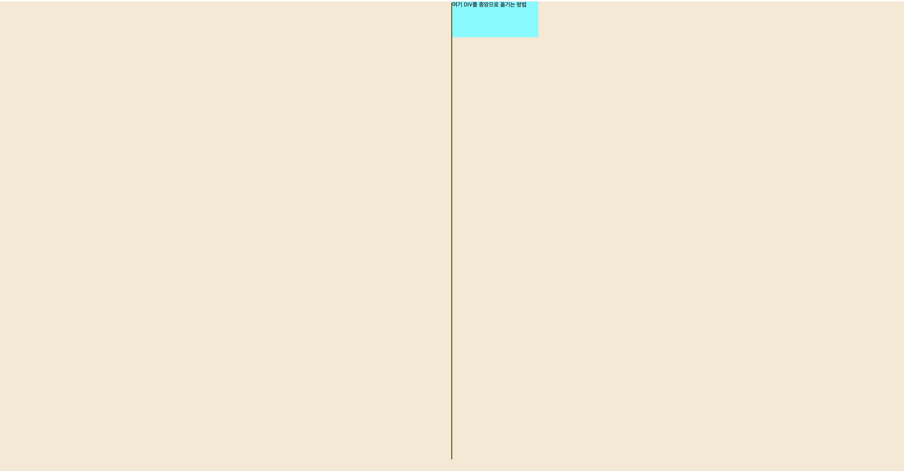
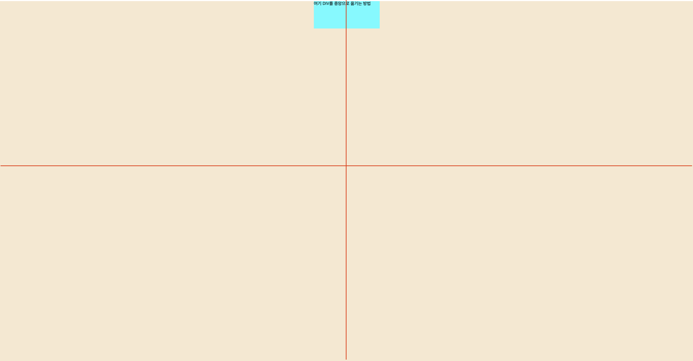

# absolute 요소 중앙정렬

### `absolute`

* absolute 요소의 기본적인 containing block은 body이다.
* 특정 부모 요소를 containg block으로 만들고 싶다면 absolute 요소를 감싸고 있는 block 요소에 `position:relative`를 적용한다.

```html
<div style="position:relative">
  <div style="position:absolute">absolute</div>
</div>
```

\


### `transform`

* absolute 요소를 움직이기 위해서는 top, left를 사용해야 한다.
* x축을 기준으로 중앙정렬을 하기 위해선 left: 50%로 이동시킨다.
* left:50%만큼 이동시키면 absolute의 요소 시작지점을 기준으로 containing block의 50%만큼 이동한다. 👉🏻 _이때 사용하는 것이 `transform`속성_

<figure><figcaption></figcaption></figure>

\


### `translate()`

* 요소의 위치를 수평 또는 수직 방향으로 변경하거나, 수평 및 수직 방향으로 변경할 때 사용하는 함수

```html
<div
  style="
      width: 240px;
      height: 100px;
      background-color: aqua;
      position: absolute;
      left: 50%;
      transform: translateX(-50%)
    "
>
  여기 DIV를 중앙으로 옮기는 방법
</div>
```

<figure><figcaption></figcaption></figure>

* x축, y축 모두 중앙으로 정렬하고 싶다면, `translate` 함수를 사용한다.

```html
<div style="
      width: 240px;
      height: 100px;
      background-color: aqua;
      position: absolute;
      left: 50%;
      top: 50%;
      transform: translate(-50%, -50%)
    ">여기 DIV를 중앙으로 옮기는 방법</div>
      </div>
```

\


### `in TailwindCSS`

```tsx
<div class='relative h-screen w-screen bg-red-300'>
  <div class='absolute left-1/2 top-1/2 h-10 w-40 -translate-x-1/2 -translate-y-1/2 bg-slate-200'>
    Example
  </div>
</div>
```
