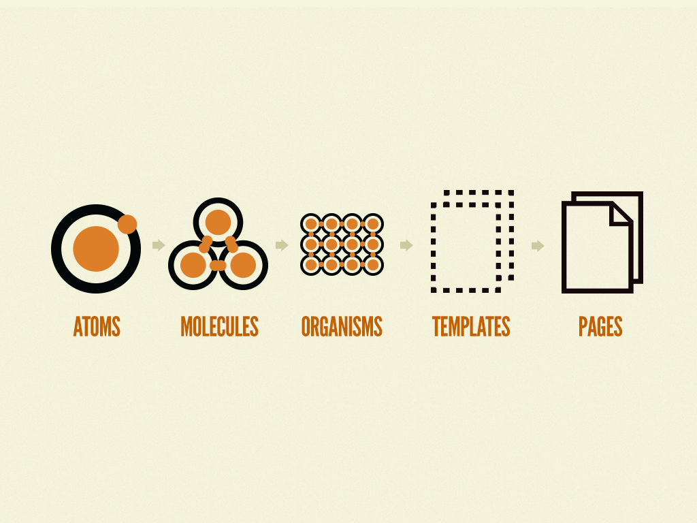

# Design System

## 학습 키워드

* 반응형 웹 디자인(Responsive web design)
* 디자인 시스템(Design System)
* Atomic Design

## 🫥 디자인 시스템(Desing System)이라는 것이 정확하게 무엇을 의미하는 걸까?

> '일관된' 인터페이스를 만드는 데 도움이 되는 기준

디자인 시스템을 사용하면 팀이 제품을 디자인하고, 실현하는데 있어 작업 흐름을 간소화하고 디자인 및 개발 시간을 단축하며 모든 제품 및 플랫폼에서 일관성을 유지할 수 있다. 또한 통합되고 직관적인 인터페이스를 제공하여 UX를 향상시킬 수 있다.

## 🫥 디자인 시스템을 언제부터 관심을 가지게 된걸까?

우아한 형제들 같은 경우에는 2020년 1분기에 배민사장님광장 셀프서비스를 전면 개선할 때부터 디자인시스템을 채택했다.

지면도 많고 복잡도도 높은 프로젝트였지만, 재사용성을 높이므로써 효율적으로 빠른 시간 안에 개발이 가능했다.

공통된 UI/UX와 규칙을 정의하여 스타일에 대한 고민없이 큰 틀에서의 디자인은 그대로 이어가면서 새로운 컨텍스트가 필요한 부분들만 cascading하여 사용함으로써 커뮤니케이션 시간을 줄이고 업무 속도도 향상시킬 수 있었다.


#### 반응형 웹 디자인(Responsive web design)

* 하나의 웹사이트에서 PC, 스마트폰, 태블릿 PC 등 접속하는 디스플레이의 종류에 따라 화면의 크기가 자동으로 변화도록 만든 웹 페이지 접근 기법
* 각 디바이스 별로 웹사이트를 별개 제작하지 않고, 하나의 공용 웹사이트를 만들어 다양한 디바이스에 대응할 수 있음 디바이스에 따른 URL이 동일하여 검색 포털 등 광고를 통한 사용자 접속을 효율적으로 관리할 수 있음
* 내용 수정 시 하나의 페이지만 수정하면 다양한 디바이스에 동일하게 반영



#### Atomic Design

* 시스템 디자인 방법론
* 더 작고 재사용 가능한 구성 요소로 나눈데 중점을 둔다.

**인터페이스를 생성하는 5가지 수준 또는 "원자"로 구성**

1. Atoms: 버튼, 아이콘과 같은 디자인 시스템의 가장 작고 가장 기본적인 빌딩 블록
2. Molecules: 드롭다운 메뉴와 같이 더 복잡한 구성 요소를 만드는 원자의 조합
3. Organisms: 헤더 또는 제품 목록과 같은 인터페이스의 고유 섹션을 형성하는 분자 조합
4. Templates: 다양한 유기체와 구성 요소가 페이지나 화면에 어떻게 배열될 수 있는지 보여주는 와이어프레임 또는 목업
5. Pages: 디자인 시스템의 최종 출력으로, 모든 구성 요소와 템플릿이 함께 작동하여 완전한 사용자 인터페이스를 만드는 방법


