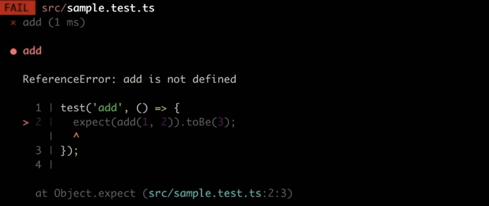

# TDD

## 학습 키워드

* TDD란
* Jest
* Describe - Context - It 패턴
* 단위테스트란


**TDD 에 대해서 주의할 점** 테스트 코드를 작성한다고 해서 TDD 가 아닙니다. TDD Cycle 에 따라 테스트 코드를 먼저 작성하고, 구현하고, 리팩터링 하는 과정을 엄격하게 지켜서 개발을 진행해야 TDD 라고 할 수 있습니다. TDD 는 테스트 코드를 작성하는 것과 별개로 따로 연습이 필요하고 습관을 들여야하는 분야 입니다. 그리고 TDD 를 잘 하기 위해서는 테스트 코드 작성법 자체부터 공부를 하셔야 합니다. 당장은 TDD 보다 테스트 코드 작성에 익숙해지고 어떻게 하면 테스트 코드를 잘 작성할 수 있을까에 초점을 맞춰 공부하시면 좋습니다.


* [테스트 주도 개발](https://github.com/ahastudio/til/blob/main/agile/test-driven-development.md)
* [TDD FAQ](https://github.com/ahastudio/til/blob/main/blog/2016/12-03-tdd-faq.md)
* [Jest를 이용한 간단한 TDD 예제](https://github.com/ahastudio/til/blob/main/jest/20201204-simple-tdd-example.md)


#### TDD (Test Driven Development)

테스트 코드를 먼저 작성하는, 즉 구현보다 인터페이스와 스펙을 먼저 정의함으로써 개발을 진행하는 방식.

**🚀 TDD를 사용하는 이유**

1. 테스트 작성이 프로세스의 일부분이기 때문.
2. 코드 작성 전에 테스트 코드를 작성하면 자동으로 테스트를 실행할 수 있다.


\\

**TDD Cycle**

1. Red → 실패하는 테스트 코드를 작성. 인터페이스와 스펙에 집중한다.
2. Green → 재빨리 테스트를 통과시킨다. 올바른 방법이 아니어도 괜찮다. (코드 작성 전에 실패하는 Red 테스트를 먼저 실행하고, 코드 작성 후에는 통과하는 테스트로 Green 테스트를 확인한다.)
3. Refactor → 리팩터링을 통해 코드를 올바르게 만든다. TDD에서 가장 중요한 부분이지만, 간과될 때가 많다.

\\

### 중요한 것은 작게 만드는 것!

작은 단계를 찾고, 코드에서 피드백을 얻는 게 (어렵고) 중요하다. 2번이 어렵다면 1번으로 돌아가서 더 작고 쉬운 문제를 정의하고, 3번을 위해 의도를 드러내고 중복을 찾아 제거하는 연습을 해야 한다. 이 둘이 익숙하지 않으면 TDD를 하는 게 거의 불가능하고, 사실 이 둘이 어려우면 일반적인 개발 또는 클린 코드를 작성하는 것 또한 매우 힘들다.

👉🏻 사실 작은 단계를 만들거나 중복을 찾아서 제거하는 것이 어려운 건 개발이 어려운 거나 마찬가지.

\\

## Jest

* [Jest](https://jestjs.io/)
* [Given-When-Then](https://github.com/ahastudio/til/blob/main/blog/2018/12-08-given-when-then.md)


#### ✅ Jest가 필요한 이유

React Testing Library는 컴포넌트를 가상 DOM을 렌더링하고, 가상 DOM과 상호작용하는데 도움을 준다. 여기까지가 RTL의 역할인데 테스트 러너가 필요하다. 테스트를 찾고 실행하며, 단언할 무언가가 필요한데 이때 Jest를 사용한다.


테스트 케이스를 정의할 때 크게 두 가지 방법을 사용한다:

1. test 함수로 개별 테스트를 나열하는 방식.
2. BDD 스타일로 주체-행위 중심으로 테스트를 조직화하는 방식.

\\

**먼저 Jest가 있는지 확인하기**

jest와 @swc/jest 가 설치되어 있어야 한다.

\\

### 🦖 @swc/jest의 역할

* Jest용 전처리기를 제공하는 패키지
* Jest에서 테스트를 실행하기 전에 SWC 컴파일러를 사용해서 JavaScript 코드로 변환해준다.

\\

처음에는 test 함수로 개별 테스트를 써보자.

```jsx
test('add', () => {
  expect(add(1, 2)).toBe(3); // 기대한다. 1, 2를 더했을 때 3이 될거라고!
});
```

이 상태로 테스트를 실행하면 add 함수가 정의되지 않았다는 오류를 발생시킨다.



```tsx
function add(x: number, y: number) => {
	return 3;
}
```

\+) 만약 타입스크립트를 인지하지 못해서 오류가 발생한다면 jest.config.js파일 추가하기

Jest에서 TypeScript 사용하도록 `jest.config.js` 파일 작성

```jsx
module.exports = {
  testEnvironment: 'jsdom',
  setupFilesAfterEnv: ['@testing-library/jest-dom/extend-expect'],
  transform: {
    '^.+\\.(t|j)sx?$': [
      '@swc/jest',
      {
        // -> tsx 또는 jsx 파일, x 뒤에 물음표가 붙으면 x가 없을 수도 있다는 의미
        jsc: {
          parser: {
            syntax: 'typescript',
            jsx: true,
            decorators: true,
          },
          transform: {
            react: {
              runtime: 'automatic',
            },
          },
        },
      },
    ],
  },
};
```

BDD 스타일로 테스트 대상과 행위를 명확히 드러내자.

```jsx
describe('add', () => {
  // ✅ add라는 것을 테스트 할거야!
  it('returns sum of two numbers', () => {
    // ✅ add는 무엇을 하는지 설명한다.
    expect(add(1, 2)).toBe(3); // ✅ 무엇을 기대하는지 작성하기
  });
});
```

\\

다양한 경우를 고려해 보자.

🤷🏻‍♀️: 두 숫자만 더하는거 아닌데? 들어오는 숫자들 다 더하는건데?

```jsx
function add(...numbers: number[]): number {
  return numbers.reduce((acc, cur) => acc + cur, 0); // ✅ 리팩토링의 결과물!

  // refactoring 전 코드
  // return add(...numbers.slice(0, numbers.length - 1)) + numbers[numbers.length - 1]);
}

const context = describe;

describe('add', () => {
  context('with no argument', () => {
    it('returns zero', () => {
      expect(add()).toBe(0);
    });
  });

  context('with only one number', () => {
    it('returns the same number', () => {
      expect(add(1)).toBe(1);
    });
  });

  context('with two numbers', () => {
    it('returns sum of two numbers', () => {
      expect(add(1, 2)).toBe(3);
    });
  });

  context('with three numbers', () => {
    it('returns sum of three numbers', () => {
      expect(add(1, 2, 3)).toBe(6);
    });
  });
});
```

여러 개의 테스트 코드를 먼저 작성하고 테스트를 실행하면서 코드를 리팩토링해 나갈 수 있다. 또한 테스트 케이스를 생각하면서 어떤 값들이 들어올 것 같은지에 대해 생각해볼 수 있다.

## 🦁 logRoles

* getByRole로 테스트 중인 DOM을 쿼리하는 방법을 찾는 데 유용하다.

```tsx
import { logRoles } from '@testing-library/dom'; // 🚧 @testing-library/react가 아닌 @testing-library/dom에서 가져오는 것 주의

const nav = document.createElement('nav');
nav.innerHTML = `
<ul>
  <li>Item 1</li>
  <li>Item 2</li>
</ul>`;

logRoles(nav);
```

Result:

```tsx
navigation:
<nav />
--------------------------------------------------
list:
<ul />
--------------------------------------------------
listitem:
<li />
<li />
--------------------------------------------------
```
