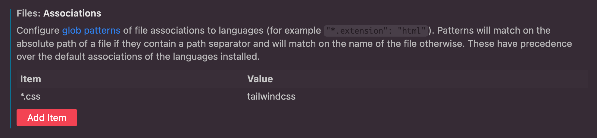

# Next.js 14 & Langchain & Vercel SDK & ChatGPT API & TailwindCSS

### Next.js 설치

```tsx
npx create-next-app@latest
```

### Dependencies 설치

* openai
* langchain
* @langchain/openai : LangChain 프레임워크에서 Open AI의 API를 사용하기 위한 라이브러리
* ai
* clsx
* tailwind-merge
* ts-node
* dotenv
* lucide-react : 아이콘 라이브러리
* next-themes
* react-markdown : markdown 형식의 텍스트를 HTML로 렌더링하는 데 사용되는 라이브러리
* @datastax/astra-db-ts : Atra DB에 엑세스하고 상호작용하기 위한 Node.js 클라이언트 라이브러리
* @upstash/redis : Upstash Redis 서비스와 통합하기 위한 Node.js 클라이언트 라이브러리

```tsx
npm i openai langchain @langchain/openai ai clsx tailwind-merge ts-node dotenv lucide-react next-themes react-markdown @datastax/astra-db-ts @upstash/redis
```

### DevDependecies 설치

* prettier
* prettier-plugin-tailwindcss
* eslint-config-prettier

```tsx
npm i -D prettier prettier-plugin-tailwindcss eslint-config-prettier
```

\
package.json에서 \`@langchain/core\` 버전 설정하기

```tsx
"overrides": {
    "@langchain/core": "0.1.20"
  }
```

### Prettier Setup

Settings > Files:Associations

<figure><figcaption></figcaption></figure>

Settings > Quick Suggestion

<figure><figcaption></figcaption></figure>

\


프로젝트 루트에 `prettier.confing.js` 파일 생성

```tsx
module.exports = {
  plugins: ['prettier-plugin-tailwindcss'],
};
```

`eslintrc.json` 내용 수정

```
{
  "extends": ["next/core-web-vitals", "prettier"]
}
```

Settings > Default Formatter

<figure><figcaption></figcaption></figure>

### Tailwind Theming

[shadcn](https://ui.shadcn.com/themes) 에서 theme color 정한 후 copy code

global.css 수정

```css
@tailwind base;
@tailwind components;
@tailwind utilities;

@layer base {
  :root {
    --background: 0 0% 100%;
    --foreground: 224 71.4% 4.1%;
    --card: 0 0% 100%;
    --card-foreground: 224 71.4% 4.1%;
    --popover: 0 0% 100%;
    --popover-foreground: 224 71.4% 4.1%;
    --primary: 262.1 83.3% 57.8%;
    --primary-foreground: 210 20% 98%;
    --secondary: 220 14.3% 95.9%;
    --secondary-foreground: 220.9 39.3% 11%;
    --muted: 220 14.3% 95.9%;
    --muted-foreground: 220 8.9% 46.1%;
    --accent: 220 14.3% 95.9%;
    --accent-foreground: 220.9 39.3% 11%;
    --destructive: 0 84.2% 60.2%;
    --destructive-foreground: 210 20% 98%;
    --border: 220 13% 91%;
    --input: 220 13% 91%;
    --ring: 262.1 83.3% 57.8%;
    --radius: 0.5rem;
  }

  .dark {
    --background: 224 71.4% 4.1%;
    --foreground: 210 20% 98%;
    --card: 224 71.4% 4.1%;
    --card-foreground: 210 20% 98%;
    --popover: 224 71.4% 4.1%;
    --popover-foreground: 210 20% 98%;
    --primary: 263.4 70% 50.4%;
    --primary-foreground: 210 20% 98%;
    --secondary: 215 27.9% 16.9%;
    --secondary-foreground: 210 20% 98%;
    --muted: 215 27.9% 16.9%;
    --muted-foreground: 217.9 10.6% 64.9%;
    --accent: 215 27.9% 16.9%;
    --accent-foreground: 210 20% 98%;
    --destructive: 0 62.8% 30.6%;
    --destructive-foreground: 210 20% 98%;
    --border: 215 27.9% 16.9%;
    --input: 215 27.9% 16.9%;
    --ring: 263.4 70% 50.4%;
  }
}

@layer base {
  * {
    @apply border-border;
  }
  body {
    @apply bg-background text-foreground;
  }
}
```

\


`tailwind.confing.ts` 수정

```tsx
import type { Config } from 'tailwindcss';

const config: Config = {
  darkMode: 'class',
  content: [
    './src/pages/**/*.{js,ts,jsx,tsx,mdx}',
    './src/components/**/*.{js,ts,jsx,tsx,mdx}',
    './src/app/**/*.{js,ts,jsx,tsx,mdx}',
  ],
  theme: {
    extend: {
      colors: {
        border: 'hsl(var(--border))',
        input: 'hsl(var(--input))',
        ring: 'hsl(var(--ring))',
        background: 'hsl(var(--background))',
        foreground: 'hsl(var(--foreground))',
        primary: {
          DEFAULT: 'hsl(var(--primary))',
          foreground: 'hsl(var(--primary-foreground))',
        },
        secondary: {
          DEFAULT: 'hsl(var(--secondary))',
          foreground: 'hsl(var(--secondary-foreground))',
        },
        destructive: {
          DEFAULT: 'hsl(var(--destructive))',
          foreground: 'hsl(var(--destructive-foreground))',
        },
        muted: {
          DEFAULT: 'hsl(var(--muted))',
          foreground: 'hsl(var(--muted-foreground))',
        },
        accent: {
          DEFAULT: 'hsl(var(--accent))',
          foreground: 'hsl(var(--accent-foreground))',
        },
        popover: {
          DEFAULT: 'hsl(var(--popover))',
          foreground: 'hsl(var(--popover-foreground))',
        },
        card: {
          DEFAULT: 'hsl(var(--card))',
          foreground: 'hsl(var(--card-foreground))',
        },
      },
      borderRadius: {
        lg: 'var(--radius)',
        md: 'calc(var(--radius) - 2px)',
        sm: 'calc(var(--radius) - 4px)',
      },
    },
  },
  plugins: [],
};
export default config;
```
