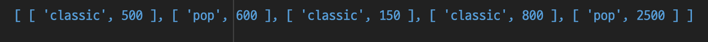
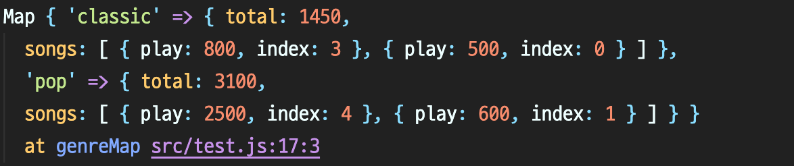

# 베스트 앨범 - Hash Table

### 문제설명

스트리밍 사이트에서 장르 별로 가장 많이 재생된 노래를 두 개씩 모아 베스트 앨범을 출시하려 합니다. 노래는 고유 번호로 구분하며, 노래를 수록하는 기준은 다음과 같습니다.

1. 속한 노래가 많이 재생된 장르를 먼저 수록합니다.
2. 장르 내에서 많이 재생된 노래를 먼저 수록합니다.
3. 장르 내에서 재생 횟수가 같은 노래 중에서는 고유 번호가 낮은 노래를 먼저 수록합니다.

노래의 장르를 나타내는 문자열 배열 genres와 노래별 재생 횟수를 나타내는 정수 배열 plays가 주어질 때, 베스트 앨범에 들어갈 노래의 고유 번호를 순서대로 return 하도록 solution 함수를 완성하세요.

### 제한사항

- genres[i]는 고유번호가 i인 노래의 장르입니다.
- plays[i]는 고유번호가 i인 노래가 재생된 횟수입니다.
- genres와 plays의 길이는 같으며, 이는 1 이상 10,000 이하입니다.
- 장르 종류는 100개 미만입니다.
- 장르에 속한 곡이 하나라면, 하나의 곡만 선택합니다.
- 모든 장르는 재생된 횟수가 다릅니다.

### 입출력 예

genres plays return
["classic", "pop", "classic", "classic", "pop"] [500, 600, 150, 800, 2500] [4, 1, 3, 0]

### 입출력 예 설명

classic 장르는 1,450회 재생되었으며, classic 노래는 다음과 같습니다.

- 고유 번호 3: 800회 재생
- 고유 번호 0: 500회 재생
- 고유 번호 2: 150회 재생

pop 장르는 3,100회 재생되었으며, pop 노래는 다음과 같습니다.

- 고유 번호 4: 2,500회 재생
- 고유 번호 1: 600회 재생

따라서 pop 장르의 [4, 1]번 노래를 먼저, classic 장르의 [3, 0]번 노래를 그다음에 수록합니다.

**장르 별로 가장 많이 재생된 노래를 최대 두 개까지 모아 베스트 앨범을 출시하므로 2번 노래는 수록되지 않습니다.**

---

### 풀이

요구사항을 정리해보면,

1. 같은 장르를 묶어야한다. 반환 값의 우선순위를 정해야 하기 때문이다. 현재 배열의 요소로는 "classic"과 "pop" 두 개가 있고 "pop" 장르의 재생횟수가 더 많으므로 pop 장르의 노래를 먼저 반환해야한다.
2. 묶인 노래들을 재생 횟수에 따라 정렬을 해줘야한다.
3. 노래를 2개까지 자르는 작업이 필요하다.

장르와 재생 횟수를 배열로 묶어주는 작업을 해준다.

```js
genres.map((genre, index) => [genre, plays[index]]);
```



총 재생횟수는 어떻게 구하는게 좋을까? 키를 장르로 가지고 있고, 값으로 총 횟수와 각 재생횟수를 객체로 가지고 있는 데이터 자료형을 만든다. 👉🏻 `Map`을 사용한다.

```js
{'classic', {total: 1450, songs: [{500, 0}, {150, 2}, {800, 3}]}},
{'pop', {total: 3100, songs: [{600, 1}, {2500, 4}]}}

```

```js
const genreMap = new Map();

gernes
  .map((genre, index) => [genre, plays[index]])
  .forEach(([genre, play], index) => {
    const data = genreMap.get(genre) || { total: 0, songs: [] };

    genreMap.set(genre, {
      total: data.total + play,
      songs: [...data.songs, { play, index }],
    });
  });
```



### Map 객체, 언제 사용해야할까?

Map 객체는 객체의 프로퍼티를 자주 변경해야할 때 사용하는 것이 좋다.
기존 객체는 순회를 할 수 없지만 Map 객체는 for..of 문을 통해 순회가 가능하다.

맵 객체를 다를 때는 점표기법이나 대괄호표기법을 사용하지 않고 메서드(set, get, delete, clear)를 사용해서 프로퍼티를 수정하거나 조회할 수 있기 때문에 동작과 의도를 보다 정확하게 보여준다는 장점이 있다.

```js
const contacts = new Map();
contacts.set('Jessie', { phone: '213-555-1234', address: '123 N 1st Ave' });
contacts.has('Jessie'); // true
contacts.get('Hilary'); // undefined
contacts.set('Hilary', { phone: '617-555-4321', address: '321 S 2nd St' });
contacts.get('Jessie'); // {phone: "213-555-1234", address: "123 N 1st Ave"}
contacts.delete('Raymond'); // false
contacts.delete('Jessie'); // true
console.log(contacts.size); // 1
```



이제 묶인 노래들을 재생 횟수에 따라 정렬하는 작업이 필요하다.

```js
[...data.songs, { play, index }].sort((a, b) => b.play - a.play).slice(0, 2);
```

genreMap 객체가 어떤 구조로 되어있는지 확인해보면 다음과 같다.


마지막으로

1. genreMap 객체를 하나의 배열로 만들고 total의 값을 기준으로 정렬한다.
2. songs만을 배열로 만들고 평탄화작업을 한다.
3. song.index만을 배열로 반환한다.

```js
return [...genreMap.entries()]
  .sort((a, b) => b[1].total - a[1].total)
  .flatMap((item) => item[1].songs)
  .map((song) => song.index);
```

### 전체코드

```js
function solution(genres, plays) {
  const genreMap = new Map();

  genres
    .map((genre, index) => [genre, plays[index]])
    .forEach(([genre, play], index) => {
      const data = genreMap.get(genre) || { total: 0, songs: [] };

      genreMap.set(genre, {
        total: data.total + play,
        songs: [...data.songs, { play, index }]
          .sort((a, b) => b.play - a.play)
          .slice(0, 2),
      });
    });

  return [...genreMap.entries()]
    .sort((a, b) => b[1].total - a[1].total)
    .flatMap((item) => item[1].songs)
    .map((song) => song.index);
}
```

### 참고

- https://school.programmers.co.kr/learn/courses/30/lessons/42579
- https://developer.mozilla.org/ko/docs/Web/JavaScript/Reference/Global_Objects/Map
- https://developer.mozilla.org/ko/docs/Web/JavaScript/Reference/Global_Objects/Array/flatMap
- https://maxkim-j.github.io/posts/js-map/
