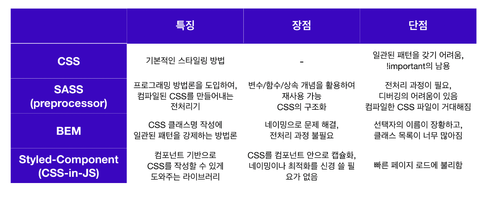

# CSS in JS

## 학습 키워드

- CSS in JS 란
- CSS

 

인터넷이 만들어진 이후 기술의 발달과 함께 사용자들은 다양한 환경(디바이스)에서 인터넷을 사용하기 시작했고, 이에 따라 개발자들의 CSS 작성 방식도 꾸준히 진화해오고 있다.

> CSS는 개발자들에게 가장 큰 걸림돌

프로젝트의 규모나 복잡도가 점점 커지고 함께 작업해야 할 팀원 수도 많아짐에 따라 CSS를 작성하는 일관된 패턴이 없다는 것은 큰 컬림돌이 되었다.

또한 모바일이나 태블릿을 비롯한 다양한 디바이스들의 등장으로 웹사이트들이 다양한 디스플레이를 커버해야 하기 때문에 CSS는 더 복잡해지게 되었다.

따라서 CSS 작업을 효율적으로 하기 위해 구조화된 CSS의 필요성이 대두되었고, CSS를 구조화하는 방법에 대한 연구가 필요해졌다.

 

### CSS 방법론들의 특징과 장단점

