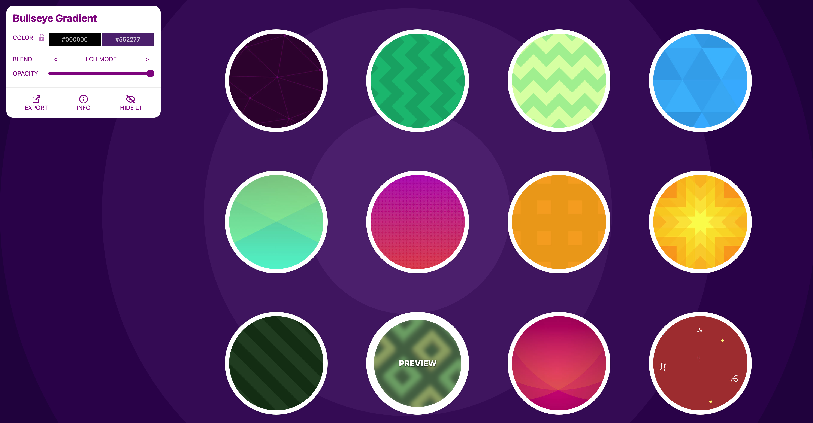
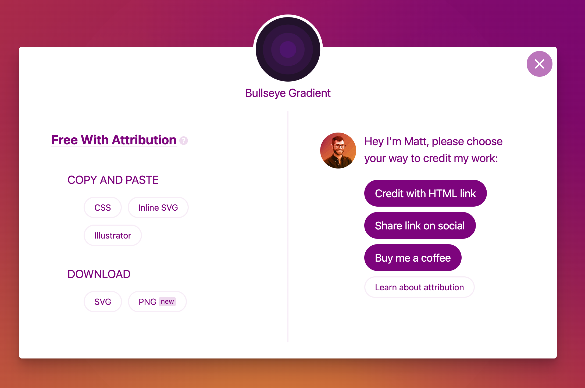

# SVG를 배경으로 사용하기

[Free SVG Backgrounds](https://www.svgbackgrounds.com/set/free-svg-backgrounds-and-patterns/)

👉🏻  SVG 배경 무료 사이트


<figure><figcaption></figcaption></figure>

배경으로 적용하고 싶은 색상을 고른 후, EXPORT 클릭

<figure><figcaption></figcaption></figure>

CSS로  복사한 후, `global.css`에 붙여넣는다.&#x20;

````
```tailwindcss
.bg-back {
  background-color: #000000;
  background-image: url("data:image/svg+xml,%3Csvg xmlns='http://www.w3.org/2000/svg' width='100%25' height='100%25' viewBox='0 0 800 800'%3E%3Cg %3E%3Ccircle fill='%23000000' cx='400' cy='400' r='600'/%3E%3Ccircle fill='%23230046' cx='400' cy='400' r='500'/%3E%3Ccircle fill='%232f0052' cx='400' cy='400' r='400'/%3E%3Ccircle fill='%233b075e' cx='400' cy='400' r='300'/%3E%3Ccircle fill='%2348156a' cx='400' cy='400' r='200'/%3E%3Ccircle fill='%23552277' cx='400' cy='400' r='100'/%3E%3C/g%3E%3C/svg%3E");
  background-attachment: fixed;
  background-size: cover;
}

```
````


className에 \`bg-black\` 적용

```typescriptreact
className='bg-back`
```

<figure><figcaption></figcaption></figure>
