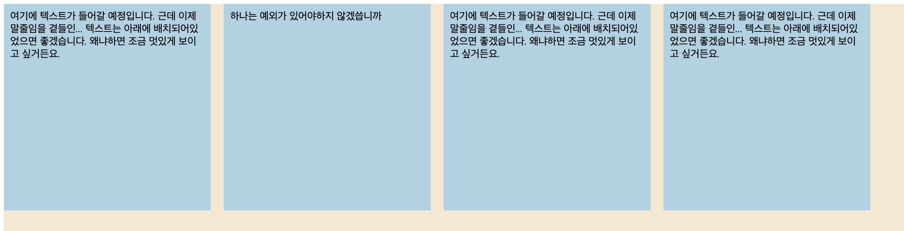
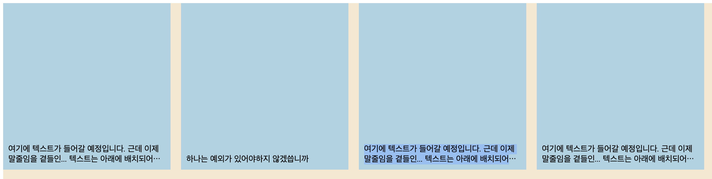

# 특정 줄수에서 말줄임 처리 👉🏻 line-clamp

<figure><figcaption></figcaption></figure>

텍스트 요소들은 div의 아래 기준으로 시작하고, 2줄이 넘어갈 경우 말줄임(...) 처리를 하는 방법

```tsx
<div style='display:flex; align-items:end;'>
  <div>
    여기에 텍스트가 들어갈 예정입니다. 근데 이제 말줄임을 곁들인... 텍스트는
    아래에 배치되어있었으면 좋겠습니다. 왜냐하면 조금 멋있게 보이고 싶거든요.
  </div>
</div>
```


### `-webkit-line-clamp`

* block 요소를 지정된 줄 수로 제한할 수 있는 CSS 속성
* _<mark style="background-color:red;">**display 속성이**</mark><mark style="background-color:red;">** **</mark><mark style="background-color:red;">**`-webkit-box`**</mark><mark style="background-color:red;">** **</mark><mark style="background-color:red;">**또는**</mark><mark style="background-color:red;">** **</mark><mark style="background-color:red;">**`-webkit-inline-box`**</mark><mark style="background-color:red;">**인 경우에만 동작**</mark>_한다.
* overflow:hidden으로 설정하면 지정된 줄 수 뒤에 줄임표를 표시할 수 있다.

```tsx
<div style='display:flex; align-items:end;'>
  <div
    style='
            display: -webkit-box;
            -webkit-box-orient: vertical;
            -webkit-line-clamp: 2;
            overflow: hidden;
          '
  >
    여기에 텍스트가 들어갈 예정입니다. 근데 이제 말줄임을 곁들인... 텍스트는
    아래에 배치되어있었으면 좋겠습니다. 왜냐하면 조금 멋있게 보이고 싶거든요.
  </div>
</div>
```

<figure><figcaption></figcaption></figure>


### `TailwindCSS`

```tsx
<div className='flex items-end'>
  <div className='line-clamp-3'>
    여기에 텍스트가 들어갈 예정입니다. 근데 이제 말줄임을 곁들인... 텍스트는
    아래에 배치되어있었으면 좋겠습니다. 왜냐하면 조금 멋있게 보이고 싶거든요.
  </div>
</div>
```
