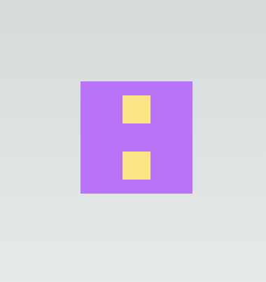
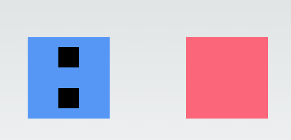

# TailwindCSS Tricks

### Peer and Group

`bg-blue-400`인 div에 hover했을 때, 하위 자식 div도 색상을 변경하는 방법 👉🏻 _<mark style="color:red;">**`group`**</mark>_

```jsx
<div className='h-40 w-40 grid place-items-center bg-blue-400 hover:bg-purple-400'>
  <div className='bg-black h-10 w-10'></div>
  <div className='bg-black h-10 w-10'></div>
</div>
```

<figure><figcaption></figcaption></figure>

* 상위 컨테이너 요소에 group 클래스 지정
* 하위 요소에 `group-hover:` 클래스 지정

```jsx
<div className='h-40 w-40 group grid place-items-center bg-blue-400 hover:bg-purple-400'>
  <div className='bg-black h-10 w-10 group-hover:bg-amber-200'></div>
  <div className='bg-black h-10 w-10 group-hover:bg-amber-200'></div>
</div>
```

<figure><figcaption></figcaption></figure>

형제 요소의 색상을 변경하는 방법 👉🏻 _<mark style="color:red;">**`peer`**</mark>_

```jsx
<div className='peer h-40 w-40 group grid place-items-center bg-blue-400 hover:bg-purple-400'>
  <div className='bg-black h-10 w-10 group-hover:bg-amber-200'></div>
  <div className='bg-black h-10 w-10 group-hover:bg-amber-200'></div>
</div>
<div className='w-40 h-40 bg-rose-400 peer-hover:bg-slate-300'></div>

```

<figure><figcaption></figcaption></figure>


### Extend Tailwind

`shadow-[0_0_10px_theme('colors.purple. 700')]` 과 같은 그림자의 효과를 여러 곳에서 사용해야 할 때 👉🏻 _**유틸리티**_

```js
theme: {
    extend: {
      boxShadow: {
        neon: "0 0 5px theme('colors.purple.200'), 0 0 20px theme('colors.purple.700')",
      },
    },
  },
```

`tailwind.config.ts`에 작성한 'neon' 클래스 사용

```jsx
<div>
  <div className='shadow-neon' />
</div>
```


### Plugins

```js
import plugin from 'tailwindcss/plugin';

//...생략

plugins: [
  plugin(({ theme, addUtilities }) => {
    const neonUtilities = {};
    const colors = theme('colors');
    for (const color in colors) {
      if (typeof colors[color] === 'object') {
        const color1 = colors[color]['500'];
        const color2 = colors[color]['700'];
        neonUtilities[`.neon-${color}`] = {
          boxShadow: `0 0 5px ${color1}, 0 0 20px ${color2}`,
        };
      }
    }
    addUtilities(neonUtilities);
  }),
],

```

plugins에서 만든 유틸리티를 사용해 여러가지 색상의 `neon-${color}`를 사용할 수 있다.

```js
<div className='neon-red' />
<div className='neon-green' />
```


### Color object

colors object를 가져와서 기본 색상값 설정하기

```js
theme: {
    extend: {
      colors: {
        primary: colors.violet,
      },
    },
  },
```

```js
<div className='text-primary-400' />
```

원하는 경우 spread 연산자를 사용하여 기본 색상을 추가해 숫자 없이 기본 색상을 사용할 수 있다.

```js
theme: {
    extend: {
      colors: {
        primary: {...colors.violet, DEFAULT: colors.violet[600]}
      },
    },
  },
```

```js
<div className='text-primary' />
```
