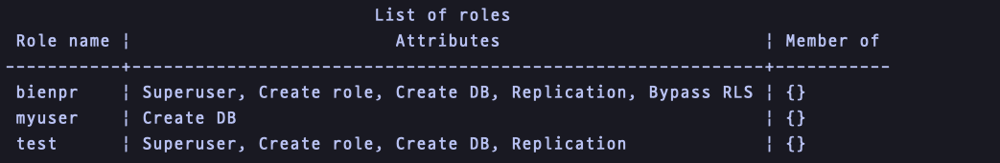

# PostgreSQL 설치, 실행

### postgresSQL install

postgresSQL 설치 (on Mac)

```bash
brew install postgresql
```

정상적으로 설치되었는지 확인하는 방법

```bash
postgres - V;
```

_➡️ postgres (PostgreSQL) 14.10 (Homebrew)_

\


### postgresSQL 실행

```bash
brew services start postgresql
```

<figure><figcaption></figcaption></figure>

default user로 postgre 접속

```bash
postgres-#: psql -U postgres
```

<figure><figcaption></figcaption></figure>

\


### 새로운 User, Password 생성

```
postgres=# CREATE USER [myuser] WITH PASSWORD ['mypassword'];
CREATE ROLE
```

\


### Username 변경

```
postgres=# ALTER USER bienpr RENAME TO postgres;
```


_ERROR: session user cannot be renamed_


👉🏻 세션 사용자의 이름을 바꾸려고 할 때 오류가 발생한다. 다른 사용자로 로그인 한 후, 이름을 변경해야한다.


```
postgres=# ALTER USER test with superuser;
postgres=# ALTER USER test with createdb;
postgres=# ALTER USER test with createrole;
postgres=# ALTER USER test with replication;
```



```
postgres=# ALTER USER bienpr RENAME TO postgres;
ALTER ROLE
postgres=# DROP USER test;
DROP ROLE
```


\


### User 삭제

```
postgres=# DROP USER [test];
DROP ROLE
```

\


### 현재 User 조회

```
postgres=# select current_user;
```

<figure><figcaption></figcaption></figure>

\


### 현재 선택된 database 조회

```
postgres=# select current_database();
```

<figure><figcaption></figcaption></figure>

***

### 기존 User에 데이터베이스 추가

기존에 myuser라는 role이 있었다고 가정했을 때, 새로운 데이터베이스를 추가하기 위해선 먼저 `postgres` 데이터베이스를 사용한다.

```
psql -U myuser -d postgres
```

로그인 후, 새 데이터베이스를 생성한다.

```
pstgres=# CREATE DATABASE "businesscard-prj"
```

***

### psql 명령어

*   `\l` : 현재 서버에 있는 모든 데이터베이스 목록을 조회

    <figure><figcaption></figcaption></figure>
*   `\c {database_name}` : 지정한 `database_name` 데이터베이스로 접속

    <figure><figcaption></figcaption></figure>
*   `\du` : USER 조회

    <figure><figcaption></figcaption></figure>

```
```
