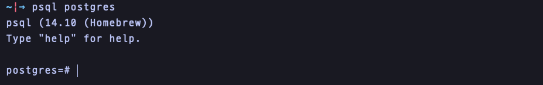
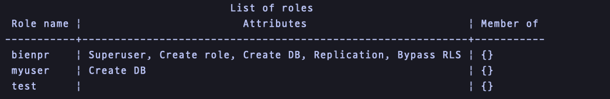
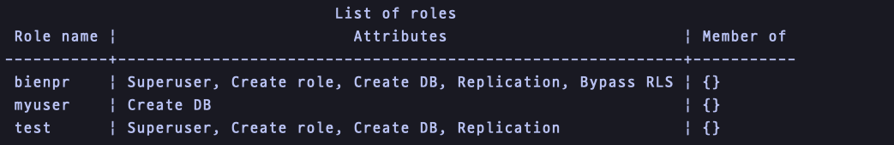
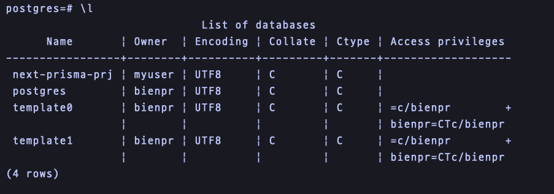
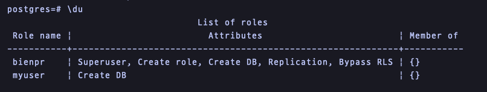

# PostgreSQL 설치, 실행

### Install

postgresSQL 설치 (on Mac)

```bash
brew install postgresql
```


정상적으로 설치되었는지 확인하는 방법

```bash
postgres - V;
```

_➡️ postgres (PostgreSQL) 14.10 (Homebrew)_\


### postgresSQL 실행

```javascript
brew services start postgresql
```

<figure><figcaption></figcaption></figure>

### postgres 접속&#x20;

```
psql -U postgres
```

<figure><figcaption></figcaption></figure>

### user, password 생성

```
CREATE USER [myuser] WITH PASSWORD ['mypassword'];

CREATE ROLE
```


### username 변경

```
ALTER USER bienpr RENAME TO postgres;
```


_**ERROR: session user cannot be renamed**_


👉🏻 세션 사용자의 이름을 바꾸려고 할 때 오류가 발생한다. 다른 사용자로 로그인 한 후, 이름을 변경해야한다.




```javascript
postgres=# ALTER USER test with superuser; 
postgres=# ALTER USER test with createdb; 
postgres=# ALTER USER test with createrole; 
postgres=# ALTER USER test with replication;
```

<figure><figcaption></figcaption></figure>

```javascript
ALTER USER bienpr RENAME TO postgres;
ALTER ROLE

DROP USER test;
DROP ROLE
```


### user 삭제

```
DROP USER [test];

DROP ROLE
```


### current user 조회

```
select current_user;
```

<figure><figcaption></figcaption></figure>

### 현재 선택된 database 조회&#x20;

```
postgres=# select current_database();
```


### 기존 user에 데이터베이스 추가

기존에 myuser라는 role이 있었다고 가정했을 때, 새로운 데이터베이스를 추가하기 위해선 먼저 `postgres` 데이터베이스를 사용한다.

```
psql -U myuser -d postgres
```

로그인 후, 새 데이터베이스를 생성한다.

```
pstgres=# CREATE DATABASE "businesscard-prj"
```


***

### ✅  psql 명령어

* **`\l`** : 현재 서버에 있는 모든 데이터베이스 목록을 조회

<figure><figcaption></figcaption></figure>

* **`\c {database_name}`** : 지정한 `database_name` 데이터베이스로 접속

<figure><figcaption></figcaption></figure>

* **`\du`** : USER 조회

<div data-full-width="false">

<figure><figcaption></figcaption></figure>

</div>

