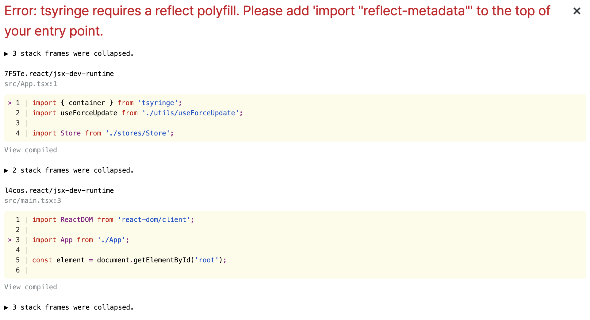
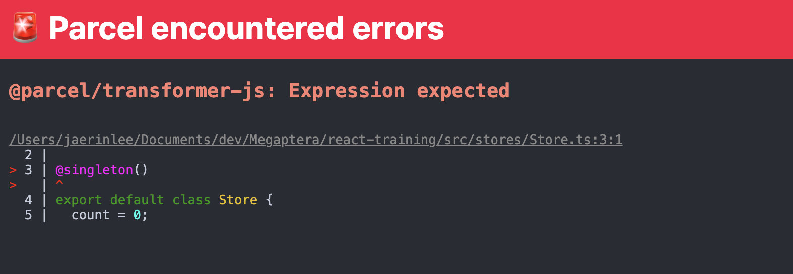
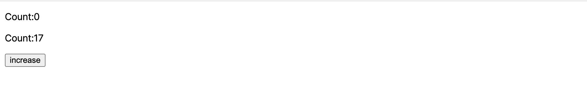
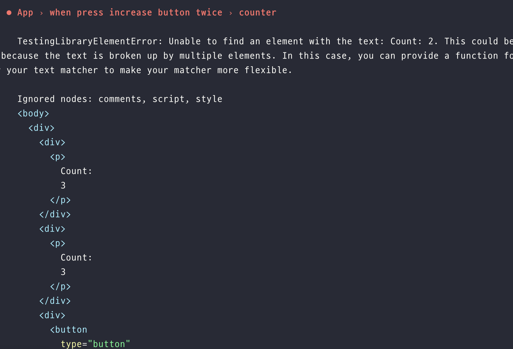

# TSyringe

## 학습 키워드

* TSyringe
* 의존성 주입(Dependency Injection)
* reflect-metadata
* sington (싱글톤)


## TSyringe

: TypeScript용 DI 라이브러리

프론트엔드에서 DI를 언제 쓰는가?를 살펴보면 External Store를 관리할 때 사용한다. TSyringe를 잘 사용하면 전역처럼 사용이 가능하다.

* [TSyringe](https://github.com/microsoft/tsyringe)
* [reflect-metadata](https://github.com/rbuckton/reflect-metadata)
* [The problem with passing props](https://beta.reactjs.org/learn/passing-data-deeply-with-context#the-problem-with-passing-props)

\


> 전역처럼 사용 가능하다는 것이 무엇을 의미할까? 👉🏻 TSyringe는 @singleton으로 이뤄져 있다. 즉, 하나의 인스턴스만 생성할 수 있기 때문에 어느 곳에서 값을 참조해도 같은 값을 확인할 수 있다.


#### DI(Dependency Injection)

: 종속성(의존성) 주입, 하나의 객체가 다른 객체의 의존성을 제공하는 테크닉

* `의존성` 은 서비스로 사용할 수 있는 객체\
  : 클라이언트가 어떤 서비스를 사용할 것인지 지정하는 대신, 클라이언트에게 무슨 서비스를 사용할 것이라고 말해주는 것
* `주입` 은 의존성을 사용하려는 객체(클라이언트)로 전달하는 것을 의미\
  : 서비스는 클라이언트 상태의 일부이다. 클라이언트가 서비스를 구축하거나 찾는 것을 허용하는 대신 클라이언트에게 서비스를 전달하는 것이 패턴의 기본 요건

**🚀 의존성 주입의 의도** : 객체의 생성과 사용의 관심을 분리하는 것이다. 어떤 서비스를 호출하려는 클라이언트는 그 서비스가 어떻게 구성되었는지 알지 못해야 한다. 클라이언트는 대신 서비스 제공에 대한 책임을 외부 코드(주입자)로 위임한다.

DI를 사용하면 클래스와 개체가 서로 밀접하게 결합되지 않고 런타임 시 개체에 종속성이 "주입"되므로 애플리케이션이 더 모듈화되고 유지 관리가 쉬워진다.

\


**DI를 사용해야하는 이유**

* Unit Test가 용이해진다.
* 코드의 재활용성을 높여준다.
* 객체 간의 의존성(종속성)을 줄이거나 없엘 수 있다.
* 객체 간의 결합도이 낮추면서 유연한 코드를 작성할 수 있다.


\


### reflect-metadata

```jsx
npm i tsryinge reflect-metadata
// reflect-metadata는 tsryinge에서 내부적으로 사용하고 있는 API
```

* Reflect API를 위한 폴리필을 추가할 때 사용한다.
* reflect-metadata를 사용할 수도 있고 공식 문서에서는 core-js, reflection과 같은 useage도 제공

\


### ✅ TSyringe 사용방법

**store를 만든다.**

```tsx
import { singleton } from 'tsyringe';

export default class Store {
  count = 0;
}
```

**만든 store를 app.tsx에서 사용**

* tsryinge는 container를 제공한다.

```tsx
import { container } from 'tsyringe';
import Store from './stores/Store';

import useForceUpdate from './utils/useForceUpdate';

const state = {
  count: 0,
};

export default function App() {
  const forceUpdate = useForceUpdate();
  const store = container.resolve(Store);

  const handleClick = () => {
    state.count += 1;
    forceUpdate();
  };

  return (
    <div>
      <p>{state.count}</p>
      <button type="button" onClick={handleClick}>
        increase
      </button>
    </div>
  );
}
```



`import “reflect-metadata”` 를 어디에 써줘야할까?\
👉🏻 모든 프로그램이 시작하는 곳에 써줘야한다. `main.tsx`

테스트 파일은 시작하는 곳이 없는데 테스트 파일에서는 어디에 명시해줘야할까?\
👉🏻 `jest.config.js` 에서 확인해보면 `'<rootDir>/src/setupTests.ts',` 시작점을 설정해줬었다.

```jsx
import 'reflect-metadata'; // ✅

import server from './mocks/server';

beforeAll(() => server.listen({ onUnhandledRequest: 'error' }));

afterAll(() => server.close());

afterEach(() => server.resetHandlers());
```

\


다시 실행시켜보면 다른 오류 발생



타입스크립트에서도 데코레이터를 쓸 수 있도록 만들어줘야한다.\
👉🏻 tsconfig에서 주석을 해제해주면 된다.

```jsx
"experimentalDecorators": true /* Enable experimental support for legacy experimental decorators. */,
"emitDecoratorMetadata": true /* Emit design-type metadata for decorated declarations in source files. */,
```

> 데코레이터는 선언적 구문을 통해 클래스가 정의될 때 클래스와 그 멤버를 보강하는 기능을 추가함

\



#### singleton

TSyringe에서의 singleton은 클래스를 전역 컨테이너 내에서 싱글톤으로 등록하는 클래스 데코레이터 팩토리

[singleton 패턴](https://patterns-dev-kr.github.io/design-patterns/singleton-pattern/)

Singleton은 1회에 한하여 인스턴스화가 가능하며 전역에서 접근 가능한 클래스를 지칭한다. 만들어진 Singleton 인스턴스는 앱 전역에서 공유되기 때문에 앱의 전역 상태를 관리하기에 적합하다.


\


`App.tsx`

```tsx
import Counter from './components/Counter';
import CountControl from './components/CountControl';

export default function App() {
  return (
    <>
      <Counter />
      <CountControl />
    </>
  );
}
```

`Store.ts`

```tsx
import { singleton } from 'tsyringe';

@singleton()
export default class Store {
  count = 0;

  forceUpdate: () => void;

  update() {
    // 뭐할건데? -> forceUpdate도 여기서 실행해야하지않을까?
    this.forceUpdate();
  }
}
```

`Counter.tsx`

```tsx
import { container } from 'tsyringe';

import Store from '../stores/Store';
import useForceUpdate from '../utils/useForceUpdate';

export default function Counter() {
  const store = container.resolve(Store);
  const forceUpdate = useForceUpdate();
  store.forceUpdate = forceUpdate; // Counter가 가지고 있는 forceUpdate를 store.forceUpdate에 등록해준다.

  return (
    <div>
      <p>Count:{store.count}</p>
    </div>
  );
}
```

`CounterControl.tsx`

```tsx
import { container } from 'tsyringe';

import Store from '../stores/Store';

export default function CounterControl() {
  const store = container.resolve(Store);

  const handleClick = () => {
    store.count += 1;
    store.update(); // Counter.tsx에서 Store에 등록했기 때문에 store.update를 실행하면 Counter에서 선언한 forceUpdate가 실행된다.
  };

  return (
    <div>
      <button type="button" onClick={handleClick}>
        increase
      </button>
    </div>
  );
}
```

\


만약 Counter 컴포넌트를 여러 개 만든다면?

```tsx
import Counter from './components/Counter';
import CountControl from './components/CountControl';

export default function App() {
  return (
    <>
      <Counter />
      <Counter />
      <CountControl />
    </>
  );
}
```



값을 덮어쓰기 때문에 마지막 컴포넌트만 값이 출력된다.

\
하나의 값을 여러 개의 컴포넌트에서 렌더링하고 싶다면?

```tsx
import { singleton } from 'tsyringe';

type ForceUpdate = () => void;

@singleton()
export default class Store {
  count = 0;

  forceUpdates = new Set<ForceUpdate>(); // ✅

  update() {
    this.forceUpdates.forEach((forceUpdate) => {
      forceUpdate();
    });
  }
}
```

`Couter.tsx`

```tsx
import { container } from 'tsyringe';

import Store from '../stores/Store';
import useForceUpdate from '../utils/useForceUpdate';

export default function Counter() {
  const store = container.resolve(Store);
  const forceUpdate = useForceUpdate();
  // store.forceUpdate = forceUpdate;
  store.forceUpdates.add(forceUpdate);

  return (
    <div>
      <p>Count:{store.count}</p>
    </div>
  );
}
```

사실은 `store.forceUpdates.add(forceUpdate);` 코드도 렌더링이 될 때마다 add 하면 안되기 때문에 useEffect를 사용해야한다.

```tsx
import { useEffect } from 'react';
import { container } from 'tsyringe';

import Store from '../stores/Store';
import useForceUpdate from '../utils/useForceUpdate';

export default function Counter() {
  const store = container.resolve(Store);
  const forceUpdate = useForceUpdate();

  useEffect(() => {
    store.forceUpdates.add(forceUpdate);

    return () => {
      store.forceUpdates.delete(forceUpdate);
    };
  }, []);

  return (
    <div>
      <p>Count:{store.count}</p>
    </div>
  );
}
```

\


## Refactoring 1

캡슐화를 하기 위해 리팩토링을 해보면,

`Store.ts`

```tsx
import { singleton } from 'tsyringe';

type Listener = () => void;

@singleton()
export default class Store {
  count = 0;

  listeners = new Set<Listener>();

  publish() {
    this.listeners.forEach((listener) => {
      listener();
    });
  }

  addListener(listener: Listener) {
    this.listeners.add(listener);
  }

  removeListener(listener: Listener) {
    this.listeners.delete(listener);
  }
}
```

```tsx
import { useEffect } from 'react';
import { container } from 'tsyringe';

import Store from '../stores/Store';
import useForceUpdate from '../utils/useForceUpdate';

export default function Counter() {
  const store = container.resolve(Store);
  const forceUpdate = useForceUpdate();

  useEffect(() => {
    store.addListener(forceUpdate);

    return () => store.removeListener(forceUpdate);
  }, []);

  return (
    <div>
      <p>Count:{store.count}</p>
    </div>
  );
}
```

`CountControl.tsx`

```jsx
import { container } from 'tsyringe';

import Store from '../stores/Store';

export default function CounterControl() {
  const store = container.resolve(Store);

  const handleClickIncrease = () => {
    store.count += 1;
    store.publish();
  };

  const handleClickDecrease = () => {
    store.count -= 1;
    store.publish();
  };

  return (
    <div>
      <button type="button" onClick={handleClickIncrease}>
        increase
      </button>
      <button type="button" onClick={handleClickDecrease}>
        decrease
      </button>
    </div>
  );
}
```

### 테스트 코드 작성

```tsx
import { fireEvent, render, screen } from '@testing-library/react';

import App from './App';

test('App', async () => {
  render(<App />);
});

describe('App', () => {
  test('counter', () => {
    render(<App />);

    fireEvent.click(screen.getByText('increase'));

    screen.getByText('Count: 1');
  });
});
```

이 때 발생하는 오류

> _TestingLibraryElementError: Found multiple elements with the text: Count: 1_

👉🏻 `screen.getByText('Count: 1')` 결과는 한 개만 나와야하는데 두 개가 나왔기 때문에

\


context를 나눠서 테스트를 실행시켜보면?

```tsx
import { fireEvent, render, screen } from '@testing-library/react';

import App from './App';

const context = describe;

test('App', async () => {
  render(<App />);
});

describe('App', () => {
  context('when press increase button once', () => {
    test('counter', () => {
      render(<App />);

      fireEvent.click(screen.getByText('increase'));

      expect(screen.getAllByText('Count: 1')).toHaveLength(2);
    });
  });

  context('when press increase button twice', () => {
    test('counter', () => {
      render(<App />);

      fireEvent.click(screen.getByText('increase'));
      fireEvent.click(screen.getByText('increase'));

      expect(screen.getAllByText('Count: 2')).toHaveLength(2);
    });
  });
});
```



2가 나올 것이라고 예상했지만 실제 결과는 3이 나오는 것을 볼 수 있다.

테스트 코드를 작성할 때는 각각이 독립적이어야 한다. 문제는 전역의 상태를 쓰고 있기 때문에 독립적이지 않다.

이를 해결하기 위해선 실행시킬 때 매번 초기화를 시켜주면 된다.

```tsx
import { fireEvent, render, screen } from '@testing-library/react';
import { container } from 'tsyringe';

import App from './App';

const context = describe;

test('App', async () => {
  render(<App />);
});

describe('App', () => {
  **// 여기서 모든 테스트들이 독립적으로 실행될 수 있도록 초기화시키는 것
  beforeEach(() => {
    container.clearInstances();
  })**;

  context('when press increase button once', () => {
    test('counter', () => {
      render(<App />);

      fireEvent.click(screen.getByText('increase'));

      expect(screen.getAllByText('Count: 1')).toHaveLength(2);
    });
  });

  context('when press increase button twice', () => {
    test('counter', () => {
      render(<App />);

      fireEvent.click(screen.getByText('increase'));
      fireEvent.click(screen.getByText('increase'));

      expect(screen.getAllByText('Count: 2')).toHaveLength(2);
    });
  });
});
```

\


## Refactoring 2

상태가 변경되면 리렌더링을 다시하는 로직을 커스텀 훅으로 분리시켜보자.

`useCounterStore.tsx`

```tsx
import { useEffect } from 'react';
import { container } from 'tsyringe';

import CounterStore from '../stores/CounterStore';

import useForceUpdate from '../utils/useForceUpdate';

export default function useCounterStore() {
  const store = container.resolve(CounterStore);

  const forceUpdate = useForceUpdate();

  useEffect(() => {
    store.addListener(forceUpdate);

    return () => store.removeListener(forceUpdate);
  }, []);

  return store;
}
```

커스텀훅으로 분리했을 때의 장점은 store만 가져와서 사용하면 된다는 것이다.

```tsx
import useCounterStore from '../hooks/useCounterStore';

export default function Counter() {
  const store = useCounterStore();

  return (
    <div>
      <p>Count: {store.count}</p>
    </div>
  );
}
```

```tsx
import useCounterStore from '../hooks/useCounterStore';

export default function CounterControl() {
  // const store = container.resolve(CounterStore);
  const store = useCounterStore();

  const handleClickIncrease = () => {
    store.count += 1;
    store.publish();
  };

  const handleClickDecrease = () => {
    store.count -= 1;
    store.publish();
  };

  return (
    <div>
      <p>{store.count}</p>
      <button type="button" onClick={handleClickIncrease}>
        increase
      </button>
      <button type="button" onClick={handleClickDecrease}>
        decrease
      </button>
    </div>
  );
}
```

`handleClickIncrease`, `handleClickDecrease` 내부 로직도 캡슐화를 시킬 수 있다.

```tsx
import { singleton } from 'tsyringe';

type Listener = () => void;

@singleton()
export default class CounterStore {
  count = 0;

  listeners = new Set<Listener>();

  **increase() {
    this.count += 1;
    this.publish();
  }

  decrease() {
    this.count -= 1;
    this.publish();
  }**

  publish() {
    this.listeners.forEach((listener) => {
      listener();
    });
  }

  addListener(listener: Listener) {
    this.listeners.add(listener);
  }

  removeListener(listener: Listener) {
    this.listeners.delete(listener);
  }
}
```

```jsx
import useCounterStore from '../hooks/useCounterStore';

export default function CounterControl() {
  // const store = container.resolve(CounterStore);
  const store = useCounterStore();

  const handleClickIncrease = () => {
    store.increase();
  };

  const handleClickDecrease = () => {
    store.decrease();
  };

  return (
    <div>
      <p>{store.count}</p>
      <button type="button" onClick={handleClickIncrease}>
        increase
      </button>
      <button type="button" onClick={handleClickDecrease}>
        decrease
      </button>
    </div>
  );
}
```
