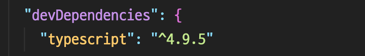

## 📚 강의 정리

Node.js를 기반으로 자바스크립트 환경 세팅하는 방법에 대해서 학습해보자.
Deno를 사용한다면 개발 환경 세팅이 간단하겠지만, 대부분 Node.js를 기반으로 하고 있기 때문에 기본적으로 Node.js를 알아야 한다.
'본질의 중요성'이라는 관점에서 보면 리액트도 비슷한 것 같다. 리액트를 쉽고 편하게 사용하려면 자바스크립트를 깊게 이해하고 있어야 한다는 것.

## JavaScript 개발 환경 (Node.js) 세팅

첫 번째로 해야할 일은 Node.js를 설치하고, 프로젝트를 진행할 수 있도록 Node.js 패키지를 만들어야 한다.
프로젝트를 진행할 때마다 항상 같은 버전을 쓸 수 없는 상황이 생긴다.

예를 들면 프로젝트 때 사용할 외부 패키지가 해당 버전을 지원하지 않는 경우가 있다. 그래서 여러 버전을 설치해야하는 경우들이 생기는데 이때 `fnm` 을 사용하면 편리하다.

```jsx
// install fnm
brew install fnm

// ~/.zshrc에 환경변수 추가하기
eval "$(fnm env)"
```

> iterm에서 작업을 진행했는데, `~/.zshrc`에 코드를 입력하고 난 후 프로그램을 종료했다가 다시 실행해야 해당 변수를 인식한다. **_(fnm env를 찾을 수 없다는 오류때문에 해결하기 위해서 공식문서에 있는 해결책도 써봣지만 아주 간단히 해결할 수 있는 문제였다..🥲)_**

<br>

LTS(Long Term Support) 버전을 설치하자.

```jsx
// Node.js LTS 버전 설치
fnm intall --lts

// 설치된 리스트 확인하기
fnm list

// 지정한 버전 default로 설정하기
fnm default $(fnm current)

// 현재 기준 LTS 최신버전 확인하기
node -v
```

<br>

## TypeScript + React + Jest + ESLint + Parcel 개발 환경 세팅

프로젝트에 필요한 환경들을 세팅해야할 때 어떤 순서로 진행하면 좋을까?

순서로 기억해서 습관을 들여보자 👏🏻

1. 프로젝트 폴더 생성
2. npm init -y
3. .gitignore 파일 생성
4. 타입스크립트 설치
5. ESLint 설치
6. 리액트 설치
7. 테스팅 도구(Jest) 설치
8. Parcel 설치

<br>

하나씩 자세히 살펴보면 다음과 같다.

1. 프로젝트 폴더 생성

   ```jsx
   // my-project 라는 폴더 생성
   mkdir my-project
   // 만든 폴더로 이동
   cd my-project
   // VSCode로 해당 폴더 열기
   code .
   ```

   <br>

2. npm init -y

   - npm init 명령어는 Node.js 프로젝트를 시작할 때 사용하는 명령어
   - 프로젝트의 이름, 버전, 설명, 기술과 같은 정보를 입력한다.
   - 이 정보를 입력하면 `package.json` 파일을 생성하고 내가 입력한 정보들이 이 곳에 저장된다.
   - `npm init -y` 명령어를 실행하면 정보를 입력하지 않아도 package.json이 생성된다. 이후 package.json에 정보를 수정할 수 있다.

<br>

3. `.gitignore` 파일 생성

   - .gitignore 파일은 필수
   - 실행되는 모든 패키지가 저장되어있는 node_modules 폴더는 매우매우 무겁고 올릴 필요가 없다.
   - .gitignore는 Git에게 '여기 써져있는 폴더나 파일은 신경쓰지 말아줘'라는 전달해주는 역할을 한다.
   - .gitignore 파일을 쉽게 만들 수 있는 사이트(https://www.toptal.com/developers/gitignore/)

<br>

4. 타입스크립트 설치

   ```jsx
   npm i -D typescript
   ```

   - -D가 붙는 이유는? 👉🏻 타입스크립트는 개발자가 사용하기 위한 도구이지, 배포할 때는 필요가 없기 때문이다.
   - `--save-dev`를 줄여서 `-D`라고 쓸 수 있다. 이 옵션으로 설치된 패키지는 devDependecies에 들어간다.
     

   ```jsx
   npx tsc --init
   ```

   - tsc는 타입스크립트 컴파일러
   - npm으로 설치를 하고나면 node_modules에 .bin 폴더에 실행 파일이 생겨있는걸 볼 수 있다.
   - 실행시키려면? 👉🏻 `./node_modules/.bin/tsc` 로 실행 시킬 수 있다.
     - 그럼 npx 명령어를 쓰는 이유는 뭘까?
     - 첫 번째로 써야하는 코드의 길이가 줄어든다. `./node_modules/.bin/`를 모두 지우고 `npx tsc`만 입력했을 때 동일하게 동작한다.
     - 두 번째 이유로는 로컬에 설치하지 않고도 프로그램을 실행시킬 수 있는 장점이 있다.
   - 명령어를 실행시키고 나면 tsconfig.json 파일이 만들어진다.
   - `tsconfig.json` 파일에서 한 가지 수정하기
     - `"jsx": "react-jsx"`

<br>

5. ESLint 설치

   ```jsx
   npm i -D eslint

   // typescript와 마찬가지로 설정파일을 만들어줘야함
   npx eslint --init
   ```

   - 설정을 모두 끝내면 .eslintrc.js 파일이 생성됨
   - `.eslintrc.js` 설정 수정하기
     - jest를 쓸거니까 `jest: true`미리 설정해놓기
   - **.eslintignore 파일 잊지말고 만들기**

<br>

6. 리액트 설치

   ```jsx
   npm i react react-dom

   // 타입스크립트를 사용하기 위한 패키지 설치
   // 타입스크립트와 동일하게 타입에 대한 부분은 배포될 때 필요한 것들이 아니기 때문 -D 옵션을 사용해 설치한다.
   npm i -D @types/react @types/react-dom
   ```

<br>

7. 테스팅도구 설치

   ```jsx
   npm i -D jest @types/jest @swc/core @swc/jest \
    jest-environment-jsdom \
    @testing-library/react @testing-library/jest-dom
   ```

   - jest는 들어본 적이 있는데, SWC가 뭐지? 👉🏻 [SWC](#swc)
   - jest가 기본적으로 타입스크립트와 SWC를 사용하지 않기 때문에 추가적으로 설정이 필요하다.
     - jest.config.js 파일 생성
     - 참고(https://github.com/ahastudio/CodingLife/blob/main/20220726/react/jest.config.js)

<br>

8. Parcel 설치
   - parcel을 사용해서 데브 서버를 띄울 수 있다.
   - index.html을 하나 만들어서 텍스트를 입력한 후 `npm run start`를 하면? 👉🏻 `Could not find entry:`라는 오류 메세지를 보여준다.
     - Node 같은 경우 실행할 때 package.json 이라는 파일에 main에 있는 파일을 entry point로 잡는다.
     - 하지만 우리는 웹 서버를 띄울 것이기 때문에 `"source": "./index.html"`를 적어주어야 한다.

---

## ✅ Keyword

### Node.js

🙋🏻‍♀️ Node.js란?

- Ryan Dahl이 개발한 JavaScript 런타임
- JavaScript를 사용해서 서버 측 애플리케이션을 개발할 수 있는 플랫폼
- Chrome V8 JavaScript 엔진을 사용하여 JavaScript 코드를 실행함

🙋🏻‍♂️ Node.js가 나타나게 된 배경은?

- 이전까지 JavaScript는 브라우저 환경에서만 동작했음
- V8 엔진의 성능이 크게 향상하면서 자바스크립트를 웹 브라우저가 아닌 곳에서도 사용하고자 하는 의견이 많아짐

<br>

### NPM(Node Package Manager)

🙋🏻‍♀️ NPM이란?

- Node Package Manager, Node.js의 패키지 관리자
- Node.js에서 사용되는 모듈이나 라이브러리를 쉽게 설치, 삭제, 관리할 수 있도록 도와준다.
- `npm` 명령어를 사용해서 패키지를 검색하고 설치하는 작업을 수행할 수 있음

🙋🏻‍♂️ NPM이 탄생하게 된 배경이 있을까?

- Node.js는 여러 개의 모듈이 필요한 애플리케이션을 만들 때 발생하는 문제를 해결하기 위해 2010년 Isaac Z. Schlueter가 개발
- 초기에는 Node.js와 함께 배포되지 않았으나, Node.js 개발자들 사이에서 빠르게 인기를 얻어, 2011년부터 Node.js와 함께 배포되기 시작

### package.json / pacakge-lock.json

🙋🏻 `npm init`을 하면 package.json이 만들어지는데 package.json의 역할은 무엇일까?

- package.json은 Node.js 프로젝트에서 필수적으로 사용되는 파일
- 프로젝트의 메타데이터와 의존성 정보를 담고 있는 파일
- 이 파일을 통해 npm이 필요한 패키지를 자동으로 설치하고, 프로젝트에서 사용하는 스크립트를 쉽게 실행할 수 있음

🙋🏻‍♂️ package-lock.json의 역할은?

- package.json을 보면 모듈의 버전 정보는 틸드(~)로 명시되어있음. 즉, package.json에서는 버전정보를 저장할 때 version range를 사용한다.
- package.json만을 이용해서 모듈들을 설치한다면? 👉🏻 같은 프로젝트를 진행하는 누군가는 4.16.1 버전을 사용하고, 누군가는 4.16.2 버전을 사용하는 경우가 생김. 이 때 버전이 맞지 않아 에러가 발생할 수도 있음
- 이 때 필요한 것이 package-lock.json. package-lock.json에는 버전명이 정확히 명시되어 있음

🙋🏻‍♂️ npm init을 했을 때에는 package.json만 생성된다. 그렇다면 package-lock.json은 언제 생길까?

- npm 공식문서에 따르면, package-lock.json은 npm이 node_modules트리 또는 package.json이 수정될 때, 자동으로 생성됨
- 간단히 말하면 npm install 했을 때 생성되면 이해가 쉽다.

🙋🏻‍♂️ package-lock.json과 package.json의 차이점을 정리하면?

- package.json 파일은 프로젝트의 메타데이터와 의존성 정보를 제공하는 역할
- package-lock.json 파일은 패키지의 정확한 의존성 정보와 버전 정보를 제공하며, 의존성 버전의 일관성을 보장하는 역할

<br>

### node_modules

🙋🏻‍♂️ node_modules란?

- npm을 통해 프로젝트에서 사용하는 패키지들을 설치하면 해당 패키지들의 소스 코드와 의존성 모듈들이 node_modules 디렉토리에 저장됨
- node_modules 디렉토리는 일반적으로 repository에 포함하지 않고, 개발자 로컬에 각자 설치하도록 한다.

🙋🏻 node_modules 안에 .bin 폴더의 역할은 뭘까?

- node_modules/.bin 폴더는 Node.js 프로젝트에서 사용하는 패키지들의 실행 파일(binaries)을 저장하는 폴더
- 이 폴더는 패키지가 제공하는 CLI(Command Line Interface) 도구나 스크립트를 실행할 수 있도록 도와준다.

<br>

### npx

🙋🏻 npm이랑 비슷하게 생겼는데 npx는 뭘까?

- Node.js 패키지 실행 도구로, npm 5.2.0 버전부터 새로 추가된 도구
- npx를 사용하면 로컬에 설치된 패키지를 간단하게 실행시키거나, 인터넷에서 바로 실행하고 다운로드할 수 있음
- npm이 관리를 하는 역할이라면, npx는 실행하는 역할이라고 할 수 있다.

🙋🏻‍♀️ npx가 등장하게 된 배경은?

- 과거 npm으로 설치할 때 두 가지 케이스가 존재했음
  1.  전역으로 패키지를 설치하여 관리하는 방법
  2.  특정 프로젝트에만 라이브러리를 설치하는 방법
- 전역이나 로컬에 설치가 되었을 때 패키지가 업데이트 되면 전역에서 따로 업데이트를 해주고, 로컬에서도 따로 업데이트를 해줘야하는 불편함이 발생
- 이러한 문제를 해결할 수 있는 도구가 npx

<br>

### ES Modules Vs. Common JS

🙋🏻‍♂️ ES Modules이란?

- ECMAScript 6에서 추가된 모듈 시스템
- CommonJS나 AMD 등 다른 모듈 시스템과 달리, ES Modules는 브라우저 환경에서 사용할 수 있다.

🙋🏻‍♂️ ES Modules 특징은 무엇이 있을까?

- 자바스크립트 파일 당 하나의 모듈로 정의, 모든 파일은 모듈 스코프를 가지게 된다.
- 모듈은 별도의 파일에 정의되며, export 키워드를 사용하여 모듈에서 내보낼 변수, 함수, 클래스 등을 지정
- 다른 모듈에서 export 키워드와 import 키워드를 사용하여 내보낸 변수, 함수, 클래스 등을 가져올 수 있다.

🙋🏻‍♂️ ES Modules을 사용했을 때 이점은?

- 자바스크립트 파일 당 하나의 모듈로 정의되므로, 코드의 구조가 더욱 명확해진다.
- 필요한 모듈만 가져와 사용할 수 있으므로, 불필요한 코드의 로딩을 줄일 수 있음

🙋🏻‍♀️ CommonJS란?

- 자바스크립트의 모듈 시스템 중 하나로, Node.js에서 기본적으로 사용됨

🙋🏻‍♀️ CommonJS의 특징은?

- 모듈은 별도의 파일에 정의됨
- 모듈에서 내보내고자 하는 변수, 함수, 클래스 등을 **module.exports** 객체에 할당
- 다른 모듈에서 require 함수를 사용하여 모듈을 가져올 수 있음

🙋🏻 React에서는 ES Modules와 CommonJS 둘 중 무엇을 사용할까?

- 리액트에서는 ES Modules를 사용하고 있음
- 하지만 대부분 모듈은 CommonJS로 구성되어있는 경우가 많아, CommonJS로 작성된 코드를 ES Modules롤 바꾸는 작업이 필요한데 해당 작업은 컴파일러가 진행한다.

---

## 🐋 Supplement

### Deno

💬 Deno를 사용하면 Node.js로 작업환경을 세팅할 때보다 훨씬 편하다고 했는데, Node.js와 어떤 차이점이 있는걸까?

- 모듈 시스템: Deno는 ES Modules를 기본적으로 지원하며, import 문으로 모듈을 가져오는 반면, Node.js는 CommonJS를 사용하며, require 함수로 모듈을 가져온다. (Node.js도 컴파일러를 사용하면 ES Modules을 사용할 수 있다!)
- 기본 모듈: Deno는 기본적으로 TypeScript, Promises, Async/Await, Fetch API 등을 지원한다. 반면, Node.js는 이러한 모듈을 사용하기 위해 추가적인 모듈 설치가 필요하다.
- JavaScript와 TypeScript: Deno는 기본적으로 TypeScript를 지원하며, TypeScript 파일을 직접 실행할 수 있다. Node.js는 TypeScript 파일을 실행하기 위해서는 TypeScript 컴파일러와 같은 추가 도구가 필요하다.

> 이래서 Deno를 사용하면 훨씬 편리하다고 했다보다..👍🏻 Deno가 기본적으로 제공해주는 것들을 Node.js에선 하나하나 설치를 해야했는데 말이다.

<br>

### fnm(Fast Node Manager) Vs. nvm(Node Version Manager)

💬 nvm은 노드 버전 관리자로 여러 개의 노드 버전을 관리하는 역할을 하는 것으로 배운 적이 있다. fnm은 이번 기회에 처음 알게 되었는데 nvm 대신 fnm을 사용하는 이유가 있을까?

- fnm은 Rust로 작성된 프로그램으로 실행속도가 빠르다. nvm보다 더 빠르고 가볍다는 장점이 있다.

<br>

### dependencies / devDependecies

💬 dependencies의 역할은?

- 코드 실행에 필요한 패키지를 포함
- Express, React 등과 같은 라이브러리는 배포 환경에서도 필요하다.

💬 devDependencies의 역할은?

- 개발을 위해 필요한 도구들을 포함
- 테스트 프레임(Jest), ESLint와 같은 패키지를 devDependencies에 설치한다.

> _차를 만들어낼 때 자동차 부품은 필수적이지만 자동차 정비사가 듣는 음악은 차를 잘 만들어내기 위해 필요한 도구인거지 🔨_

<br>

### SWC

💬 SWC란?

- stands for Speedy Web Compiler
- Rust로 작성된 JavaScript/TypeScript 컴파일러
- 속도와 성능 개선에 초점을 맞추고 있으며, 기존의 Babel 등의 트랜스파일러를 압도적으로 뛰어넘는 성능을 보여줌

💬 SWC가 빠른 이유가 뭘까?

- Rust 언어로 작성되어있다.
  - Rust는 메모리 안정성과 고성능을 동시에 제공하는 저수준 언어로, 매우 빠른 속도와 낮은 메모리 사용량을 가지고 있음
- SWC는 필요한 최소한의 변환만 수행한다.
  - Babel과는 다르게 플러그인을 적용할 때 필요한 최소한의 변환만 수행한다. 이로 인해 SWC는 불필요한 변환 작업을 하지 않아 빠른 속도를 보장할 수 있다.
