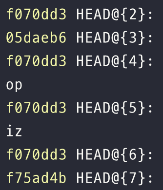

# 삭제된 브랜치 복구하기

`git reflog`

: 이전에 커밋을 남긴 로그를 확인할 수 있다.&#x20;

<figure><figcaption></figcaption></figure>

복구하고 싶은 커밋의 HEAD@{number}를 찾는다.&#x20;

`git checkout -b [브랜치명] HEAD@{2}`

해당 커밋이 새로운 브랜치로 복구된다.&#x20;
