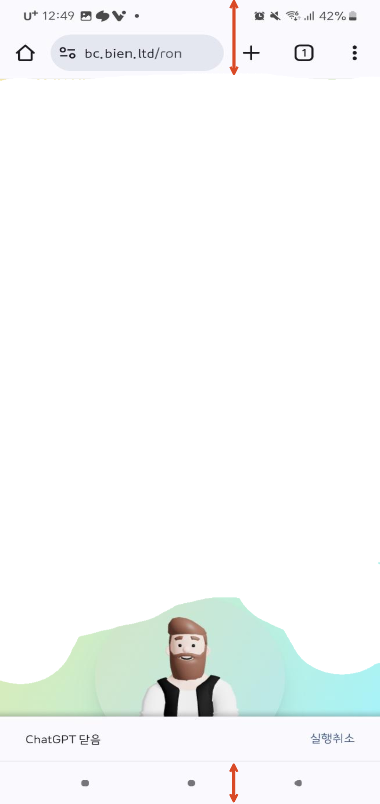

# 크롬 모바일 브라우저에서 100vh 적용하는 방법

크롬 모바일 브라우저에서 `h-screen`, 즉 `height: 100vh;`를 적용하면 예상과 다르게 만들어진다.


## 원인

vh가 정확히 어떻게 동작하는지 이해해보자.


vh는 viewport height에 해당하는 단위로 브라우저의 높이에 따라서 상대적으로 적용되는 단위이다. (1vh는 뷰포트 높이의 1%이다.)

예를 들어, 화면의 높이가 100px이라면 1vh는 1px이 된다.


👉🏻 모바일에서는 상단에 위치한 URL바와 하단에 위치한 네비게이션바도 영역으로 인식하기 때문에 100vh를 설정하더라도 아래 혹은 윗 부분이 잘리는 현상이 발생하는 것이다.

<div align="left">

<figure><figcaption></figcaption></figure>

</div>


## 첫 번째 해결방법 👉🏻 window.innerHeight

```tsx
const [innerHeight, setInnerHeight] = useState(0);
useEffect(() => {
  if (typeof window !== 'undefined') {
    setInnerHeight(window.innerHeight);
  }
});
```

```tsx
return <div style={{ height: innerHeight }}>{children}</div>;
```

useEffect hook을 사용해 처음 화면이 렌더링 될 때의 window.innerHeight 값을 저장한 후, style로 적용시킨다.


***

## 두 번째 해결 방법 👉🏻 dvh, svh, lvh

### dvh (Dynamic Viewprot Height)

: 주소 표시줄이 스크롤을 통해 축소가 되든 노출이 되고있든 상관 없이 현재 보여지는 뷰포트 톺이를 동적으로 가져온다. 모바일 디바이스에서 주소 창이 스크롤에 따라 사라지거나 나타나면서 뷰포트 높이가 변할 때 유용하다.&#x20;


### svh (Short Viewport Height)

: 사용자 화면 기준으로 가장 짧은 뷰포트를 가져온다. 주소 표시줄이 없어져도 기존 주소 표시줄의 높이 값을 뺀 나머지 값을 가져온다.&#x20;


### lvh (Large Viewport Height)

: svh와는 반대로 가장 긴 뷰포트를 가져온다. 주소 표시줄이 있더라도 주소 표시줄이 없을 때의 총 화면 길이를 가져온다.&#x20;


_**✅ 주소 표시줄의 유무에 따라 뷰포트의 높이가 가변적으로 변할 때를 고려하여 dvh를 사용하는 것이 적합하다**_

