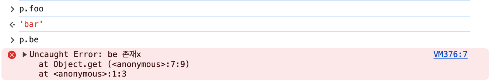

# Proxy 객체 활용하기

Proxy 객체 언제 사용하면 좋을까? 👉🏻 _**객체의 없는 속성들에 접근하면 undefined가 아닌 에러를 내보내고 싶을 때**_


```javascript
const o = { foo: 'bar' };
const p = new Proxy(o, {
  get(target, prop) {
    if (prop in target) {
      return target[prop];
    }
    throw new Error(`${prop} 존재x`);
  },
});
```

<figure><figcaption></figcaption></figure>
