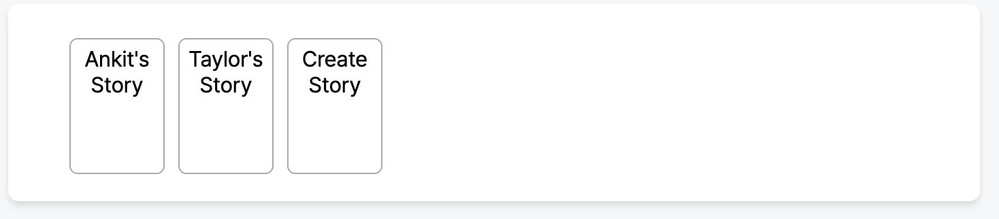

# JSX

## 📚 강의 정리

## JSX

- "XML-like syntax extension to ECMAScript"
- JSX는 XML과 유사한 문법
- JSX에서 가장 중요한 것은? 문법 확장이라는 것

JSX는 React를 만들면서 나온 리액트의 부산물과 같다.하지만 JSX를 리액트에서만 사용하는 것은 아니다.  
Vue.js에서도 JSX를 사용할 수 있다.



### JSX는 HTML이 아니다

HTML과 매우 비슷하게 생겼지만, XML과 비슷한 특징을 가지고 있다.

XML은 보다 더 엄격한 문법을 가지고 있으며, 태그와 속성의 이름이나 값 등이 반드시 큰 따옴표로 둘러싸여야 한다. JSX에서도 이러한 특징이 나타난다.

예를 들면, <br> 태그를 HTML에서는 self-closing 태그가 없어도 사용가능하지만 XML에서는 `<br />` 처럼 작성해야 오류가 생기지 않는다.



JSX는 XML처럼 작성된 부분을 React.createElement을 쓰는 JavaScript 코드로 변환한다.
중괄호를 써서 JavaScript 코드를 그대로 쓸 수 있고, 결국은 **JavaScript 코드와 1:1로 매칭**된다.

<br />

🚀 **JSX를 사용하는 방법**

```jsx
// Using JSX to express UI Components
var dropdown =
  <Dropdown>
    A dropdown list
    <Menu>
      <MeneItem>Do Something</MeneItem>
      <MeneItem>Do Something Fun</MeneItem>
      <MeneItem>Do Something Else</MeneItem>
    </Menu>

render(dropdown);
```

JSX코드를 JavaScript 코드로 변환하는 방법 👉🏻 변환기 중 제일 유명한 [Babel](https://babeljs.io/repl#?browsers=defaults%2C%20not%20ie%2011%2C%20not%20ie_mob%2011&build=&builtIns=false&corejs=3.21&spec=false&loose=false&code_lz=Q&debug=false&forceAllTransforms=false&modules=false&shippedProposals=false&circleciRepo=&evaluate=false&fileSize=false&timeTravel=false&sourceType=module&lineWrap=true&presets=env%2Creact%2Cstage-2&prettier=false&targets=&version=7.21.3&externalPlugins=&assumptions=%7B%7D)로 확인 가능.

> “Presets”에서 “react”를 체크하거나, “Plugins”에서 “@babel/plugin-transform-react-jsx”를 추가하면 JSX를 실험할 수 있다.

<br />

예제코드 보면서 JSX와 익숙해지기

### Example 1

```jsx
// JSX 코드
<p>Hello, world!</p>;

// 변환된 JS 코드
/*#__PURE__*/ React.createElement('p', null, 'Hello, world');
```

`/* @jsx */`를 코드 상단 주석에 작성하면 JSX를 JS로 변환할 때 React.createtElement가 아닌 작성한 이름대로 코드가 변환된다.

만약 리액트가 아닌 외부에서 JSX를 사용하고 싶다면 이 방식을 사용한다.

```jsx
/* @jsx Reeact.createElement */

<p>Hello, world</p>;

// 변환된 JS 코드
/* @jsx Reeact.createElement */

Reeact.createElement('p', null, 'Hello, world');
```

<br />

### Example 2

```jsx
// JSX 코드
<Greeting name="world" />;

// 변환된 JS 코드
/*#__PURE__*/ React.createElement(Greeting, {
  name: 'world',
});
```

- Greeting은 기본 태그가 아닌 사용자가 만든 컴포넌트
- 변환 코드에서도 첫 번째 인자에 Greeting 함수가 그대로 들어간다.

```jsx
function Greeting({ name }) {
  return <p>Hello, {name}</p>;
}

<Greeting name="world" />;

// JS 변환 코드
function Greeting({ name }) {
  return /*#__PURE__*/ React.createElement('p', null, 'Hello, ', name);
}
/*#__PURE__*/ React.createElement(Greeting, {
  name: 'world',
});
```

- `React.createElement(Greeting, {name: 'world',}`
  - 변환을 하지 않고 Greeting 함수를 그대로 넣어준 것을 볼 수 있다. 👉🏻 함수는 일급 객체이기 때문
- 두 번째 인자에는 `{name:'world'}` 👉🏻 속성들을 전달하는 자리
- 전달해야 할 속성이 2개 이상이라면 `{name: 'world', age: '13'}`
- 문자열이 아닌 숫자타입의 값을 주고 싶다면 `<Greeting name="world" age={13} />` 와 같이 전달한다.

<br />

### Example 3

```jsx
<Button type="submit">Send</Button>;

// 변환된 JS 코드
React.createElement(Button, { type: 'submit' }, 'Send');
```

onClick 이벤트를 추가하는 경우

```jsx
<Button onClick={onClickHandler} type="submit">
  Send
</Button>;

// 변환된 JS 코드
/*#__PURE__*/ React.createElement(
  Button,
  {
    onClick: onClickHandler,
    type: 'submit',
  },
  'Send'
);
```

- 속성에 대한 Object를 두 번째 인자에 넘겨준다.

<br />

### Exmaple 4

```jsx
<p>Hello, world!</p>
<Button type="submit">Send</Button>

// Error
/repl.jsx: Adjacent JSX elements must be wrapped in an enclosing tag. Did you want a JSX fragment <>...</>? (2:0)
```

오류가 발생하는 이유

- 명시적으로 각각 따로 호출하면

  ```jsx
  React.createElement('p', null, 'Hello, world!');

  React.createElement(
    Button,
    {
      type: 'submit',
    },
    'Send'
  );
  ```

- 두 개를 묶어서 호출하게 되면 함수를 한 줄에 연속으로 두 개 호출한 것과 동일하다.

  ```jsx
  add(2, 4) add(3, 5);

  React.createElement('p', null, 'Hello, world!') React.createElement(Button, { type: 'submit', },'Send')
  ```

React.Fragment

```jsx
<React.Fragment>
  <p>Hello, world!</p>
  <Button type="submit">Send</Button>
</React.Fragment>;

// JS 변환 코드
React.createElement(
  React.Fragment,
  null,
  React.createElement('p', null, 'Hello, world!'),
  React.createElement(
    Button,
    {
      type: 'submit',
    },
    'Send'
  )
);
```

- `<React.Fragment>` 대신 `<></>`을 사용할 수도 있다.
- 변환된 JS 코드는 동일

```jsx
<div className="test">
  <p>Hello, world!</p>
  <Button type="submit">Send</Button>
</div>;

// 변환된 JS 코드
React.createElement(
  'div',
  { className: 'test' },
  React.createElement('p', null, 'Hello, world!'),
  React.createElement(Button, { type: 'submit' }, 'Send')
);
```

- 첫 번째 인자: 태그
- 두 번째 인자: 속성 값
- 세 번째 인자: `React.createElement('p', null, 'Hello, world!')`
- 네 번째 인자: `React.createElement(Button, { type: 'submit' }, 'Send')`

React Runtime 옵션을 사용하면 코드가 조금 달라진다.

```jsx
<React.Fragment>
  <p>Hello, world!</p>
  <Button type="submit">Send</Button>
</React.Fragment>;

// 변환된 JS 코드
import { jsx as _jsx } from 'react/jsx-runtime';
import { jsxs as _jsxs } from 'react/jsx-runtime';

/*#__PURE__*/ _jsxs(React.Fragment, {
  children: [
    /*#__PURE__*/ _jsx('p', {
      children: 'Hello, world!',
    }),
    /*#__PURE__*/ _jsx(Button, {
      type: 'submit',
      children: 'Send',
    }),
  ],
});
```

- 강의에서 본 것과는 코드가 살짝 다르다. (그 사이에 업데이트 된 것 같다.)
- react/jsx-runtime에서 가져온 `_jsx`를 사용한다. 👉🏻 이 코드가 요즘의 JSX

<br />

### Example 5

```jsx
<div>
  <p>Count: {count}!</p>
  <button type="button" onClick={() => setCount(count + 1)}>
    Increase
  </button>
</div>;

// 변환된 JS코드
React.createElement(
  'div',
  null,
  React.createElement('p', null, 'Count: ', count, '!'),
  React.createElement(
    'button',
    {
      type: 'button',
      onClick: () => setCount(count + 1),
    },
    'Increase'
  )
);
```

- jsx는 태그안에서 text와 JavaScript 값으로만 구분을 한다.
- {' '}을 이용하면 createElement에 추가된다.

<br />

## React Element

- [JSX 없이 사용하는 React](https://ko.reactjs.org/docs/react-without-jsx.html)
- [createElement](https://beta.reactjs.org/reference/react/createElement)

```jsx
function Greeting({ name }) {
  return <p>Hello, {name}</p>;
}

// JSX 코드를 쓰지 않고 React.createElement를 써서 리액트를 사용해도 된다.

function Greeting({ name }) {
  return React.createElement('p', null, 'Hello, ', name);
}
```

그럼 JSX를 사용하는 이유가 뭘까?  
: React.createElement를 쉽게 사용하도록 하기 위해



### JSX 대신 React.createElement를 써서 React Element 트리를 갱신하는데 쓸 수 있다.

`document.createElement('div')`를 하면 div element가 만들어지는 것과 동일하다.

React.createElement를 직접 쓰면 복잡하기 때문에 jsx-runtime에서는 \_jsx, Preact는 h란 함수를 지원한다.



<br />

## Virtaul DOM

- [Virtaul DOM](https://ko.reactjs.org/docs/faq-internals.html)
- [재조정 (Reconciliation)](https://ko.reactjs.org/docs/reconciliation.html) 👉🏻 [Reconciliation(재조정) 내용 정리 🦖](#)

화면을 갱신하려면 DOM을 바꿔줘야한다.

```jsx
// DOM을 직접 조작한 경우
document.querySelector('.btn').textContent = '변경';
```

리액트는 바로 DOM을 조작하는 것이 아니라 화면 조작에 쓸 가상의 DOM 트리를 만들어서 사용한다. 👉🏻 [Virtual DOM과 Internals](#virtual-dom과-internals)



우리는 매번 작은 React Element 트리, VDOM 트리를 만든다. VDOM은 실제 DOM과 비교를 통해 변경사항을 적용한다.



## Virtual DOM을 쓰는 이유?



Virtual DOM를 사용하는 이유는 빠르기 때문이다.  
👉🏻 사실은 그렇지 않다!



가장 중요한 이유는 바로 아래 문장과 같다.

> 이 접근방식이 React의 선언적 API를 가능하게 합니다.

만약 신중하게 코드를 작성하고 어떤 데이터가 들어왔을 때 신중하게 DOM을 업데이트해야한다면 충분히 만들 수 있다. 하지만 리액트의 Virtual DOM을 사용한다면 신중하게 코드를 짜지 않아도 일단 넣으면 알아서 효율적인 렌더링을 해준다는 것.

애플리케이션을 만들 때 어디가 균형점일까?  
적절하게 빠르고 유지보수가 가능 vs 빠른 건 매우 빠름

👉🏻 리액트는 첫 번째를 선택(이게 바로 Virtual DOM)

- VDOM이 무엇이고, 왜 쓰는지 안다면 활용할 수 있는 [최적화 기법](https://ko.reactjs.org/docs/optimizing-performance.html)이 존재함.

---

## ✅ Keyword

### React에서 JSX를 사용하는 목적

- 트리 구조를 정의하기 위한 간결하고 친숙한 구문을 정의하는 것
- 자바스크립트 코드로도 작성할 수 있지만, 트리구조를 직관적으로 볼 수 있기 때문에 사용한다고 생각하면 된다.

React.createElement자바스크립트로도 작성할 수 있다. 하지만 JSX를 사용하는 이유는 트리 구조를 더 직관적으로 확인할 수 있기 때문이다. 이로 인해 코드 가독성이 향상되며 개발자가 코드를 이해하고 유지보수하기 쉬워진다.

<br />

### Syntactic sugar

[Syntactic_sugar](https://en.wikipedia.org/wiki/Syntactic_sugar)

컴퓨터 과학 용어로, Syntactic sugar는 프로그래밍 언어 내에서 더 쉽게 읽거나 표현할 수 있도록 설계된 구문

문법적 설탕은 프로그래밍 언어의 기능이나 동작을 변경하지 않지만, 코드를 작성하거나 읽을 때 더 쉽게 이해하도록 하는 역할을 한다.

- Peter J. Landin이 1964년에 발표한 논문 "The Next 700 Programming Languages"에서 처음 사용
- 이 논문에서 Landin은 "프로그래밍 언어는 문법적 설탕을 지원하여 구문 구조를 더 직관적이고 읽기 쉽게 만들 수 있다"는 주장을 함

> **Syntatic salt**  
> : 문법적으로 불필요한 요소를 추가하지만, 코드를 작성하거나 읽을 때 더 편리하고 가독성이 높은 방식으로 표현하는 것을 의미

<br />

### React.createElement

[createElement](https://beta.reactjs.org/reference/react/createElement#reference)

createElement를 사용하면 React element를 생성할 수 있다.  
_(React.createElement는 JSX코드와 1대1로 매칭된다.)_

```jsx
React.createElement(type, [props], [...children]);
```

React.createElement() 메소드를 호출할 때마다 React를 앞에 붙이는 것은 번거롭다면 React 모듈에서 createElement() 함수를 가져와서 사용

```jsx
import { createElement } from 'react';

const element = createElement(type, props, ...children);
const element = createElement('h1', { className: 'greeting' }, 'Hello, world!');
// <h1 className="greeting">Hello, world!</h1>
```

- type: 태그 문자, React 컴포넌트(함수, 클래스 또는 Fragment와 같은 특수 컴포넌트)
- props: 객체이거나 null, null을 전달하면 빈 객체와 동일하게 처리된다.
- optional: 0개 이상의 자식 노드,
  - React 엘리먼트, 문자열, 숫자, 포털, 빈 노드(null, 정의되지 않음, true, false), React 노드의 배열을 포함한 모든 React 노드가 될 수 있다.

<br />

### React Element

: DOM 요소 또는 컴포넌트 인스턴스를 나타내는 일반적인 JavaScript 객체

예를 들어, `<Greeting name="Taylor" />` 와`createElement(Greeting, { name: 'Taylor' })`는 모두 객체를 만들어낸다.

```jsx
// Slightly simplified
{
  type: Greeting,
  props: {
    name: 'Taylor'
  },
  key: null,
  ref: null,
}
```



### 이 객체를 생성해도 Greeting 컴포넌트가 렌더링되거나 DOM element가 생성되는 것은 아니다.

App 컴포넌트에서 이 객체를 반환함으로써 React에게 다음에 할 일을 지시할 수 있다.

element를 생성하는 것은 매우 저렴하므로 최적화하거나 피하려고 노력할 필요가 없다.



<br />

### React StrictMode

[StrictMode](https://beta.reactjs.org/reference/react/StrictMode)  
: `<StrictMode>`를 사용하면 개발 중에 컴포넌트에서 흔히 발생하는 버그를 조기에 발견할 수 있다.

```jsx
<StrictMode>
  <App />
</StrictMode>
```

**Reference**

내부의 전체 컴포넌트 트리에 대한 추가 개발 동작 및 경고를 활성화할 수 있음

```jsx
import { StrictMode } from 'react';
import { createRoot } from 'react-dom/client';

const root = createRoot(document.getElementById('root'));
root.render(
  <StrictMode>
    <App />
  </StrictMode>
);
```

Strict Mode에선 아래와 같은 개발 전용 동작이 활성화된다.

- 컴포넌트가 불완전한 렌더링으로 인한 버그를 찾기 위해 추가 시간을 들여 리렌더링 한다.
- 컴포넌트가 이펙트 정리가 누락되어 발생한 버그를 찾기 위해 한 번 더 다시 이펙트를 실행한다.
- 컴포넌트에서 더 이상 사용되지 않는 API의 사용 여부를 확인한다.

<br>

**Usage**

### [Enabling Strict Mode for entire app](https://beta.reactjs.org/reference/react/StrictMode#enabling-strict-mode-for-entire-app)

: 전체 app에 Strict Mode 활성화

Strict Mode를 사용하면 `<StrictMode>` 컴포넌트 내부의 전체 컴포넌트 트리에 대해 개발 전용 검사를 추가로 수행할 수 있다. 👉🏻 이러한 검사를 통해 컴포넌트의 일반적인 버그를 발견할 수 있음

전체 앱에 Strict 모드를 사용하려면 렌더링할 때 루트 컴포넌트를 <StrictMode>로 래핑:

```jsx
import { StrictMode } from 'react';
import { createRoot } from 'react-dom/client';

const root = createRoot(document.getElementById('root'));
root.render(
  <StrictMode>
    <App />
  </StrictMode>
);
```

### [Enabling strict mode for a part of the app](https://beta.reactjs.org/reference/react/StrictMode#enabling-strict-mode-for-a-part-of-the-app)

: 앱의 일부분에 Strict Mode 활성화

애플리케이션의 일부분에 Strict Mode를 활성화 시킬 수 있다.

```jsx
import { StrictMode } from 'react';

function App() {
  return (
    <>
      <Header />
      <StrictMode>
        <main>
          <Sidebar />
          <Content />
        </main>
      </StrictMode>
      <Footer />
    </>
  );
}
```

- 위 예제에서는 Header와 Footer 컴포넌트에는 Strict Mode가 적용되지 않음

### [Fixing bugs found by double rendering in development](https://beta.reactjs.org/reference/react/StrictMode#fixing-bugs-found-by-double-rendering-in-development)

: 개발 단계에서 이중 렌더링으로 인한 버그 수정

리액트는 작성한 모든 컴포넌트가 순수함수라고 가정한다. 즉, 작성한 React 컴포넌트는 동일한 입력(state, 프로퍼티, 컨텍스트)가 주어지면 항상 동일한 JSX를 반환해야 한다.

👉🏻 이 규칙을 위반하는 컴포넌트는 예측할 수 없는 동작을 하며, 버그를 유발

불순한 코드를 찾을 수 있수 있도록 Strict Mode는 개발 과정에서 일부 함수를 두 번 호출한다.

- 컴포넌트 함수 본문(이벤트 핸들러 내부의 코드는 포함되지 않음)
- useState, useMemo 또는 useReducer에 전달한 함수
- 생성자, 렌더링, shouldComponentUpdate와 같은 일부 클래스 컴포넌트 메서드

순수한 함수는 매번 동일한 결과를 생성하므로 두 번 실행해도 동작이 변경되지 않는다. 그러나 함수가 순수하지 못한 경우 두 번 실행하면 눈에 띄는 경향이 있으므로 버그를 조기에 발견하고 수정하는데 도움이 된다.

예를 들어, 이 `StoryTray` 컴포넌트는 stories 배열을 가져와 마지막에 'Create Story' 항목을 하나 더 추가합니다:

**index.js**

```jsx
import { createRoot } from 'react-dom/client';
import './styles.css';

import App from './App';

const root = createRoot(document.getElementById('root'));
root.render(<App />);
```

**App.js**

```jsx
import { useState } from 'react';
import StoryTray from './StoryTray.js';

let initialStories = [
  { id: 0, label: "Ankit's Story" },
  { id: 1, label: "Taylor's Story" },
];

export default function App() {
  let [stories, setStories] = useState(initialStories);
  return (
    <div
      style={{
        width: '100%',
        height: '100%',
        textAlign: 'center',
      }}
    >
      <StoryTray stories={stories} />
    </div>
  );
}
```

**StoryTray.js**

```jsx
export default function StroyTray({ stories }) {
  const items = stories;
  items.push({ id: 'create', label: 'Create Story' });
  return (
    <ul>
      {items.map((story) => (
        <li key={items.id}> {story.label} </li>
      ))}
    </ul>
  );
}
```



위 코드는 실수가 있지만, 초기 출력은 올바르게 나타나기 때문에 놓치기 쉽다. 어떤 실수를 했을까?

예를 들어, `StoryTray` 컴포넌트에 hover할 때마다 다른 배경색으로 리렌더링하도록 해보자.

```jsx
import { useState } from 'react';

export default function StroyTray({ stories }) {
  const [isHover, setIsHover] = useState(false);
  const items = stories;
  items.push({ id: 'create', label: 'Create Story' });

  return (
    <ul
      onPointerEnter={() => setIsHover(true)}
      onPointerLeave={() => setIsHover(false)}
      style={{
        backgroundColor: isHover ? '#ddd' : '#fff',
      }}
    >
      {items.map((story) => (
        <li key={story.id}>{story.label}</li>
      ))}
    </ul>
  );
}
```

- `StroyTray` 컴포넌트 위로 마우스를 가져갈 때마다 'Create Story'가 목록에 추가되는 것을 볼 수있음
- 위 코드의 의도는? 👉🏻 마지막에 한 번 추가하는 것

하지만 코드는 `StroyTray` 는 props로부터 stories 배열을 직접 수정한다. `StroyTray` 를 매번 렌더링할 때마다 동일한 배열 끝에 'Create Story'를 추가하고 있다. 즉, `StroyTray` 는 순수한 함수가 아니므로 여러 번 실행하면 다른 결과가 생성된다.

> 이 문제를 해결하려면 배열의 복사본을 만든 다음 원본 대신 해당 복사본을 수정하면 된다.

```jsx
export default function StoryTray({ stories }) {
  const items = stories.slice(); // Clone the array
  // ✅ Good: Pushing into a new array
  items.push({ id: 'create', label: 'Create Story' });
```

이렇게 되면 `StroyTray` 함수는 순수함수가 된다. 이 함수는 호출될 때마다 배열의 새 복사본만 수정하고, 외부 객체나 변수에 영향을 주지 않는다. 이렇게 하면 버그는 해결할 수 있지만, 컴포넌트의 동작에 문제가 생기기 전에 컴포넌트를 더 자주 렌더링해야 한다는 점에 주의하자.

원래 코드를 <StrictMode>로 래핑:

```jsx
import { StrictMode } from 'react';
import { createRoot } from 'react-dom/client';
import './styles.css';

import App from './App';

const root = createRoot(document.getElementById('root'));
root.render(
  <StrictMode>
    <App />
  </StrictMode>
);
```

**Strict Mode에서는 함수를 항상 두 번 호출하므로 실수를 바로 확인할 수 있다.** 프로세스 초기에 이러한 실수를 발견할 수 있다. 컴포넌트를 Strict Mode에서 렌더링하도록 수정하면 이전의 hover 기능과 같이 향후 프로덕션에서 발생할 수 있는 많은 버그도 수정할 수 있다.

### [Fixing bugs found by re-running Effects in development](https://beta.reactjs.org/reference/react/StrictMode#fixing-bugs-found-by-re-running-effects-in-development)

: 개발 단계에서 Effects를 다시 실행함으로써 발결된 버그 수정하기

Strict Mode는 Effects에서 버그를 찾는 데 도움이 된다.

모든 Effect에는 몇 가지 setup 코드가 있고 cleanup 코드가 있다. 일반적으로 React는 컴포넌트가 마운트될때(화면에 추가될 때) 설정을 호출하고 컴포넌트가 마운트 해제될 때(화면에 제거될 때) cleanup을 호출한다. 또한 React는 마지막 렌더링 이후 의존성이 변경된 경우 cleanup과 setup을 호출한다.

Strict Mode가 동작하면 React는 모든 이펙트에 대해 개발 과정에서 **extra setup+cleanup cycle**을 한 번 더 실행한다. 👉🏻 수동으로 잡기 어려운 미묘한 버그를 발견하는데 도움

Effects를 다시 실행하면 버그를 조기에 발견하는 데 어떻게 도움이 되는지 보여주는 예시:

컴포넌트를 채팅에 연결하는 예시

**index.js**

```jsx
import { createRoot } from 'react-dom/client';
import './styles.css';

import App from './App';

const root = createRoot(document.getElementById('root'));
root.render(<App />);
```

**App.js**

```jsx
import { useState, useEffect } from 'react';
import { createConnection } from './chat.js';

const serverUrl = 'https://localhost:1234';
const roomId = 'general';

export default function ChatRoom() {
  useEffect(() => {
    const connection = createConnection(serverUrl, roomId);
    connection.connect();
  }, []);
  return <h1>Welcome to the {roomId} room!</h1>;
}
```

**chat.js**

```jsx
let connections = 0;

export function createConnection(serverUrl, roomId) {
  // A real implementation would actually connect to the server
  return {
    connect() {
      console.log('✅ Connecting to "' + roomId + '" room at ' + serverUrl + '...');
      connections++;
      console.log('Active connections: ' + connections);
    },
    disconnect() {
      console.log('❌ Disconnected from "' + roomId + '" room at ' + serverUrl);
      connections--;
      console.log('Active connections: ' + connections);
    },
  };
}
```

문제가 명확하게 보이지 않기 때문에, 더 명확하게 파악하기 위해 기능을 구현해보자.

아래 예제에서는 roomId가 하드코딩되어 있지 않다. 대신 사용자가 드롭다운에서 연결하려는 룸아이디를 선택할 수 있다. "채팅 열기"를 클릭한 다음 다른 채팅방을 하나씩 선택하고 콘솔에서 활성 연결 수를 추적.

```jsx
import { useState, useEffect } from 'react';
import { createConnection } from './chat.js';

const serverUrl = 'https://localhost:1234';

function ChatRoom({ roomId }) {
  useEffect(() => {
    const connection = createConnection(serverUrl, roomId);
    connection.connect();
  }, [roomId]);

  return <h1>Welcome to the {roomId} room!</h1>;
}

export default function App() {
  const [roomId, setRoomId] = useState('general');
  const [show, setShow] = useState(false);
  return (
    <>
      <label>
        Choose the chat room:{' '}
        <select value={roomId} onChange={(e) => setRoomId(e.target.value)}>
          <option value="general">general</option>
          <option value="travel">travel</option>
          <option value="music">music</option>
        </select>
      </label>
      <button onClick={() => setShow(!show)}>{show ? 'Close chat' : 'Open chat'}</button>
      {show && <hr />}
      {show && <ChatRoom roomId={roomId} />}
    </>
  );
}
```

콘솔을 확인해보면 open connections가 항상 증가하는 것을 알 수 있다. 실제 앱에서는 성능 및 네트워크 문제가 발생할 수 있다. 문제는 **‘이펙트가 cleanup 기능이 없다는 것’**

```jsx
useEffect(() => {
  const connection = createConnection(serverUrl, roomId);
  connection.connect();
  return () => connection.disconnect();
}, [roomId]);
```

원래 문제가 있는 코드를 `<Strict Mode>`로 래핑하면?

- 사용하면 문제가 있음을 즉시 알 수 있다. (Active connection가 2로 점프)
- Strict Mode는 모든 Effect에 대해 setup + cleanup 사이클을 실행하기 때문
- 이 Effect는 cleanup 로직이 없으므로 추가 연결을 생성하지만 파괴하지는 않음 👉🏻 cleanup 함수가 누락되었다는 힌트

### [Fixing deprecation warnings enabled by Strict Mode](https://beta.reactjs.org/reference/react/StrictMode#fixing-deprecation-warnings-enabled-by-strict-mode)

: Strict Mode에서 활성화된 사용 중단 경고 수정

React는 <StrictMode> 트리 내의 컴포넌트가 이러한 더 이상 사용되지 않는 API 중 하나를 사용하는 경우 경고를 표시한다:

- findDOMNode
- Legacy context
- Legacy string refs

<br />

### Virtual DOM과 Internals

: ‘가상’적인 표현을 메모리에 저장하고 ReactDOM과 같은 라이브러리에 의해 ‘실제’ DOM과 동기화하는 프로그래밍 개념 👉🏻 이 과정을 **재조정**이라고 한다.

이 접근방식이 React의 선언적 API를 가능하게 한다.

React에게 원하는 UI 상태를 알려주면 DOM이 그 상태와 일치하도록 한다. 👉🏻 이러한 방식은 앱 구축에 사용해야 하는 어트리뷰트 조작, 이벤트 처리, 수동 DOM 업데이트를 추상화한다.



### 🔥 “virtual DOM”은 특정 기술이라기보다는 패턴에 가깝에 가깝다.

React에서 virtual DOM 👉🏻 보통 사용자 인터페이스를 나타내는 객체이기 때문에 React elements와 연관된다.

그러나 React는 컴포넌트 트리에 대한 추가 정보를 포함하기 위해 ‘fiber’라는 내부 객체를 사용한다.

- React Fiber: React 16의 새로운 재조정 엔진
- 이 프로그램의 주요 목표는 virtual DOM의 렌더링을 활성화하는 것



<br />

### DOM

: 문서 객체 모델(Document Object Model)은 HTML 문서의 프로그래밍 interface

- 문서의 구조화된 표현을 제공
- 프로그래밍 언어가 DOM 구조에 접근할 수 있는 방법을 제공 👉🏻 문서 구조, 스타일, 내용을 변경할 수 있음

DOM은 nodes와 object로 문서를 표현한다.

<br />

### DOM과 Virtual DOM의 차이

DOM은 브라우저에서 실제로 렌더링 되는 페이지의 요소를 나타낸다.

반면, Virtual DOM은 브라우저에서 동작하는 **DOM을 추상화한 개념**

- 실제 DOM을 복제한 가상의 객체
- 실제 DOM을 조작하지 않고 이전의 가상 객체와 현재 객체를 비교하여 변경된 부분만 최적화하여 실제 DOM에 반영한다.

<br>

### Reconciliation(재조정)

: Virtual DOM을 사용하여 UI의 변경사항을 처리하는 과정을 의미

- Reconciliation은 이전 상태와 현재 상태를 비교하여 변경된 부분만 실제 DOM에 적용하여 성능을 향상시키는 기술
- UI의 변화가 발생하면 이전 Virtual DOM과 현재 Virtual DOM을 비교하여 변경된 부분을 찾는다.
- React의 핵심 알고리즘 중 하나이며, React의 성능을 향상시키는 중요한 요소

React는 휴리스틱에 의존하고 있기 때문에, 휴리스틱이 기반하고 있는 가정에 부합하지 않는 경우 성능이 나빠질 수 있다.

- 알고리즘은 다른 컴포넌트 타입을 갖는 종속 트리들의 일치 여부를 확인하지 않는다.
- key는 반드시 변하지 않고, 예상 가능하며, 유일해야 한다.  
  변하는 key(Math.random()으로 생성된 값 등)를 사용하면 많은 컴포넌트 인스턴스와 DOM 노드를 불필요하게 재생성하여 성능이 나빠지거나 자식 컴포넌트의 state가 유실될 수 있다.

---

## 🐋 Supplement

### 추상화

: 복잡한 현실 세계에서 핵심적인 개념이나 기능을 간추려 내어 간략화하고 단순화 하는 것

복잡한 문제를 이해하고 해결하기 위해 필요한 개념과 구성 요소를 강조하는 것

추상화를 통해 문제를 더 쉽게 이해하고 해결할 수 있음

예를 들어, 자동차를 추상화하면?

- 운송 수단, 엔진 바퀴, 핸들 등의 구성 요소로 단순화 할 수 있음
- 추상화를 통해 자동차의 복잡한 구조를 이해하지 않고도, 자동차를 이해하는데 필요한 정보를 얻을 수 있다.

프로그래밍에서의 추상화

- 객체 지향 프로그래밍 구현
- 복잡한 데이터를 처리하고 저장하는 방식으로 사용

이를 통해 복잡한 코드를 더 쉽게 작성하고 유지보수 할 수 있음

<br />

### 휴리스틱(Heuristic)

: 충분한 시간이나 정보로 인하여 합리적인 판단을 할 수 없거나, 합리적인 판단이 굳이 필요하지 않은 상황에서 사람들이 빠르게 사용할 수 있게 보다 용이하게 구성된 간편추론의 방법

- 주로 직관이나 경험적 지식을 기반으로 한다.
- 휴리스틱은 일반적으로 최적의 해결책을 찾지 못할 수 있지만, 많은 경우에 유용하게 사용된다.  
  👉🏻 이는 문제 해결에 대한 빠른 솔루션을 제공하고, 불필요한 시간과 비용을 절약하는 데 도움이 됨
