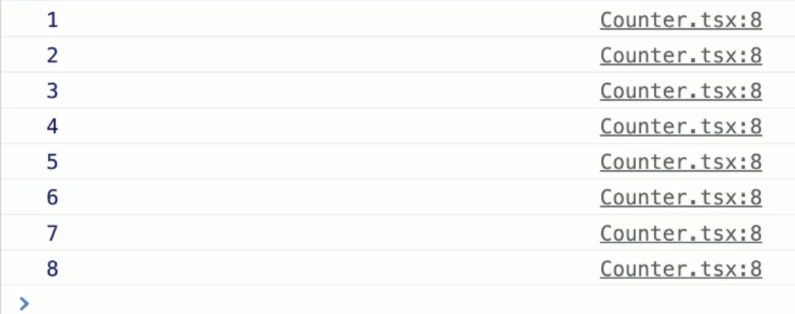

# External Store

## 학습 키워드

* 관심사의 분리
* Layered Architecture
* Flux Architecture
* useReducer
* useCallback


## Separation of Concerns

* [관심사의 분리](https://ko.wikipedia.org/wiki/%EA%B4%80%EC%8B%AC%EC%82%AC\_%EB%B6%84%EB%A6%AC)


#### 관심사의 분리 (separation of concerns, SoC)

: 리액트에서 컴포넌트를 나누는 이유!

관심사의 분리란, 컴퓨터 프로그램을 구별된 부분으로 분리하는 디자인 원칙을 의미한다. 관심사의 분리를 이용하면 프로그램 설계와 코드의 유지보수성을 용이하게 할 수 있다.

리액트에서 컴포넌트를 나누는 이유는 관심사를 분리하기 위해서이다. 서로의 컴포넌트가 무엇을 하는지 관심이 없기 때문!


\


### 🦖 여기서 말하는 관심사란?

: 컴포넌트를 나누는 기준이 기능적인 측면일 수도 있고, 설계관점일 수도 있다.

Layered Architecture는 설계관점에서 사용자를 기준으로 가까운 부분(UI)부터 먼 부분(데이터에 접근하고 저장하는 부분)으로 나눈다.

\



#### Layered Architecture

웹 페이지를 구성하는 요소가 중복되는 경우가 있는데, 이런 url 요청을 처리하는 Controller에서 중복되는 부분을 처리하려면 어떻게 해야할까?

예를 들어, 게시판에서도 회원 정보를 보여주고 상품 목록 보기에서도 회원 정보를 보여줘야한다면 회원 정보를 읽어오는 코드는 어디에 넣어야할까?

회원정보를 불러오는 객체를 따로 만들어 놓고 여러 개의 Controller가 사용하도록 한다. 여기서 말하는 객체는 비즈니스 로직을 수행하는 메서드를 가지고 있는 객체를 의미함

🚧 자세한 내용은 영상 다시 보고 익히기! [Layered Architecture란?](https://www.boostcourse.org/web316/lecture/16767?isDesc=false)


\


> _Input → Process → Output이란 3단계로 코드를 적절히 구분만 해도 코드를 이해하고 유지보수하는데 크게 도움이 된다._

\


하나의 Output은 다시 사용자에게 Input을 요청하게 되고, 일반적인 프로그램은 다음과 같이 계속 순환하는 구조가 된다.

1. Input: 프로그램 시작
2. Process: 프로그램 초기화
3. Output: 사용자에게 초기 UI 보여주기
4. Input: 사용자의 입력
5. Process: 사용자의 입력에 따라 처리
6. Output: 처리 결과 보여주기
7. Input: 사용자의 또 다른 입력
8. …반복…

\


MVC로 대략 매핑하면 다음과 같다.

* Model → Process
* View → Output
* Controller → Input


#### MCV 패턴

: Model, Controller, View의 약자로 애플리케이션을 세 가지 역할로 구분한 개발 방법론을 의미한다.

**MVC 패턴이 왜 생겨난 걸까?**

MVC 패턴이 언제 생겨났는지 살펴보면 GUI 데스크탑 애플리케이션이 생겨나면서부터다. 사람과 기계 간의 간극을 줄이고, 입력-이벤트-출력을 자연스럽게 처리하기 위해서 나타났다.


\


## Flux Architecture

* [Flux](https://facebook.github.io/flux/docs/in-depth-overview/)
* [Flux (한국어)](https://haruair.github.io/flux/docs/overview.html)
* [Redux의 핵심](https://ko.redux.js.org/tutorials/essentials/part-1-overview-concepts)

: MVC 패턴의 대안

\


기존 프론트엔드 프레임워크에서는 Model-View가 서로 공유하는 2-waybinding을 많이 사용했었는데 그 결과 관계가 복잡해진다.

> Flux Architecture는 "단방향 데이터(unidirectional data flow)"를 강조한다.


* Action: 이벤트/메세지와 같은 객체
* Dispatcher: 여러 store에 Action을 전달하는 역할

### 🦖 MVC 패턴과 Flux Architecture의 차이점

| MVC                                            | Flux Architecture                         |
| ---------------------------------------------- | ----------------------------------------- |
| 컨트롤러 → 모델과 뷰 사이의 중재자 역할 (입력을 처리하고 모델과 뷰를 업데이트) | 모든 데이터는 Dispatcher → Store → View 방향으로 흐름 |
| 데이터 흐름이 엄격하게 단방향이 아니다.                         | 단방향 데이터 흐름을 엄격하게 적용                       |

\


### 기존에 리액트에서 상태를 변경할 때는 useState를 사용했다.

```jsx
import { useState } from 'react';

export default function Counter() {
  const [count, setCount] = useState();
  const handleClick = () => {
    setCount((count) => count + 1);
  };

  return (
    <div>
      <p>{count}</p>
      <button type="button" onClick={handleClick}>
        Increase
      </button>
    </div>
  );
}
```

만약 외부의 변수로 값을 변경시키고 싶다면? 컴포넌트 이외의 곳에서 변수를 선언하고 값을 가져와야한다.

```jsx
let count = 0;

export default function Counter() {
  const handleClick = () => {
    count += 1;
  };

  return (
    <div>
      <p>{count}</p>
      <button type="button" onClick={handleClick}>
        Increase
      </button>
    </div>
  );
}
```

\



외부에 변수를 선언하고 사용하면 문제가 무엇일까?

리액트는 상태가 변경되면 리렌더링을 한다. 하지만 컴포넌트 외부에서 선언된 변수는 변경되었는지 알 수 없기 때문에 콘솔창에 count를 출력해보면 count는 증가하고 있지만, 화면에는 변화가 없다.




\


### 강제로 리렌더링을 시키는 방법

```jsx
const handleClick = () => {
  count += 1;
  // 🚀 여기서 강제로 렌더링을 시키면 되지 않을까?
};
```

useForceUpdate라는 커스텀 훅을 만들고, 강제로 렌더링을 시키기 위해서 setState를 사용한다.

```jsx
// useForceUpdate.tsx

import { useState } from 'react';

// 🚧 강제로 렌더링을 시키기 위해서 setState를 사용한다.
export default function useForceUpdate() {
  const [state, setState] = useState(0);

  const forceUpdate = () => {
    setState(state + 1);
  };

  return forceUpdate;
}
```

리팩토링을 한다면 다음과 같이 코드를 작성할 수 있다.

```jsx
import { useCallback, useState } from 'react';

export default function useForceUpdate() {
  const [, setState] = useState({});

  return useCallback(() => setState({}), []); // ✅ 항상 빈 객체로 setState한다.
}
```

```jsx
import useForceUpdate from './useForceUpdate';

const state = {
  count: 0,
};

export default function App() {
  const forceUpdate = useForceUpdate();
  const handleClick = () => {
    count += 1;
    forceUpdate();
  };

  return (
    <div>
      <p>{state.count}</p>
      <button type="button" onClick={handleClick}>
        Increase
      </button>
    </div>
  );
}
```

\


직접 1을 증가시키는 것이 아니라 increase 함수를 실행시키면 state값을 올릴 수 있도록 Business Logic과 UI Logic으로 나눌 수 있다.

```jsx
import useForceUpdate from './useForceUpdate';

let state = {
  count: 0,
};

const increase = () => {
  state.count += 1;
};

export default function App() {
  const forceUpdate = useForceUpdate();
  const handleClick = () => {
    increase(); // ✅ 어떻게 증가하는지는 중요하지 않다.
    forceUpdate();
  };

  return (
    <div>
      <p>{state.count}</p>
      <button type="button" onClick={handleClick}>
        Increase
      </button>
    </div>
  );
}
```
