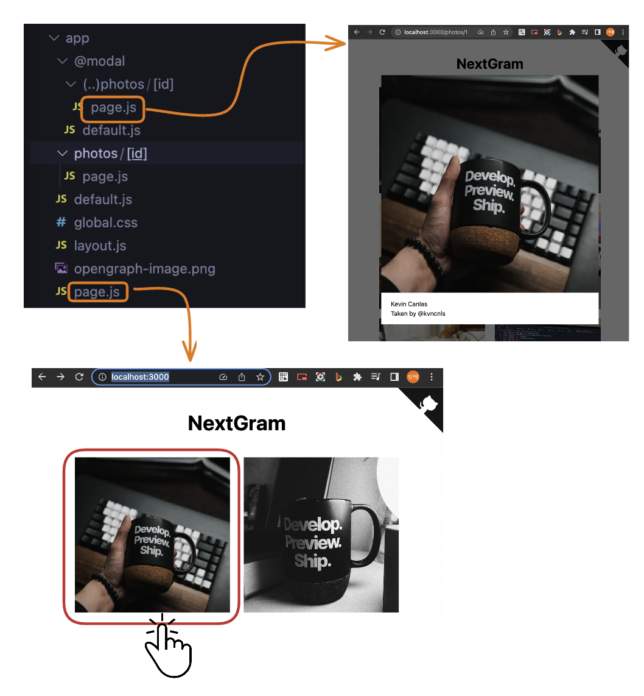

# 인터셉팅 라우팅(Intercepting Routes)

## Intercepting Routes

* 현재 표기되는 페이지의 레이아웃을 그대로 사용하면서 화면 상에 표현되는 url에 따라 추가적인 뷰를 그릴 수 있다.&#x20;
* `(..)` 표기를 통해 intercepting routes를 생성할 수 있다.
  * `(.)` : 같은 디렉토리의 세그먼트와 매치
  * `(..)` : 하나 위의 디렉토리 route를 인터셉트
  * `(..)(..)` : 두 레벨 위의 디렉토리 route를 인터셉트\
    👉🏻 `/one/two/three/(..)(..)apple` -> `/one/apple`
  * `(...)` : app 디렉토리 기준으로 relative path를 인터셉트\
    👉🏻 `/app/a/b/c/(...)apple` -> `/app/apple`\


## Nextgram을 통해 인터셉팅 라우트 알아보기

> 예제: [https://nextgram.vercel.app/](https://nextgram.vercel.app/)\
> 예제코드 저장소: [https://github.com/vercel/nextgram](https://github.com/vercel/nextgram)

<figure><figcaption></figcaption></figure>

<figure><figcaption></figcaption></figure>

### 폴더 구조

* 먼저 `@modal` parallel routes를 생성한다. `@modal` 디렉토리 안에서는 dynamic routes로 생성한다.&#x20;
* 동일한 세그먼트 구조를 가지는 `photos/[id]/page.tsx`를 app 디렉토리 하위에 생성한다.&#x20;

<figure><figcaption></figcaption></figure>


`@modal`은 segment가 아니라 slot이므로 photos segment 경로에 `(..)`가 아닌`(.)`를 사용한다. 즉, photos 경로는 하나의 레벨만큼 차이나지만 segment 레벨은 동일하다.&#x20;


* 생성한 modal slot을 layout에 props로 전달한다.&#x20;

```html
<html lang='en'>
  <body className={inter.className}>
    {children}
    {modal}
    <div id='modal-root' />
  </body>
</html>
```


### `Link` 이동

카드를 클릭하면 'photos/1'로 이동하면서 카드에 대한 모달이 띄워진다.&#x20;

<figure><figcaption><p>출처: <a href="https://velog.io/@jay/Parallel-Routes">https://velog.io/@jay/Parallel-Routes</a></p></figcaption></figure>

url은 'photos/1'로 변경되었지만, 모달의 백그라운드 레이아웃은 여전히 '/'의 page.tsx가 렌더링된다.&#x20;


### 모달이 뜨는 위치

modal.tsx를 확인해보면 모달은 `modal-root`라는 `id`를 가진 DOM 노드에 렌더링하도록 구현하였다.

```html
return createPortal(
    <div className='modal-backdrop'>
      <dialog ref={dialogRef} className='modal' onClose={onDismiss}>
        {children}
        <button onClick={onDismiss} className='close-button' />
      </dialog>
    </div>,
    document.getElementById('modal-root')!
  );
```

<figure><figcaption></figcaption></figure>


👉🏻 `photos/1`이라는 라우트가 즉, `@modal/(.)photos/1` 라우트에 의해 인터셉트 되었을 때, 기존에 그려진 컴포넌트는 유지하되 모달 컴포넌트가 렌더링되는 것.
