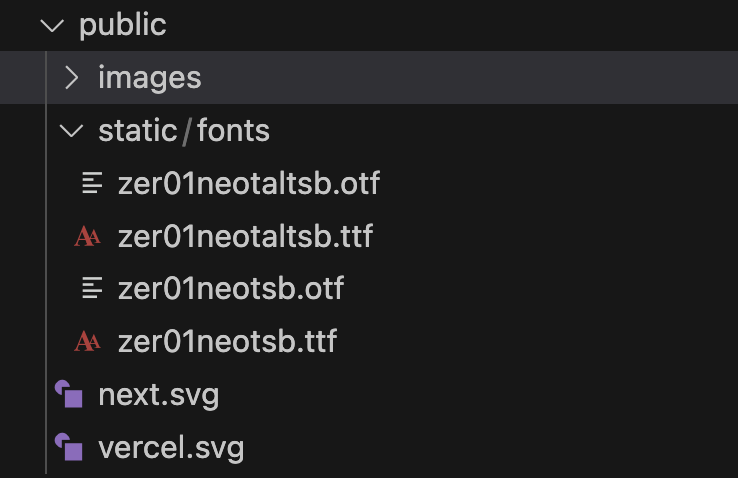
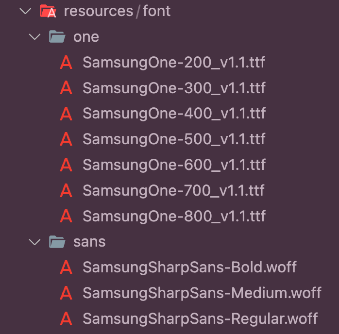

# 폰트 적용하기

### Local Font 적용

public폴더 혹은 resource/font 폴더를 만들어 로컬 폰트를 넣어준다.

<div align="left">

<figure><figcaption></figcaption></figure>

</div>

`global.css`

```css
@tailwind base;
@tailwind components;
@tailwind utilities;

:root {
  --foreground-rgb: 0, 0, 0;
  --background-start-rgb: 214, 219, 220;
  --background-end-rgb: 255, 255, 255;
}

@font-face {
  font-family: 'zer01ne'; // ✅ font-family로 적용할 이름
  src: url('/static/fonts/zer01neotsb.ttf'); // ✅ 폰트가 저장되어있는 위치
}
```

해당 폰트를 사용할 때는 `font-[폰트명]`을 클래스에 입력한다.

```html
<div className="font-[zer01ne-al]">
  <div className="flex items-center flex-col">
    <h1>{title}</h1>
    <button>확인</button>
  </div>
</div>
```


_<mark style="background-color:red;">**⛏️ Other Solution**</mark>_

<div align="left">

<figure><figcaption></figcaption></figure>

</div>

`globals.css`

```css
@tailwind base;
@tailwind components;
@tailwind utilities;

/*S */
@font-face {
  font-family: 'sharpSans';
  font-weight: 400;
  font-style: normal;
  src: url('../resources/font/sans/SamsungSharpSans-Regular.woff') format('woff');
}
@font-face {
  font-family: 'sharpSans';
  font-weight: 500;
  font-style: normal;
  src: url('../resources/font/sans/SamsungSharpSans-Medium.woff') format('woff');
}

/* one */
@font-face {
  font-family: 'one';
  font-weight: 200;
  font-style: normal;
  src: url('../resources/font/one/SamsungOne-200_v1.1.ttf') format('truetype');
}
@font-face {
  font-family: 'one';
  font-weight: 300;
  font-style: normal;
  src: url('../resources/font/one/SamsungOne-300_v1.1.ttf') format('truetype');
}

body {
  margin: 0;
  font-family: 'sharpSans', 'sans-serif', 'serif';
  background-color: #ffffff;
}
```

`tailwind.confing.ts` tailwindCSS를 사용하는 경우, extend에 fontFamily를 추가

```tsx
const config: Config = {
  content: [
    './pages/**/*.{js,ts,jsx,tsx,mdx}',
    './components/**/*.{js,ts,jsx,tsx,mdx}',
    './app/**/*.{js,ts,jsx,tsx,mdx}',
  ],
  theme: {
    extend: {
      fontFamily: {
        sharpSans: ['sharpSans'],
        one: ['one'],
      },
    },
  },
};
```


### Google Font 적용

next/font/google에서 적용하고자 하는 폰트를 import 해온다.

```tsx
import { Noto_Serif_KR } from 'next/font/google';
```

사용할 font-weight와 속성들을 지정해준다.

```tsx
const notoSerif = Noto_Serif_KR({
  subsets: ['latin'],
  display: 'swap',
  weight: ['400', '500', '200'],
});
```

`RootLayout`에 className으로 지정해준다.

```tsx
export default function RootLayout({
  children,
}: {
  children: React.ReactNode;
}) {
  return (
    <html lang='en'>
      <body className={notoSerif.className}>
        <RecoilRootProvider>{children}</RecoilRootProvider>
      </body>
    </html>
  );
}
```
