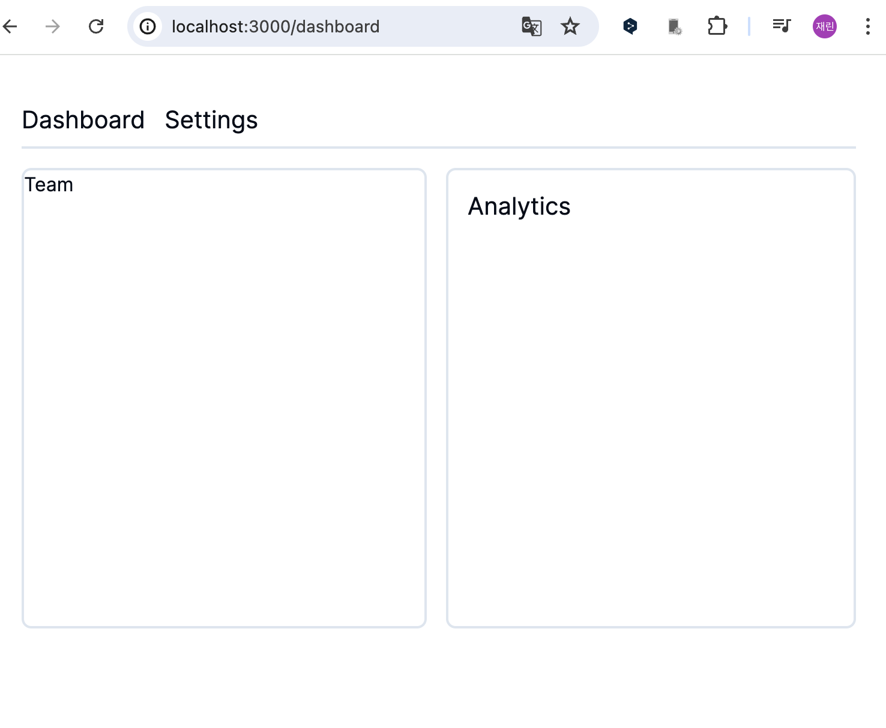
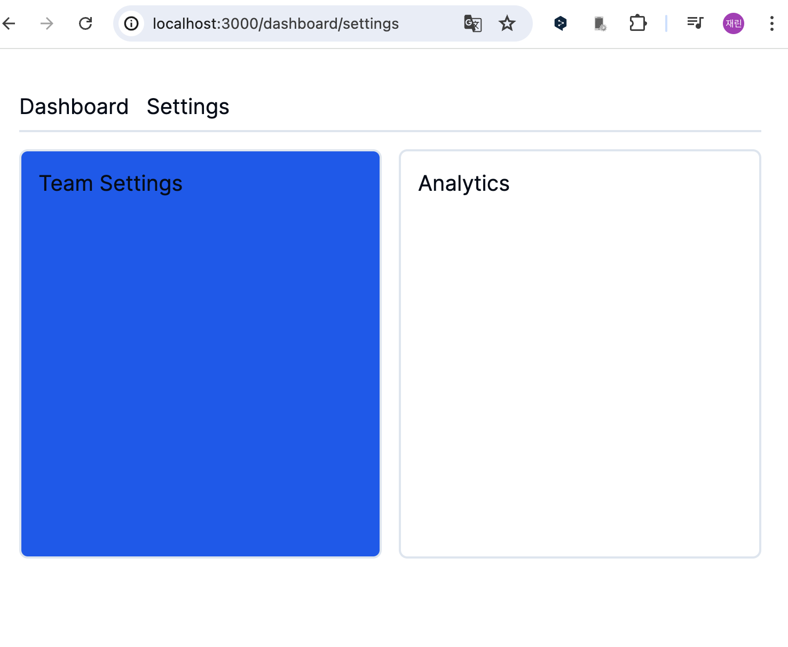

# 병렬 라우팅(Parallel Routes)

'/dashboard' 페이지에는 각 두 곳에서 데이터를 받아오는 컴포넌트들이 존재한다.&#x20;

<figure><figcaption></figcaption></figure>

<figure><figcaption></figcaption></figure>

병렬 라우팅을 사용하지 않고 이전 방식으로 코드를 작성하면 다음과 같다.&#x20;

```typescript
export default function DashBoardLayout({ children }: { children: React.ReactNode }) {
  return (
    <>
      <div>{children}</div>
      <Team />
      <Analytics />
    </>
  );
}
```


## 병렬 라우팅

* Next.js에서의 병렬 라우팅은 slot을 이용해 정의한다.&#x20;
* slot을 정의하기 위해선 @folder 규칙을 사용한다.
* _<mark style="color:red;">**각 slot은 layout.tsx 파일에 props로 전달된다.**</mark>_&#x20;


### 병렬 라우팅으로 코드 변경하기

폴더를 만들 때 @folder 를 사용하여 만든다.&#x20;

라우터를 사용하긴 하지만 라우팅이 되면 안되기 때문에 '@'를 사용하여 폴더를 만든다. ('@'를 넣으면 라우팅에서 인식이 되지 않는다.)

* `dashboard/@team/page.tsx`
* `dashboard/@analytics/page.tsx`


slot을 만들었다면 서버를 끄고 다시 실행시켜야 한다.



슬롯을 만들었다면 layout.tsx 파일에 props로 전달해준다.&#x20;


```typescript
import Header from './Header';

export default function DashboardLayout({
  children,
  team,
  analytics,
}: Readonly<{
  children: React.ReactNode;
  team: React.ReactNode;
  analytics: React.ReactNode;
}>) {
  return (
    <div className='p-8'>
      <Header />
      {children}
      <div className='flex gap-4 py-4'>
        {team}
        {analytics}
      </div>
    </div>
  );
}
```


이 때 만약 '/dashboard/team'으로 라우터를 이동시킨다면? 👉🏻 404 페이지를 렌더링한다.&#x20;

즉, dashboard 라우팅 밑에는 표면적으로 team 라우팅이 없고, 병렬 라우팅으로 만든건 dashboard 라우팅 안에서만 존재하는 라우팅이 된다.&#x20;


### 병렬 라우팅의 장점은?

* 코드 관리가 수월해진다.&#x20;
* 독립적인 라우팅 처리와 서브 내비게이션이 가능해진다.&#x20;
* 슬롯이 병렬적으로 로딩되기 때문에 동시에 똑같이 로드되지 않는다. 이때 loading.tsx를 사용하면 페이지 로드가 느린 부분은 loading UI를 화면에 띄울 수 있다.


### 서브 내비게이션

슬롯 안에서도 라우팅을 구현할 수 있다. 👉🏻 서브 내비게이션

&#x20;그리고 'settings' 탭을 누르게 되면 'dashboard/settings'로 라우팅이 되어야 하는 경우에 서브 내비게이션으로 만들 수 있다.&#x20;

<figure><figcaption></figcaption></figure>

* `dashboard/@team/settings/page.tsx`

```typescript
import { pause } from '@/lib/utils';

export default async function TeamSettings() {
  await pause(3000);

  return (
    <section className='h-96 w-96 border-2 rounded-lg p-4 bg-blue-600'>
      <h2 className='text-xl'>Team Settings</h2>
    </section>
  );
}
```


### default.tsx가 필요한 이유 (Unmatched Rotues)


#### 새로고침을 하게되면?

UI 안에서 네비게이션의 경우, URL이 변경되더라도 이전에 활성화된 상태의 슬롯을 유지한다. 하지만 문제는 새로고침을 했을 때 발생한다.\
\
'dashboard/settings'에서 새로고침을 했을 때 @analytics 슬롯에 대한 상태가 사라졌기 때문에 404 에러가 발생한다. **이럴 때를 대비해 **<mark style="color:red;">**default.tsx**</mark>** 파일을 작성**한다.&#x20;


* 즉, 페이지 새로고침 시, Next.js는 각 일치하지 않는 슬롯 내에서 default.tsx 파일을 즉시 검색한다. 이 파일의 존재 여부가 중요한데, Next.js가 화면에 렌더링할 기본 컨텐츠를 제공하기 때문.
* 현재 라우트에 대해 일치하지 않는 슬롯 중 하나라도 default.tsx 파일이 없다면, Next.js는 404 오류를 렌더링한다.&#x20;


```typescript
import { pause } from '@/lib/utils';

export default async function DefaultAnalytics() {
  await pause(1000);

  return (
    <section className='h-96 w-96 border-2 rounded-lg p-4 bg-purple-700'>
      <h2 className='text-xl'>Default Analytics</h2>
    </section>
  );
}
```


<figure><figcaption></figcaption></figure>
