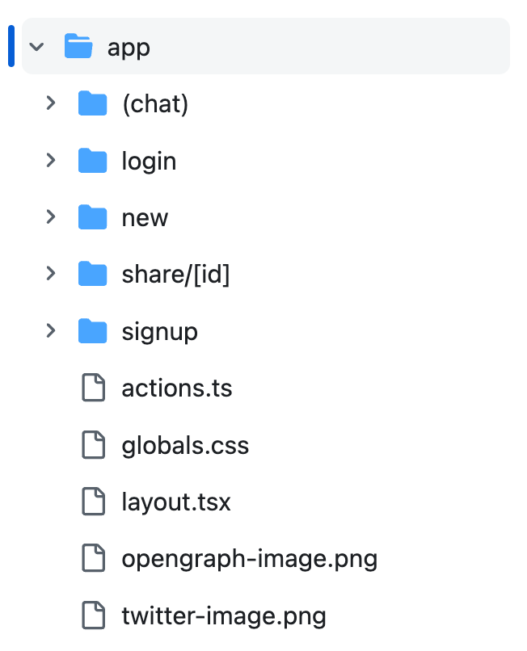

# Server actions 기능

Next.js가 14로 업데이트 되면서 api 폴더가 사라진 것을 확인할 수 있다.&#x20;

<div align="left">

<figure><figcaption><p>ai-chatbot</p></figcaption></figure>

</div>

그럼 api 콜을 했을 때, 서버에서 작업하는 코드는 어디로 간걸까? 👉🏻 **`action.ts`**


**Sever actions 기능을 사용하기 전 체크해야 할 것**\


* next 버전이 13.4.0 이상인지 확인
*   next.config.js 파일에 코드 추가 (14이상이면 상관x)

    `module.exports = { experimental: { serverActions: true, }, };`



### actions.ts

DB에 데이터를 저장해야 할 때 이전에는 api 폴더에 서버 API를 만들고, 요청을 날리는 방식을 사용했지만

Server actions라는 기능을 이용하면 server/client component 안에서 한 번에 처리할 수 있다.&#x20;


```typescript
export default async function Write() {
    async function handleSubmit(formData) {
        'use server'; // 🚧 'use server'를 작성해두면 함수 내용을 자동으로 서버 API로 만들어준다.
        console.log(formData)
    }

    return (
        <form action={handleSumbit}>
            <input type='text' name='title' />
            <button type='submit'>Submit</button>
        </form>
    );
}       
```


'use server' 를 넣은 코드는 서버 API로 자동으로 변환되어 유저에게 전달되지 않는다.&#x20;


### +) 폼 전송을 누른 후, 새로고침하는 방법

action={}으로 실행시킨 함수로 폼을 전송한 후 새로고침이 되지 않는다. 새로고침을 하려면 rouer.refresh()을 사용하거나, 서버 컴포넌트의 경우에는 revalidatePath, revalidateTag 함수를 사용해야 한다.&#x20;

```typescript
import { revalidatePath } from "next/cache" //페이지 상단에 추가

async function handleSubmit(formData) { 
  'use server'; 
  const db = (await connectDB).db('forum') 
  await db.collection('post_test').insertOne({title : formData.get('post1')})
  revalidatePath('/write2')
} 
```

* revalidatePath : 해당 URL에 있던 캐시를 삭제하고 다시 생성해주는 함수
* 페이지 전체를 다시 그리는 것이 아니라 차이점만 바꿔주기 때문에 server component 만으로도 SPA처럼 업데이트가 가능하다.&#x20;


### +) client component에서 사용하려면

action.ts 파일을 분리해서 작성한 후, client component에서 불러온 후 action={} 안에 넣어서 사용한다.&#x20;


