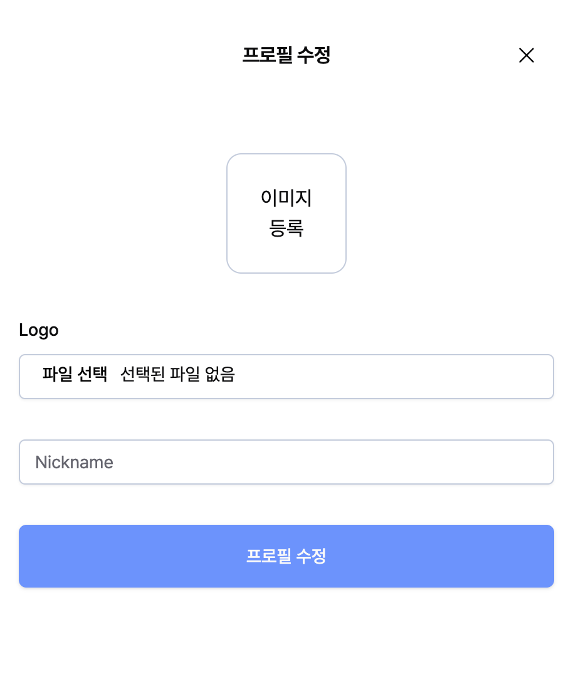
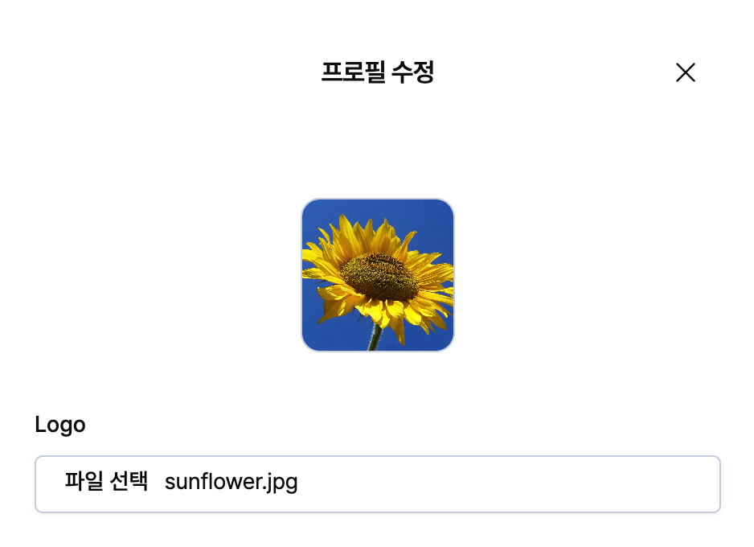

# 이미지 등록 컴포넌트 구현하기

<div align="left">

<figure><figcaption></figcaption></figure>

</div>

<div align="left">

<figure><figcaption></figcaption></figure>

</div>

👉🏻 이미지 등록 버튼을 클릭하면 파일 창이 열리고, 업로드한 이미지가 보이는 기능을 구현해야 했다.&#x20;


### 이미지 등록 컴포넌트

이미지를 등록할 수 있는 div 요소는 업로드 된 이미지가 있을 경우엔 업로드 이미지를 보여주고, 없다면 이미지 등록 텍스트를 보여줘야 한다.&#x20;


이미지 등록 버튼을 클릭했을 때 `'파일 선택'`input에 클릭이벤트가 걸려야한다.&#x20;


```typescript
<div className='flex justify-center'>
  <Avatar
    className='w-24 h-24 rounded-xl border border-input cursor-pointer'
    onClick={handleAvatarClick}
  >
    {preview ? (
      <AvatarImage
        src={preview}
        className='object-cover object-center'
        alt='Profile Preview'
      />
    ) : (
      <div className='flex flex-col justify-center items-center h-full w-full'>
        <span>이미지</span>
        <span>등록</span>
      </div>
    )}
  </Avatar>
</div>
```


### onClick 핸들러 함수

fileInputRef는 logo input에 연결 🔗

Avatar 컴포넌트를 클릭했을 때 fileInputRef DOM 요소에 직접적으로 접근할 수 있다.&#x20;

```typescript
const handleAvatarClick = () => {
  if (fileInputRef.current != null) {
    fileInputRef.current.click();
  }
};
```


### FormField

```typescript
<FormField
  control={form.control}
  name='logo'
  render={({ field: { onChange, value, ref, ...rest } }) => ( // ✅ ref
    <FormItem>
      <FormLabel>Logo</FormLabel>
      <FormControl>
        <Input
          type='file'
          ref={fileInputRef}
          {...rest}
          onChange={(event) => {
            const files = getImageData(event);
            onChange(files);
          }}
        />
      </FormControl>
      <FormMessage />
    </FormItem>
  )}
/>
```
