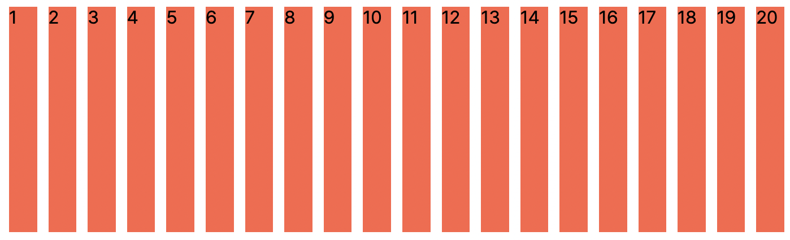

# Flexbox

### Before Flexbox

flexbox가 만들어지기 전엔 block 요소들을 어떻게 정렬했을까?


**block 요소 옆에 block 요소를 위치하는 방법**

<figure><figcaption></figcaption></figure>

1. **inline-block**

```css
.box {
  width: 150px;
  height: 150px;
  background: red;
  display: inline-block;
}

.box:nth-child(2) {
  margin-left: 23.8%;
  margin-right: 23.8%;
}
```


2. **float**

```css
.box {
  width: 150px;
  height: 150px;
  background: red;
  display: inline-block;
}

.box:first-child {
  float: left;
}

.box:last-child {
  float: right;
}

.box:nth-child(2) {
  margin: 0 24%;
}
```

두 방법 모두 margin 값을 하드코딩해야하는 불편함이 있었다. 만약 viewport를 줄이는 경우 레이아웃이 깨지기 때문에 모바일친화적으로 만들기 위해선 **media-query**를 사용해야 한다.

_<mark style="color:red;">**👉🏻 이것이 바로 flexbox가 도입된 이유**</mark>_

***

### Flexbox

> _flex는 자식 요소에 관심이 없다. container에 관심이 있을 뿐이다._

즉, 열이 될 box들에 직접 명령하지 않는 것이 flex의 원칙

```html
<body>
  <div class="box"></div>
  <div class="box"></div>
  <div class="box"></div>
</body>
```

* 여기서의 container는 `<body>`태그


```css
body {
  display: flex;
  justify-content: space-between;
}
```

* 인간이 margin의 값을 직접 계산해서 명령하는 것이 아닌, `justify-content: space-between`이라는 코드로 선언함으로서 모든 요소들이 같은 간격으로 정렬할 수 있게 되었다.

***

### Flex Direction

`flex-direction` : flex 요소들이 어떤 방향으로 갈지 정하는 것.

* 기본 값은 row
* `row` | `column` | `row-revers` | `column-reverse`

***

### Main and Cross Axis

* flex container의 direction에 따라서 main axis와 cross axis가 달라진다.
* `flex-direction: row`인 경우
  * main axis: 가로 ➡️
  * cross axis: 세로 ⬇️
*   `flex-direction: column`인 경우

    * main axis: 세로 ⬇️
    * cross axis: 가로 ➡️


`justify-content`&#x20;

: main axis에서 아이템을 이동한다.

* _Aligns flex items along the main axis of the current line of the flex container._


`align-items`

&#x20;: cross axis에서 아이템을 이동한다.

* _Aligns flex items along the cross axis of the current line of the flex container._


#### align-items를 설정해도 변화가 없는 이유

`align-items`를 설정했을 때 변화가 없는 경우가 종종 있다. 그 이유는 flex를 적용하면 flex 요소들의 높이와 동일하게 맞춰지기 떄문이다.

> flex container의 높이 === flex box의 높이

만약 align-items를 적용하고 싶다면 flex container의 높이를 flex box의 높이보다 크게 설정해야한다.


***

### Flex Flow

container 안에 수많은 box가 있다면?

```css
.container {
  display: flex;
  gap: 10px;
}
.box {
  width: 200px;
  height: 200px;
  background-color: tomato;
}
```

<figure><figcaption></figcaption></figure>

* box 요소의 전체 width가 viewport의 width를 넘어가는 순간 box 요소들의 width, height가 보장되지 않는다.

_<mark style="color:red;">**👉🏻 flexbox는 flex 컨테이너 안의 요소들을 한 줄로 표시하려고 하기 때문**</mark>_


**`flex-wrap`**&#x20;

: box 요소의 크기를 보장하면서 viewport를 넘어가게 되면 box 요소를 줄 바꿈해준다.

* 기본 값은 `nowrap`
* `nowrap` | `wrap`| `wrap-reverse`


**`flex-flow`**

: `flex-direction` + `flex-wrap`

* usage

```css
flex-flow: row wrap;
```
