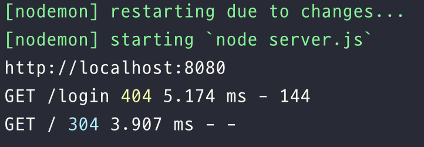

# Express

### First Server

```js
const express = require('express');
const app = express();

app.listen(8080, () => {
  console.log('http://localhost:8080');
});
```

- `listen`의 역할:'8080'이라는 PORT 번호로 서버를 오픈하는 역할을 한다.
- 서버가 어떤 PORT의 요청을 듣고있는지 확인하는 것

---

### GET Requests



### 처음 localhost에 접속하면 `Cannot GET /`이라고 나타나는 이유

- `Cannot GET /`의 의미는 '/'로 GET 요청을 할 수 없다는 것이다.
- 간단히 설명하면 `www.naver.com`이라고 주소창에 입력하는 것과 `www.naver.com/`라고 입력하는 것은 동일하다.
- GET은 HTTP 메서드 중 하나 (HTTP는 우리가 서버와 소통하는 방법 중 하나)



**간단한 GET 요청 만들기**

```js
const express = require('express');

const app = express();

app.get('/', (req, res) => {
  res.send('youtube clone class');
});

app.listen(8080, () => {
  console.log('http://localhost:8080');
});
```

- get 메서드는 두 개의 arguments를 받는다.

  1. 요청할 엔드포인트
  2. 요청과 응답 로직을 설정할 콜백 함수

- '/' 요청이 들어오면 응답으로 'youtube clone class' 라는 텍스트를 보내줘라는 의미

---

### Middlewares

**Middlewares 개념 이해하기**

- 브라우저가 무언가를 요청하면 서버는 응답해준다.
- middleware는 브라우저와 서버 사이에 존재한다.
- 모든 controller는 middleware이다.
- 모든 controller는 request, response, next 세 개의 argument를 기본으로 가지고 있다.

```js
const testMiddleware = (req, res, next) => {
  console.log(`I'm middleware`);
  next();
}; // controller

app.get('/', testMiddleware, (req, res) => {
  res.send('youtube clone class');
});
```

**`app.use`**

- `app.use`는 global middleware를 만들 수 있게 해준다.
- 즉, 어느 url에서나 동작한다.

```js
const testMiddleware = (req, res, next) => {
  console.log(`I'm middleware in app.use()`);
  next();
};

app.use(testMiddleware); //✅
app.get('/', (req, res) => {
  res.send('youtube clone class');
});
```



### `app.use()`를 사용할 때 순서 주의하기

- 항상 `app.get()`을 사용하기 이전에 작성되어야 한다.
- 모든 url에 적용되도록 해야하기 때문에 가장 최상단에 올라와야한다.



<br />

**morgan**

- [morgan](https://www.npmjs.com/package/morgan)
- HTTP request logger middleware for node.js
- morgan 함수를 호출하면 middleware를 return해준다.
- HTTP method, url, status code, 응답시간 등을 볼 수 있다.

```js
const morgan = require('morgan');
app.use(morgan('dev'));
```

<figure><figcaption></figcaption></figure>
