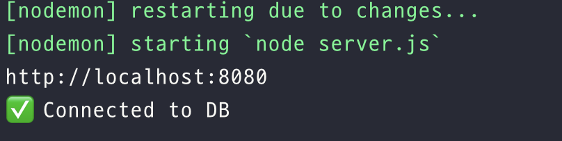
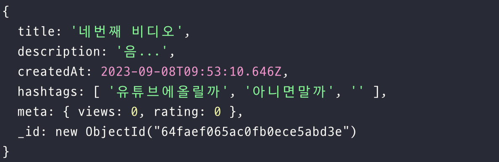

# MongoDB and Mongoose

### Introduction to MongoDB

**MongoDB**
- document-oriented database, 즉 문서 지향 데이터베이스의 범주에 속한다. 
- JSON(JavaScript Object Notation) 문서와 유사한 형식으로 데이터를 저장한다는 의미

**Install MongoDB**
- [Install MongoDB Community Edition](https://www.mongodb.com/docs/manual/tutorial/install-mongodb-on-os-x/#install-mongodb-community-edition)

```
$ xcode-select --install
$ brew tap mongodb/brew
$ brew install mongodb-community@7.0

```

---

### Connecting to Mongo

**Mongoose**
- MongoDB와 함께 사용되는 Node.js 기반의 ODM (Object Data Modeling) 라이브러리
- Node.js와 MongoDB를 이어주는 역할을 한다.
- 자바스크립트로 코드를 적으면 mongoose가 mongoDB에게 전달한다.

```js
const mongoose = require('mongoose');
mongoose.connect('mongodb://127.0.0.1:27017/test');

const Cat = mongoose.model('Cat', { name: String });

const kitty = new Cat({ name: 'Zildjian' });
kitty.save().then(() => console.log('meow'));
```


**Install Mongoose**
```
$ npm install mongoose --save

```

**mongoose 세팅하기**
database.js 파일 생성
```js
import mongoose from 'mongoose';

mongoose.connect('mongodb://127.0.0.1:27017/youtube');
```
- database.js 파일을 server.js에서 import해줌으로써, monogoDB에 연결

```js
import mongoose from 'mongoose';

mongoose.connect('mongodb://127.0.0.1:27017/youtube', {
  useNewUrlParser: true,
  useUnifiedTopology: true,
});

const db = mongoose.connection;

const handleOpen = () => console.log('✅ Connected to DB');
const handleError = (error) => console.log('❌ DB Error', error);

db.on('error', handleError);
db.once('open', handleOpen);

```


### on과 once의 차이점
- on은 여러 번 발생시킬 수 있음.
- once는 한 번만 발생함


<figure><figcaption></figcaption></figure>

---

### CRUD Introduction

**CRUD**
: create, read, update, delete


mongoose는 mongoDB와 대화할 수 있도록 해준다. 그러기 위해선 mongoose를 도와줄 필요가 있다. 👉🏻 데이터가 어떻게 생겼는지 알려줘야 한다.


**`new mongoose.Schema`**
: Schema를 정의할 수 있다. 

```js
const videoSchema = new mongoose.Schema({
  title: String,
  description: String,
  createdAt: Date,
  hashtags: [{ type: String }],
  meta: {
    views: Number,
    rating: Number,
  },
});
```

**`mongoose.model('Video', videoSchema)`**
: model을 만들 수 있다. name, schema를 인자로 받는다. 

```js
import mongoose from 'mongoose';

const videoSchema = new mongoose.Schema({
  title: String,
  description: String,
  createdAt: Date,
  hashtags: [{ type: String }],
  meta: {
    views: Number,
    rating: Number,
  },
});

const Video = mongoose.model('Video', videoSchema);
export default Video;
```



### callback과 promise




--- 

### Our First Query
- [Queries](https://mongoosejs.com/docs/queries.html#queries)
- `Model.find()`
    - Finds documents.
    ```js
    // find all documents
    await MyModel.find({});

    // find all documents named john and at least 18
    await MyModel.find({ name: 'john', age: { $gte: 18 } }).exec();
    ```

```js
globalRouter.get('/', async (req, res) => {
  const videos = await Video.find({});
  return res.render('home', { pageTitle: 'Home', videos });
});
```

--- 
### Creating a Video

사용자가 Schema에 맞게 업로드할 수 있도록 Form 만들기
```js
extends base.pug

block content
    form(method="POST")
        input(placeholder="Title", required, type="text", name="title")
        input(placeholder="Description", required, type="text", name="description")
        input(placeholder="Hashtags, separated by comma.", required, type="text", name="hashtags")
        input(type="submit", value="Upload Video")        
```

```js
videoRouter.post('/upload', (req, res) => {
  // 새로운 데이터를 기존 데이터에 추가 후 리다이렉트
  const { title, description, hashtags } = req.body;
  const video = new Video({
    title,
    description,
    createdAt: Date.now(),
    hashtags: hashtags.split(',').map((word) => `${word}`),
    meta: {
      views: 0,
      rating: 0,
    },
  });
  console.log(video);

  return res.redirect('/');
});
```

video를 확인해보면 

<figure><figcaption></figcaption></figure>


- 객체가 정상적으로 만들어진 것을 볼 수 있지만, 아직 database에 저장된 것은 아니다. 

**database에 데이터를 저장하는 방법**

1. `save` 사용
    ```js
    videoRouter.get('/upload', (req, res) =>
    res.render('upload', { pageTitle: 'Upload Video' })
    );
    videoRouter.post('/upload', async (req, res) => {
    // 새로운 데이터를 기존 데이터에 추가 후 리다이렉트
    const { title, description, hashtags } = req.body;
    const video = new Video({
        title,
        description,
        createdAt: Date.now(),
        hashtags: hashtags.split(',').map((word) => `${word}`),
        meta: {
        views: 0,
        rating: 0,
        },
    });
    await video.save();

    return res.redirect('/');
    });
    ```
2. `create` 사용
    ```js
    videoRouter.get('/upload', (req, res) =>
    res.render('upload', { pageTitle: 'Upload Video' })
    );
    videoRouter.post('/upload', async (req, res) => {
    // 새로운 데이터를 기존 데이터에 추가 후 리다이렉트
    const { title, description, hashtags } = req.body;
    Video.create({
        title,
        description,
        createdAt: Date.now(),
        hashtags: hashtags.split(',').map((word) => `${word}`),
        meta: {
        views: 0,
        rating: 0,
        },
    });

    return res.redirect('/');
    });
    ```

--- 

### Exceptions and Validation


1. try/catch를 통한 에러처리, 에러메세지 전달하기
2. Schema parameter : default를 설정함으로써 기본값 설정하기


비디오를 생성하기 전에 오류가 없는지 유효성 검사를 하기 위해 Schema 수정하기
```js
const videoSchema = new mongoose.Schema({
  title: { type: String, required: true },
  description: { type: String, required: true },
  createdAt: { type: Date, required: true, default: Date.now },
  hashtags: [{ type: String }],
  meta: {
    views: { type: Number, default: 0, required: true },
    rating: { type: Number, default: 0, required: true },
  },
});
```
👉🏻 Schema CreatedAt에 Date.now()가 아닌 Date.now를 적는 이유 : 생성될때만 실행되도록 하기 위해서

---
### Video Detail

비디오 링크를 클릭했을 때 `Cannot GET /videos/64faf10ee28d6fc0ffb4c26f` 와 같은 오류를 볼 수 있다. 

```js
videoRouter.get('/:id(\\d+)', ...)
```
라우터를 작성할 때 id는 숫자만 받을 수 있도록 지정했으나 mongoose에서 생성해주는 id는 digit이 아니기 때문이다.

**해결방법**
mongoose가 자동으로 생성해주는 id는 24바이트 16진수로 이뤄져있다. 정규표현식을 이용하면 된다. 
`[0-9a-f]{24}`

<br>

**특정 비디오를 찾는 방법**

링크를 클릭했을 때 id에 맞는 비디오 내용을 보여줘야한다. 
- id는 req.params로 찾을 수 있다. 
- id와 대응하는 비디오 정보는 `Video.findById()`로 찾을 수 있다. 

```js
videoRouter.get('/:id([0-9a-f]{24})', async (req, res) => {
  const { id } = req.params;
  const video = await Video.findById(id);
  return res.render('watch', { pageTitle: video.title, video });
});

```

**없는 주소로 접근했을 때 에러처리하기**
```js
if (!video) {
    return res.render('404', { pageTitle: 'Video not found.' });
  }
  return res.render('watch', { pageTitle: `${video.title}`, video });
```

---

### Edit Video
```js
videoRouter.post('/:id([0-9a-f]{24})/edit', async (req, res) => {
  const { id } = req.params;
  const { title, description, hashtags } = req.body;
  const video = await Video.findById(id);

  if (!video) {
    return res.render('404', { pageTitle: 'Video not found.' });
  }

 // ✅
  video.title = title;
  video.description = description;
  video.hashtags = hashtags
    .split(',')
    .map((word) => (word.startsWith('#') ? word : `#${word}`));

  await video.save();
  return res.redirect(`/videos/${id}`);
});

```


### `String.prototype.startsWith()` & `String.prototype.endsWith()`

**`startsWith()`**
- 어떤 문자열이 특정 문자로 시작하는지 확인하여 결과를 true 혹은 false로 반환
- startsWith(searchString, position)
    ```js
    const str1 = 'Saturday night plans';

    console.log(str1.startsWith('Sat'));
    // Expected output: true

    console.log(str1.startsWith('Sat', 3));
    // Expected output: false
    ```

**`endsWith()`**
- 어떤 문자열에서 특정 문자열로 끝나는지를 확인할 수 있으며, 그 결과를 true 혹은 false로 반환
- str.endsWith(searchString[, length])
- 
    ```js
    var str = "To be, or not to be, that is the question.";

    console.log(str.endsWith("question.")); // true
    console.log(str.endsWith("to be")); // false
    console.log(str.endsWith("to be", 19)); // true
    ```



Edit을 할 수 있는 또 다른 방법 👉🏻 `findByIdAndUpdate`
```js
const video = await Video.exists({ _id: id });

if (!video) {
return res.render('404', { pageTitle: 'Video not found.' });
}

await Video.findByIdAndUpdate(id, {
title,
description,
hashtags: hashtags
    .split(',')
    .map((word) => (word.startsWith('#') ? word : `#${word}`)),
});
return res.redirect(`/videos/${id}`);
```


--- 

### Middlewares
- [Mongoose Middleware](https://mongoosejs.com/docs/middleware.html#middleware)
- <mark style="color:red;">middleware는 무조건 Model이 생성되기 전에 만들어야한다.</mark>

```js
videoSchema.pre('save', async function () {
  console.log('We are about to', this);
});
```
- this는 우리가 저장하고자하는 문서를 가리킴
- video upload를 했을 때 보이는 console
    ```js
    We are about to {
        title: 'second video',
        description: 'boxing',
        hashtags: [ '##boxing' ],
        meta: { views: 0, rating: 0 },
        _id: new ObjectId("64fb08683ebb52a0cf7e1e67"),
        createdAt: 2023-09-08T11:41:28.709Z
    }      
    ```


### pre안에 콜백함수로 화살표 함수를 쓰면 안되는 이유

pre안에 콜백함수로 화살표 함수 쓰게 되면 this의 대상이 달라지기 때문에 function(){}으로 써야한다. 
- 화살표 함수로 작성했을 때: 상위 스코프를 가리킨다. 
- 함수 선언문(function(){})으로 작성했을 때: 전역을 가리킨다. 



- 새로 업로드를 할 때 `/post/upload`의 코드를 줄일 수 있다.
```js
// model/Video.js
videoSchema.pre('save', async function () {
  this.hashtags = this.hashtags[0]
    .split(',')
    .map((word) => (word.startsWith('#') ? word : `#${word}`));
});

// routers/videoRouter.js
try {
await Video.create({
    title,
    description,
    hashtags, // ✅ hashtags: hashtags.split(",").map((word) => (word.startsWith("#") ? word : `#${word}`)),
});
return res.redirect('/');
} catch (error) {
return res.render('upload', {
    pageTitle: 'Upload Video',
    errorMessage: error._message,
});
}

```

---

### Statics
- [Statics](https://mongoosejs.com/docs/guide.html#statics)
- model에 static 함수를 추가할 수도 있다.
- Static을 정의하는 방법
    ```js
    animalSchema.static('findByBreed', function(breed) { return this.find({ breed }); });
    
    // usage
    videoSchema.static('formatHashtags', function (hashtags) {
    return hashtags
        .split(',')
        .map((word) => (word.startsWith('#') ? word : `#${word}`));
    });
    ```

- formatHashtags을 사용하는 방법
```js
// POST
videoRouter.post('/upload', async (req, res) => {
  // 새로운 데이터를 기존 데이터에 추가 후 리다이렉트
  const { title, description, hashtags } = req.body;

  try {
    await Video.create({
      title,
      description,
      hashtags: Video.formatHashtags(hashtags),
    });
    return res.redirect('/');
  } catch (error) {
    return res.render('upload', {
      pageTitle: 'Upload Video',
      errorMessage: error._message,
    });
  }
});
videoRouter.post('/:id([0-9a-f]{24})/edit', async (req, res) => {
  const { id } = req.params;
  const { title, description, hashtags } = req.body;
  const video = await Video.exists({ _id: id });

  if (!video) {
    return res.render('404', { pageTitle: 'Video not found.' });
  }

  await Video.findByIdAndUpdate(id, {
    title,
    description,
    hashtags: Video.formatHashtags(hashtags),
  });
  return res.redirect(`/videos/${id}`);
});
```