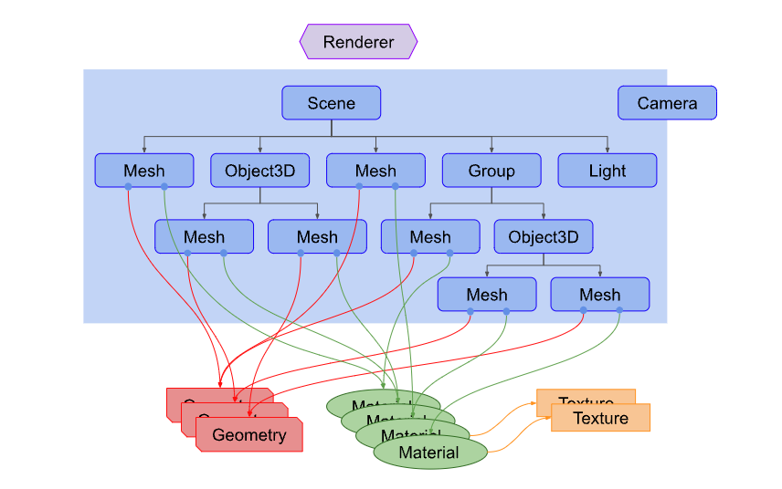

# Three.js Basics

<figure><figcaption></figcaption></figure>


## Three.js 이해하기

1. Canvas 찾기

```javascript
const canvas = document.querySelector('canvas.webgl');
```

2. WebGLRenderer 생성

```javascript
const renderer = new THREE.WebGLRenderer({ antialias: true, canvas });
```

3. Camera 생성

```javascript
const fov = 75;
const aspect = 2;
const near = 0.1;
const far = 5;
const camera = new THREE.PerspectiveCamera(fov, aspect, near, far);

camera.position.z = 2;
```

4. Scene 생성

```javascript
const scene = new THREE.Scene();
```

5. Mesh 생성 후, Scene에 추가

```javascript
const boxWidth = 1;
const boxHeight = 1;
const boxDepth = 1;
const geometry = new THREE.BoxGeometry(boxWidth, boxHeight, boxDepth);

const material = new THREE.MeshBasicMaterial({ color: 0x44aa88 });

const cube = new THREE.Mesh(geometry, material);

scene.add(cube);
```

6. renderer.render 메서드에 scene, camera 추가

```javascript
renderer.render(scene, camera);
```

<figure><figcaption></figcaption></figure>
