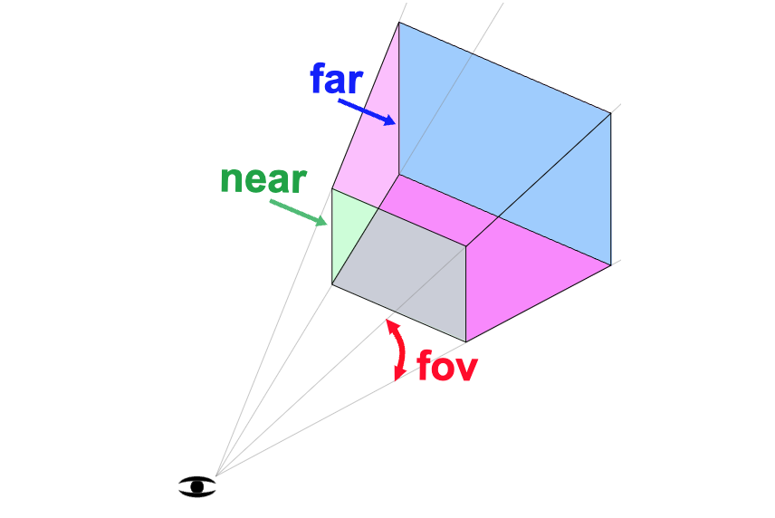

# Cameras

* ArrayCamera
* StereoCamera
* CubeCamera
* OrthographicCamera
* PerspectiveCamera

\


## Camera

#### **🚧 ArrayCamera**

* 여러 개의 카메라를 배열 형태로 사용하여 하나의 장면을 다양한 시점에서 렌더링하는데 사용
* 360도 뷰 렌더링이나 VR 애플리케이션에서 사용

#### **🚧 StereoCamera**

* 왼쪽과 오른쪽의 두 개의 카메라로 구성
* 시선을 약간씩 다르게 설정하여 입체적인 시각 효과를 제공
* 주로 3D 비디오나 게임에 사용

#### **🚧 CubeCamera**

* 여섯 개의 카메라로 구성된 특수한 카메라
* 환경매핑을 생성하거나, 큐브맵을 생성하기 위해 사용

#### **🚧 OrthographicCamera**

* 원근법이 적용되지 않는 카메라
* 2D 게임이나 CAD프로그램과 같이 원근이 필요하지 않은 애플리케이션에서 사용

### **🚧 PerspectiveCamera**&#x20;

```javascript
const fov = 75;
const aspect = 2;  // the canvas default
const near = 0.1;
const far = 5;
const camera = new THREE.PerspectiveCamera(fov, aspect, near, far);
```

* 일반적인 카메라
* `fov(Field of View)` : 카메라가 볼 수 있는 각도를 결정
* `aspect` : 캔버스의 표시 비율
* `Near`, `Far` : 카메라 앞에 렌더링될 공간

<figure><figcaption></figcaption></figure>

***

#### OrbitControls

```js
import { OrbitControls } from 'three/addons/controls/OrbitControls.js';

// Canvas
const canvas = document.querySelector('canvas.webgl'); // DOM element

// Controls
const controls = new OrbitControls(camera, canvas);
controls.enableDamping = true;
controls.target.y = 1;
conrols.update();

const tick = () => {
  // update controls
  controls.update(); // controls.enableDamping, controls.autoRotate 둘 중 하나라도 true로 설정될 경우 필수로 호출되어야 한다.

  // Render
  renderer.render(scene, camera);
};
```
