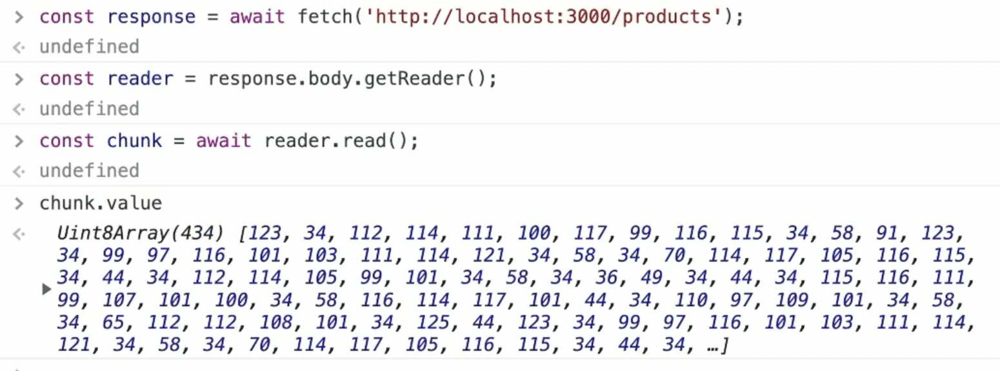
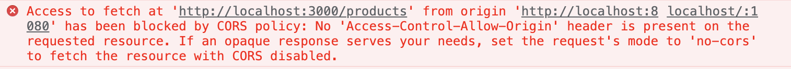
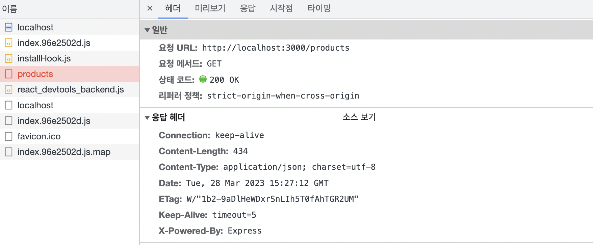

## 학습 키워드

- Fetch API 란
- Promise
- ReableStream
- Unicode
- CORS 란

---

## Fetch API

- [Fetch API](https://developer.mozilla.org/ko/docs/Web/API/Fetch_API)

- [Fetch 사용하기](https://developer.mozilla.org/ko/docs/Web/API/Fetch_API/Using_Fetch)

- [ReadableStream](https://developer.mozilla.org/ko/docs/Web/API/ReadableStream)

- [텍스트 디코더와 텍스트 인코더](https://ko.javascript.info/text-decoder)

기본적인 사용법 실험

```jsx
fetch('http://localhost:3000/products');
// → Promise
```

fetch 함수는 Promise를 반환한다.

```jsx
await fetch('http://localhost:3000/products');
// → Response
```

await 키워드를 사용하면 Response를 반환한다.

```jsx
const response = await fetch('http://localhost:3000/products');
// → response.body는 ReadableStream

const reader = response.body.getReader();
const chunk = await reader.read();
// → chunk.value는 Uint8Array 타입.
// → 원래는 chunk.done이 true일 때까지 반복해야 한다.
```



chunk.value는 bite array. 이 데이터를 string으로 바꿔줄 필요가 있다. 👉🏻 텍스트 디코더

```jsx
const body = new TextDecoder().decode(chunk.value);

const data = JSON.parse(body);
```

fetch 함수는 JSON을 기본 지원한다.

```jsx
const response = await fetch('http://localhost:3000/products');
const data = await response.json();
```

다른 HTTP Method를 쓰고 싶다면?

```jsx
const response = fetch(url, {
  method: 'POST',
});
```

객체 안에는 여러가지를 써 줄 수 있음

```jsx
const respose = await fetch(url, {
  method: 'POST',
  mode: 'cors',
  cache: 'no-cache',
  headers: {
    'Content-Type': 'application/json', // - 이 형태는 자주 사용함
  },
});

return response.json(); // JSON 응답을 네이티브 JavaScript 객체로 파싱
```

<br />

## CORS

- [동일 출처 정책](https://developer.mozilla.org/ko/docs/Web/Security/Same-origin_policy)

- [CORS](https://developer.mozilla.org/ko/docs/Web/HTTP/CORS)

이전에 작업하던 react-demo-app 프로젝트로 돌아가서 main.tsx 코드 수정하기
받아온 data.products에는 뭐가 들어올까?

```jsx
import React from 'react';
import ReactDOM from 'react-dom/client';

import App from './App';

async function main() {
  // fetch
  const url = 'http://localhost:3000/products';
  const response = await fetch(url);
  const data = await response.json();
  const { products } = data;

  console.log(products);

  const container = document.getElementById('root');
  if (!container) {
    return;
  }

  const root = ReactDOM.createRoot(container);
  root.render(
    <React.StrictMode>
      <App />
    </React.StrictMode>
  );
}

main();
```

콘솔창을 확인해보면 보이는 오류




### Access to fetch at 'http://localhost:3000/products' from origin 'http://localhost:8080' has been blocked by CORS policy:

웹 브라우저가 가지고 있는 기본 보안 정책  
중요한 건 '웹 브라우저가 가지고 있는 것'



지금 웹 페이지는? 8080  
리소스를 요청한 곳은? REST API 서버는 3000

웹 브라우저는 Same Origin Policy에 따라 웹 페이지와 리소스를 요청한 곳(여기서는 REST API 서버)이 서로 다른 출처(실제로 포트 번호까지 포함해서 출처가 된다)일 때 서버에서 얻은 결과를 사용할 수 없게 막는다. 서버에 요청하고 응답을 받아오는 것까지는 이미 진행이 다 된 상황이란 점에 주의!


👉🏻 응답을 받아오는 것까지 이미 완료된 상태. 브라우저에서 막아놓는 것!

<br />



### CORS를 사용해 교차 출처 접근을 허용한다.

'리소스 문제 있지만 나는 괜찮아'라는 것을 서버에서 알려줘야한다.

REST API 서버에서 Headers에 “Access-Control-Allow-Origin” 속성을 추가하면 된다.

Express에선 그냥 [CORS 미들웨어](https://expressjs.com/en/resources/middleware/cors.html)를 설치해서 사용하면 됨.


</br>

패키지 설치

```jsx
npm i cors

npm i -D @types/cors
```

CORS 미들웨어 사용

```jsx
import express from 'express';
import cors from 'cors';

const app = express();

app.use(cors());
```
