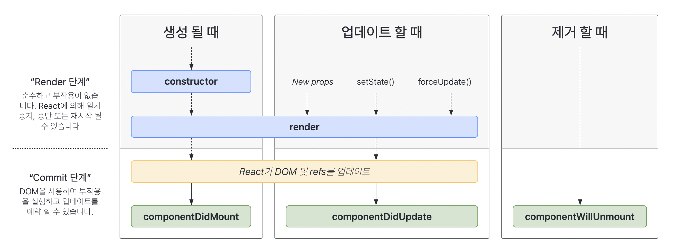

# useRef & Custom Hook

### 학습 키워드

* useRef
* Hook의 규칙


### useRef

* [beta 문서의 useRef](https://beta.reactjs.org/reference/react/useRef)
* [공식 문서의 useRef](https://ko.reactjs.org/docs/hooks-reference.html#useref)

컴포넌트의 생애주기 전체에 걸쳐서 유지되는 객체. 즉, 컴포넌트가 없어질 때까지 동일한 객체가 유지된다.

리액트 공식문서를 보고 useRef의 개념과 사용방법에 대해서 정리했다.👉🏻 [useRef의 개념과 사용방법 - LEE\_PLAY](https://leejaelll.github.io/2023/230521-archive/)

어느 상황에서 useRef를 사용해야하는지에 대해서 공부할 수 있었다. 중요한 건 변경된 값을 화면에 보여줘야하는가? 보여주지 않아도 되는가?에 차이라고 생각한다.

\


🦖 00:38 - 컴포넌트 생애주기란?

컴포넌트가 만들어졌다가 사라지는 동안의 주기를 의미함.



컴포넌트가 사라졌다는 것은 DOM 요소에서 사라지는 것을 의미. 들어갈 땐 Mount 빠질 땐 Unmount라고 부름.

**componentDidMount**

컴포넌트가 생성될 시점에 호출되는 메서드, 컴포넌트의 첫 번째 렌더링을 마치고 나면 호출된다. _이 시점에는 보통 DOM을 사용해야하는 외부 라이브러리를 연동해야하거나, Web API를 사용해야할 때 사용된다._

**componentDidUpdate**

특정 prop이나 state가 업데이트될 때 새롭게 UI를 업데이트를 해야한다. 이 때 리렌더링을 마치고 원하는 변화가 모두 반영된 이후에 호출되는 메서드

**componentWillUnmount**

컴포넌트가 화면에서 사라지기 바로 직전에 호출되는 메서드

\


useRef는 컴포넌트가 생성되었다가 사라지는 그 동안에서 계속해서 유지되는 객체!


객체 자체가 값은 아니고, 값을 참조하기 위한 객체. 즉, 언제든지 값을 변경할 수 있다.


상태와는 관계없이 값을 계속해서 유지하고 싶다면?

```jsx
const ref = {
  value: 1,
};
```

ref에 재할당을 할 순 없지만 ref.value를 바꿀 수는 있다.

각자의 컴포넌트에서 값을 가지고 싶다면 그때 useRef를 사용한다.

```jsx
const ref = useRef(1);
```

ref는 current라는 프로퍼티를 가지고 있음

```jsx
ref.current += 1;
```

이러면 useState와 무슨 차이가 있지?\
: 상태(state)가 변경되면 해당 컴포넌트와 하위 컴포넌트를 다시 렌더링하지만, 레퍼런스 객체의 현재 값(current)이 바뀌더라도 렌더링에 영향을 주지 않는다.

```jsx
export default function App() {
  const counter = useRef(1)

  const handleClick = () => {
    counter.current += 1
  }

  return(
    <p>{counter}</p>
    <button type="button" onClick={handleClick}>Toggle</button>
  )

}
```

Toggle 버튼을 클릭했을 때 숫자가 증가하는 코드

* 화면에서는 버튼을 눌러도 변화가 없다.
* 다른 상태가 변경되는 버튼을 눌렀을 때 렌더링을 다시하면 누른 수만큼 숫자가 증가되는 것을 볼 수 있다.
* 즉, 화면 렌더링을 다시 할 때 반영한다.

\


#### 주요 용도

1. 컴포넌트가 사라질 때까지 동일한 값을 써야 하는 경우. ⇒ input 등의 ID 관리.
2. (특히 useEffect 등과 함께 쓰면서 만나게 되는) 비동기 상황에서 현재 값을 제대로 쓰고 싶은 경우.
   * Closure → 변수를 capture, bind를 깜빡하는 문제가 종종 일어남.

\


### Custom Hook

* [Reusing Logic with Custom Hooks](https://beta.reactjs.org/learn/reusing-logic-with-custom-hooks)
* [자신만의 Hook 만들기](https://ko.reactjs.org/docs/hooks-custom.html)

로직을 재사용하기 위한 제일 쉬운 방법.

평범하게 Extract Function을 수행하면 된다. 컴포넌트가 대문자로 시작하는 PascalCase로 이름을 붙인다면, Hook은 “use”로 시작하는 camelCase로 이름을 붙이면 된다.

```jsx
function useFetchProducts() {
  const [products, setProducts] = useState<Product[]>([]);

  useEffect(() => {
    const fetchProducts = async () => {
      const url = 'http://localhost:3000/products';
      const response = await fetch(url);
      const data = await response.json();
      setProducts(data.products);
    };

    fetchProducts();
  }, []);

  return products;
}
```

useFetchProducts를 사용하는 방법

```jsx
export default function App() {
  const products = useFetchProducts();

  return <FilterableTable products={products} />;
}
```

컴포넌트 코드도 명확해지고, setProducts가 실수로 잘못 쓰일 문제도 해결할 수 있다.

\


### Hook의 규칙

* [Hook의 규칙](https://ko.reactjs.org/docs/hooks-rules.html)

Hook 호출은 규칙이 있어서 단순하게 쓰도록 노력해야 한다.

1. Function Component 바로 안쪽(함수의 최상위)에서만 호출.
2. Function Component 또는 Custom Hook에서만 호출.

처음에는 콜백 함수나 조건문 안에서 Hook을 호출하는 실수를 저지르기 쉽다.

```jsx
if (playing) {
  const products = useFetchProducts();
  console.log(products);
}
```
