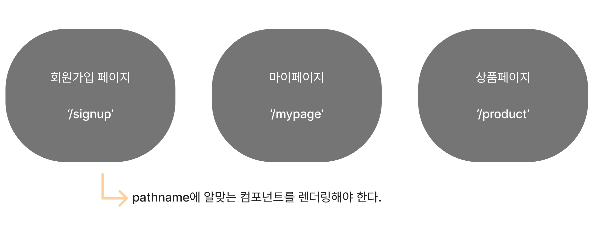

# Routing

## 학습 키워드

- HTML DOM API
  - Location
  - pathname

---

### 🫥 Routing이란 무엇을 의미하는거지?

패킷에 포함된 상세정보를 사용해서 다른 네트워크에 전달하는 경로선택과 스위칭하는 과정을 의미한다.

<br />



### 패킷(packet)

- package + bucket의 합성어로 데이터 블록을 의미한다.

네트워크 전송 용량의 단위. 데이터를 주고 받을 때 네트워크를 통해서 전송되는 데이터 **조각**이다.

**🤔 데이터를 왜 조각을 내서 전송하는걸까?**

용량이 큰 데이터의 경우 그대로 보내게 되면 대역폭을 많이 차지하고 패킷의 흐름을 원활하게 하지 못한다. 그렇기 때문에 데이터를 조각내서 보내는 것.



<br />

## Window.location



페이지 컴포넌트를 만들고 ➡️ URL에 맞는 컴포넌트를 렌더링한다.

<br />

### 🫥 URL을 확인할 수 있는 방법 👉🏻 `Window.location`



### Window.location & pathname

현재 document의 로케이션에 대한 정보를 얻을 수 있다.

브라우저에 location을 출력해보면?


location은 여러 개의 프로퍼티를 가지고 있는데 그 중에서 pathname은 **URL 경로**를 반환한다.



```jsx
export default function App() {
  const path = window.location.pathname;

  return (
    <div>
      Hello, world!
      {path} // ✅ '/'을 입력하면 '/'이 나타나고 '/about'을 입력하면 '/about'이 화면이
      나타난다.
    </div>
  );
}
```

<br />

### location.pathname을 이용해서 연습하기

페이지 컴포넌트 만들기

```jsx
// pages > HomePage.tsx
export default function HomePage() {
  return (
    <div>
      <h1>Welcome!😎</h1>
      <p>This is HomePage</p>
    </div>
  );
}

// pages > AboutPage.tsx
export default function AboutPage() {
  return (
    <div>
      <p>This is AboutPage</p>
    </div>
  )
}
```

클릭했을 때 링크로 넘어가는 Header 컴포넌트와 Footer 컴포넌트 만들기

```jsx
// components > Header.tsx
export default function Header() {
  return (
    <header>
      <nav>
        <ul>
          <li>
            <a href="/">Home</a>
          </li>
          <li>
            <a href="/about">About</a>
          </li>
        </ul>
      </nav>
    </header>
  );
}

// components > Footer.tsx
export default function Footer() {
  return (
    <footer>
      <hr />
      This is Footer
    </footer>
  )
}
```

넘어간 링크의 pathname을 확인해서 그에 맞는 컴포넌트 렌더링하기

```jsx
export default function App() {
  const path = window.location.pathname;
  return (
    <div>
      <Header />
      <main>
        {path === '/' && <HomePage />}
        {path === '/about' && <AboutPage />}
      </main>
      <Footer />
    </div>
  );
}
```

또 다른 방법

```jsx
const pages = {
  '/': HomePage,
  '/about': AboutPage,
};

const Page = pages[path] || HomePage;

<Page />;
```
