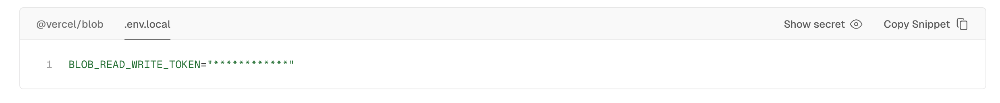

# Next.js & TailwindCSS & Shadcn UI & Vercel storage


<details>

<summary>package.json</summary>

```json
{
  "name": "server-action-practice",
  "version": "0.1.0",
  "private": true,
  "scripts": {
    "dev": "next dev",
    "build": "next build",
    "start": "next start",
    "lint": "next lint"
  },
  "dependencies": {
    "class-variance-authority": "^0.7.0",
    "clsx": "^2.1.1",
    "lucide-react": "^0.379.0",
    "next": "14.2.3",
    "react": "^18",
    "react-dom": "^18",
    "tailwind-merge": "^2.3.0",
    "tailwindcss-animate": "^1.0.7"
  },
  "devDependencies": {
    "@types/node": "^20",
    "@types/react": "^18",
    "@types/react-dom": "^18",
    "eslint": "^8",
    "eslint-config-next": "14.2.3",
    "postcss": "^8",
    "tailwindcss": "^3.4.1",
    "typescript": "^5"
  }
}

```


</details>

***

## tailwindCSS + prettier

```bash
npm install -D prettier prettier-plugin-tailwindcss eslint-confi-prettier
```



```javascript
module.exports = {
  plugins: ['prettier-plugin-tailwindcss'],
}
```



```json
{
  "extends": ["next/core-web-vitals", "prettier"]
}
```



## shadcn

```bash
npx shadcn-ui@latest init
```

component.json과 utils.ts 파일이 만들어진다.&#x20;

```json
{
  "$schema": "https://ui.shadcn.com/schema.json",
  "style": "default",
  "rsc": true,
  "tsx": true,
  "tailwind": {
    "config": "tailwind.config.ts",
    "css": "src/app/globals.css",
    "baseColor": "slate",
    "cssVariables": true,
    "prefix": ""
  },
  "aliases": {
    "components": "@/components",
    "utils": "@/lib/utils"
  }
}
```


```typescript
import { type ClassValue, clsx } from "clsx"
import { twMerge } from "tailwind-merge"

export function cn(...inputs: ClassValue[]) {
  return twMerge(clsx(inputs))
}
```



## postgres 설정하기

### prisma 초기화

```
npx prisma init
```

<div align="left">

<figure><figcaption></figcaption></figure>

</div>

### vercel postgres storage 생성하기

`.env.local` 탭에서 환경변수 복사 후 `.env`파일에 적용

<figure><figcaption></figcaption></figure>

schema.prisma 파일 내 db 코드 수정

<figure><figcaption></figcaption></figure>

### model 정의하기

```prisma
generator client {
  provider        = "prisma-client-js"
  previewFeatures = ["fullTextSearch"]
}


datasource db {
  provider  = "postgresql"
  url       = env("POSTGRES_PRISMA_URL") // uses connection pooling
  directUrl = env("POSTGRES_URL_NON_POOLING") // uses a direct connection
}

model Job {
  id               Int      @id @default(autoincrement())
  slug             String   @unique
  title            String
  type             String
  locationType     String
  location         String?
  description      String?
  salary           Int
  companyName      String
  applicationEmail String?
  applicationUrl   String?
  companyLogoUrl   String?
  approved         Boolean  @default(false)
  createdAt        DateTime @default(now())
  updatedAt        DateTime @updatedAt

  @@map("jobs")
}
```


### @@map의 역할

#### 테이블 이름 지정

* Prisma 모델의 이름이 데이터베이스에서 사용할 테이블 이름과 다른 경우 @@map 지시어를 사용하여 특정 데이터베이스 테이블 이름을 지정할 수 있다.&#x20;
  * Prisma 모델 Job이 데이터베이스에 jobs라는 이름의 테이블로 매핑되어야 한다면 @@map("jobs")를 모델 정의에 추가하여 명시할 수 있다.&#x20;
* @@map 지시어 없이도 Prisma는 일반적으로 모델 이름의 복수형을 테이블 이름으로 사용한다. (Job ➡️ jobs) 그러나 테이블 이름이 모델 이름의 단순 복수형이 아닌 경우, 또는 데이터베이스 설계상 특별한 이름 규칙을 따라야 할 때 @@map을 사용하여 명시적으로 테이블 이름을 지정할 수 있다.&#x20;


#### 추가적인 명확성 제공

* Prisma 스키마에서 테이블 이름을 명확히 하여, 코드를 읽고 이해하는 사람이 데이터베이스 구조를 더 쉽게 파악할 수 있도록 돕는다.&#x20;


### Prisma DB push & generate

```
npx prisma db push
npx prisma generate
```

### prisma.ts

```typescript
import { PrismaClient } from "@prisma/client";

const prismaClientSingleton = () => {
  return new PrismaClient();
}

declare global {
  var prisma: undefined | ReturnType<typeof prismaClientSingleton>;
}

const prisma = globalThis.prisma ?? prismaClientSingleton();

export default prisma;

if(process.env.NODE_ENV !== 'production') globalThis.prisma = prisma;
```

### seed 명령어 추가하기

<details>

<summary>placeholder-data.js</summary>


```javascript
const placeholderJobs = [
  {
    title: "Full-Stack Developer at Stripe",
    type: "Full-time",
    companyName: "Stripe",
    locationType: "Remote",
    location: "San Francisco, California, United States",
    applicationEmail: "apply@stripe.com",
    applicationUrl: "https://stripe.com/apply",
    slug: "full-stack-developer-at-stripe-1",
    salary: 150000,
    approved: true,
    description: `
**About Stripe**

Stripe is a global technology company that builds economic infrastructure for the internet. Our suite of products and services are designed to power commerce for online businesses of all sizes. At Stripe, we're looking for passionate, creative, and innovative developers to help build the next generation of payment platforms.

**Job Description**

As a Full-Stack Developer at Stripe, you will be working on cutting-edge technology to build and maintain scalable, efficient, and reliable software solutions. You'll collaborate with a team of talented engineers, designers, and product managers to deliver exceptional user experiences.

**Key Responsibilities**

- Design, develop, test, deploy, maintain, and improve software across the stack.
- Work closely with other engineering teams to integrate and develop new features.
- Contribute to the full software development lifecycle, including requirements analysis, architecture, design, coding, testing, and deployment.
- Optimize applications for maximum speed and scalability.
- Participate in code reviews and mentor junior developers.

**Qualifications**

- Bachelor's degree in Computer Science, Engineering, or a related field, or equivalent practical experience.
- 3+ years of experience in full-stack development.
- Proficiency in one or more general-purpose programming languages including but not limited to: Ruby, Java, JavaScript, Python.
- Experience with front-end technologies such as React, Angular, or Vue.js.
- Familiarity with server-side frameworks like Ruby on Rails, Django, or Node.js.
- Knowledge of database technologies such as MySQL, PostgreSQL, and MongoDB.
- Strong understanding of web technologies and architectures.
- Excellent problem-solving skills and attention to detail.

**Benefits**

- Competitive salary and equity package.
- Health, dental, and vision insurance.
- Generous vacation and parental leave policies.
- 401(k) plan with employer match.
- Flexible work arrangements.
- Continuous learning and development opportunities.

Stripe is an equal opportunity employer. We value diversity and are committed to creating an inclusive environment for all employees.
`,
  },
  {
    title: "Full-Stack Developer at Vercel",
    type: "Full-time",
    companyName: "Vercel",
    locationType: "Hybrid",
    location: "San Francisco, California, United States",
    applicationEmail: "apply@vercel.com",
    applicationUrl: "https://vercel.com/apply",
    slug: "full-stack-developer-at-vercel-2",
    salary: 120000,
    approved: true,
    description: `
**About Vercel:** 

Vercel is a cloud platform for static sites and Serverless Functions that fits perfectly with your workflow. It enables developers to host Jamstack websites with ease.

Job Description: We're looking for a talented Full-Stack Developer to join our dynamic team. As a Full-Stack Developer at Vercel, you'll work on a variety of projects, building high-quality, scalable web applications. You'll collaborate with a team of designers, developers, and product managers to push the boundaries of what's possible on the web.

**Key Responsibilities:**

-   Develop and maintain front-end and back-end components of our web applications.
-   Collaborate with cross-functional teams to define, design, and ship new features.
-   Ensure the performance, quality, and responsiveness of applications.
-   Identify and correct bottlenecks and fix bugs.
-   Help maintain code quality, organization, and automatization.

**Qualifications:**

-   Bachelor's degree in Computer Science or a related field, or equivalent experience.
-   Strong proficiency in JavaScript, including DOM manipulation and the JavaScript object model.
-   Experience with React.js and its core principles.
-   Experience with popular React.js workflows (such as Flux or Redux).
-   Familiarity with newer specifications of EcmaScript.
-   Experience with data structure libraries (e.g., Immutable.js).
-   Knowledge of isomorphic React is a plus.
-   Experience with RESTful APIs.
-   Knowledge of modern authorization mechanisms, such as JSON Web Token.
-   Familiarity with modern front-end build pipelines and tools.
-   Experience with common front-end development tools such as Babel, Webpack, NPM, etc.
-   A knack for benchmarking and optimization.
-   Familiarity with code versioning tools (such as Git).

**Benefits:**

-   Competitive salary and equity.
-   Health, dental, and vision insurance.
-   Unlimited vacation policy.
-   Home office stipend.
-   Professional development allowance.

Vercel is an equal opportunity employer. We celebrate diversity and are committed to creating an inclusive environment for all employees.

Join us at Vercel and be a part of shaping the future of web development!
`,
  },
  {
    title: "ChatGPT Backend Developer at OpenAI",
    type: "Part-time",
    companyName: "OpenAI",
    locationType: "On-site",
    location: "San Francisco, California, United States",
    applicationUrl: "https://openai.com/apply",
    slug: "chatgpt-backend-developer-at-openai-3",
    salary: 250000,
    approved: true,
    description: `
**About OpenAI:**

OpenAI is an AI research and deployment company dedicated to ensuring that artificial general intelligence (AGI) benefits all of humanity. We're leading the field in developing advanced AI models, like ChatGPT.

**Job Description:**

We are seeking a skilled ChatGPT Backend Developer to join our innovative team. In this role, you'll contribute to the development and optimization of the ChatGPT platform, focusing on backend systems that power conversational AI. You'll collaborate with a talented team of researchers, engineers, and product managers to enhance ChatGPT's capabilities and scalability.

**Key Responsibilities:**

-   Design, build, and maintain efficient, reusable, and reliable backend code for ChatGPT.
-   Work closely with AI researchers to implement and scale new features and models.
-   Improve the performance and reliability of our systems as they scale.
-   Manage individual project priorities, deadlines, and deliverables.
-   Ensure the best possible performance, quality, and responsiveness of applications.
-   Identify bottlenecks and bugs, and devise solutions to these problems.

**Qualifications:**

-   Bachelor's or Master's degree in Computer Science, Engineering, or a related field.
-   Strong experience in backend development, particularly with Python.
-   Experience with AI technologies, machine learning, or natural language processing is highly desirable.
-   Knowledge of cloud services (AWS, Google Cloud, or Azure) and serverless architecture.
-   Experience with database technology such as SQL, NoSQL, and Data Warehousing.
-   Familiarity with Docker, Kubernetes, and CI/CD pipelines.
-   Proficiency in code versioning tools, such as Git.
-   Strong problem-solving skills and a willingness to learn new technologies.

**Benefits:**

-   Competitive salary and generous stock options.
-   Comprehensive health, dental, and vision insurance.
-   Flexible work schedule and location.
-   Generous vacation and leave policies.
-   Education and conference stipends.

OpenAI is committed to diversity in its workforce and is proud to be an equal opportunity employer.

If you're passionate about AI and want to contribute to cutting-edge technology that impacts the world, join us at OpenAI!
`,
  },
  {
    title: "Intern at Coding in Flow",
    type: "Internship",
    companyName: "Coding in Flow",
    locationType: "Remote",
    applicationUrl: "https://codinginflow.com",
    slug: "intern-at-coding-in-flow-4",
    salary: 500,
    approved: true,
    description: `
**Help build the best coding tutorials**

I might not be able to pay you a lot, but I can offer you a lot of experience and a lot of fun. I'm looking for someone who is passionate about coding and wants to help me create the best coding tutorials on YouTube.
`,
  },
  {
    title: "Contractor at SmartDiary.co",
    type: "Contract",
    companyName: "SmartDiary.co",
    locationType: "Remote",
    applicationUrl: "https://smartdiary.co",
    slug: "contractor-at-smartdiary-co-5",
    salary: 30000,
    approved: true,
    description: `
**Help build the future of journaling**

Smart Diary is the intelligent journaling app with AI integration. I'm looking for someone who can help me build this website. 

Try it out for free at [https://smartdiary.co](https://smartdiary.co).
`,
  },
  {
    title: "Software Engineer at Microsoft",
    type: "Temporary",
    companyName: "Microsoft",
    locationType: "On-site",
    location: "Redmond, Washington, United States",
    applicationEmail: "applications@microsoft.com",
    applicationUrl: "https://careers.microsoft.com",
    slug: "software-engineer-at-microsoft-6",
    salary: 180000,
    approved: true,
    description: `
**About Microsoft:**

Microsoft is a global leader in software, services, devices, and solutions that help people and businesses realize their full potential. Renowned for products like Windows, Office, and Azure, Microsoft is continually innovating in the field of technology.
Job Description: We are looking for a talented and dedicated Software Engineer Contractor to contribute to Microsoft's dynamic and diverse projects. In this role, you will be responsible for developing and maintaining software applications, collaborating with various teams to bring innovative solutions to life. This is a contract position with the potential for future long-term opportunities.

**Key Responsibilities:**

-   Design, develop, and implement software solutions based on project requirements.
-   Collaborate with cross-functional teams to define and develop new features.
-   Ensure the performance, quality, and responsiveness of applications.
-   Diagnose, troubleshoot, and resolve software issues.
-   Write clean, maintainable, and efficient code.
-   Participate in code reviews and contribute to team meetings.
-   Stay abreast of new technologies and industry best practices.

**Qualifications:**

-   Bachelor's degree in Computer Science, Engineering, or a related field.
-   Proven experience as a Software Engineer, with a strong background in software development.
-   Proficiency in one or more programming languages (e.g., C#, Java, Python, JavaScript).
-   Experience with cloud services (Azure, AWS, or Google Cloud).
-   Strong understanding of software development methodologies.
-   Excellent problem-solving and analytical skills.
-   Effective communication and teamwork skills.
-   Ability to work independently and manage time effectively.

**Benefits:**

-   Competitive hourly rate.
-   Flexible work hours and remote work options.
-   Exposure to cutting-edge technology and projects.
-   Networking opportunities within Microsoft.
-   Access to Microsoft resources and learning platforms.

Microsoft is an equal opportunity employer and supports workforce diversity.

As a Microsoft contractor, you'll have the opportunity to work on exciting projects and make a significant impact in the tech world. Join us and be a part of Microsoft's innovative journey!
`,
  },
  {
    title: "Full-Stack Developer at Apple",
    type: "Full-time",
    companyName: "Apple Inc.",
    locationType: "Hybrid",
    location: "Cupertino, California, United States",
    applicationUrl: "https://apple.com/apply",
    slug: "full-stack-developer-at-apple-7",
    salary: 200000,
    approved: true,
    description: `
**About Apple:**

Apple is a pioneer in personal technology and a global leader in innovation, known for its iconic products like the iPhone, iPad, and Mac. Our mission is to create products that enrich people's lives and help them achieve their dreams.

**Job Description:**

We are seeking a Full-Stack Developer to join our forward-thinking development team at Apple. In this role, you'll be responsible for building and maintaining software that upholds the quality and innovation Apple is known for. You will play a key role in developing both front-end and back-end components of our applications, working closely with a team of world-class engineers and designers.

**Key Responsibilities:**

-   Develop, test, and maintain robust, scalable, high-quality software for our technology products.
-   Work on both front-end and back-end development of Apple's internal web applications.
-   Collaborate with cross-functional teams to define, design, and ship new features.
-   Ensure the performance, quality, and responsiveness of applications.
-   Identify and correct bottlenecks and fix bugs.
-   Continuously discover, evaluate, and implement new technologies to maximize development efficiency.

**Qualifications:**

-   Bachelor's or Master's degree in Computer Science, Software Engineering, or a related field.
-   Strong experience in full-stack development, particularly in languages like JavaScript, Python, Ruby, or Java.
-   Proficiency with front-end frameworks such as React, Angular, or Vue.js.
-   Experience with back-end development and RESTful APIs.
-   Knowledge of database technologies (SQL, NoSQL).
-   Familiarity with cloud services (AWS, Azure, or GCP).
-   Excellent problem-solving, analytical, and communication skills.
-   Passion for Apple's mission and products.

**Benefits:**

-   Competitive salary and stock options.
-   Health, dental, and vision insurance.
-   Wellness and fitness programs.
-   Onsite cafeterias and healthy food options.
-   Professional development opportunities.
-   Employee product discounts.

Apple is an equal opportunity employer committed to diversity and inclusion.

Join Apple and be a part of a team that's dedicated to making a difference in the world through technology and innovation!
`,
  },
  {
    title: "Junior Web Developer at Shopify",
    type: "Part-time",
    companyName: "Shopify",
    locationType: "Hybrid",
    location: "Ottawa, Ontario, Canada",
    applicationEmail: "career@shopify.com",
    applicationUrl: "https://shopify.com/apply",
    slug: "junior-web-developer-at-shopify-8",
    salary: 90000,
    approved: true,
    description: `
**About Shopify:**

Shopify is a leading global commerce company, providing trusted tools to start, grow, market, and manage a retail business of any size. Shopify makes commerce better for everyone with a platform and services that are engineered for reliability while delivering a better shopping experience for consumers everywhere.

**Job Description:**

We are looking for a part-time Junior Web Developer to join our development team. This role is ideal for someone who is passionate about web development, eager to learn, and looking to gain extensive experience in a dynamic e-commerce environment. You will be assisting in the development and maintenance of Shopify's web-based projects and collaborating with experienced developers.

**Key Responsibilities:**

-   Assist in developing and maintaining Shopify's web applications.
-   Write clean, maintainable, and efficient code under the guidance of senior developers.
-   Collaborate with the team to design, develop, and implement new features and functionalities.
-   Participate in code reviews to maintain high-quality code standards.
-   Troubleshoot and fix bugs reported by users or team members.
-   Stay up-to-date with emerging trends and technologies in web development.

**Qualifications:**

-   Currently pursuing or recently completed a degree in Computer Science, Web Development, or a related field.
-   Basic understanding of web development technologies, including HTML, CSS, JavaScript, and at least one server-side language (e.g., Ruby, Python).
-   Familiarity with version control tools like Git.
-   Eagerness to learn and ability to grasp new concepts quickly.
-   Good problem-solving skills and attention to detail.
-   Strong communication and teamwork abilities.

**Benefits:**

-   Flexible working hours to accommodate your schedule.
-   Competitive hourly rate.
-   Mentorship from experienced developers.
-   Opportunity to work on real-world projects in a leading e-commerce platform.
-   Potential for full-time employment and career growth within Shopify.

Shopify is an equal opportunity employer committed to diversity and inclusion in the workplace.

This is a fantastic opportunity for those looking to kickstart their career in web development while working for one of the most innovative companies in e-commerce. Join us at Shopify and help redefine commerce around the world!
`,
  },
];

module.exports = {
  placeholderJobs,
};
```


</details>

<details>

<summary>seed.js</summary>


```javascript
const { placeholderJobs } = require("./placeholder-data");
const { PrismaClient } = require("@prisma/client");
const prisma = new PrismaClient();

async function main() {
  await Promise.all(
    placeholderJobs.map(async (job) => {
      await prisma.job.upsert({
        where: {
          slug: job.slug,
        },
        update: job,
        create: job,
      });
    }),
  );
}

main()
  .then(async () => {
    await prisma.$disconnect();
  })
  .catch(async (e) => {
    console.error("Error while seeding database:", e);
    await prisma.$disconnect();
    process.exit(1);
  });
```


</details>


scripts 명령어 추가 후 실행

```json
 "seed" : "node scripts/seed.js"
```


## Blob Storage 생성하기

postgres storage와 동일하게 생성 후, .env 파일에 환경변수 추가

<figure><figcaption></figcaption></figure>

<figure><figcaption></figcaption></figure>
