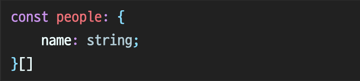

# 타입스크립트의 타입시스템

> _**타입스크립트의 가장 중요한 역할은 타입시스템에 있다.**_

| 타입시스템이란 무엇인가?                  |
| ----------------------------------------- |
| 타입 시스템을 어떻게 사용해야할까?        |
| 무엇을 결정해야하는가?                    |
| 가급적 사용하지 말아야할 기능은 무엇일까? |

### 타입이 값들의 집합이라고 생각하기


**never 타입은 언제 사용하는 걸까?**

- 아무 값도 포함하지 않는 **공집합**
- never 타입으로 선언된 변수에는 아무런 값도 할당할 수 없다.

```typescript
function hello(): never {
  throw new Error('Error');
}
```

_**never는 따로 return하지 않고, 오류를 발생시키는 함수에 타입을 지정할 때 사용한다.**_

**unknown**

- 변수의 타입을 모를때 unknown으로 지정할 수 있다.

```typescript
let a: unknown;
if (typeof a === number) {
  let b = a + 1;
}
```

<mark style="color:red;">**any와 unknown를 분리해놓은 이유가 무엇일까?**</mark>

이 둘의 차이점은 무엇일까? any와 unknwon 둘 다 모든 타입을 허용하는 것은 동일하다. 하지만 any를 사용하게 되면 타입검사를 느슨하게 하므로 개발과정에서 오류를 발생시키지 않는다. 반면 unknown의 경우에는 프로퍼티를 사용하거나 연산을 하게 될 경우, 타입체크를 하게된다. 그러므로 문제가 되는 코드를 미리 예방할 수 있다.


#### union, 합집합

```typescript
type A = 'A';
type B = 'B';
type Twlve = 12;

type AB = 'A' | 'B';
type AB12 = 'A' | 'B' | 12;
```

#### intersection, 교집합

> _타입 연산자는 인터페이스의 속성이 아닌, **값의 집합**에 적용된다._

```typescript
interface Person {
  name: string;
}
interface Lifespan {
  birth: Date;
  death?: Date;
}
type PersonSpan = Person & Lifespan;

const ps: PersonSpan = {
  name: 'Alan',
  birth: new Date('1912/12/01'),
  death: new Date('2023/08/11'),
}; // ok
```

- 세 개의 속성보다 더 많은 값을 가지더라도 PersonSpan 타입에 속한다.
- 인터섹션 타입의 값은 각 타입 내의 속성을 모두 포함하는 것이 일반적인 규칙


**typeof / keyof의 차이점**

**`typeof`**

: 데이터를 데이터 타입으로 변환해주는 연산자

```typescript
let str1 = 'hello';
let str2: typeof str = 'hi';
// === let str2: string ="hi"
```

**`keyof`**

: 객체 형태의 타입을, 따로 속성들만 뽑아 모아 **유니온** 타입으로 만들어주는 연산자

```typescript
type Type = {
  name: string;
  age: number;
  married: boolean;
};

type Union = keyof Type;
// type Union = name | age | married
```



유니온 타입에서는 다르게 동작한다.

```typescript
type K = keyof (Person | Lifespan); // never
```

유니온 타입에 속하는 값은 어떠한 키도 없기 때문에 유니온에 대한 keyof는 공집합(never)이어야만 한다.

```typescript
keyof (A&B) = (keyof A) | (keyof B)
keyof (A|B) = (keyof A) & (keyof B)
```

---

### 타입 공간과 값 공간의 심벌 구분하기

심벌(symbol)은 타입 공간이나 값 공간 중의 한 곳에 존재한다. (이 문장만으로는 정확하게 이해가 가지 않으니, 예시를 살펴보자.)

```typescript
interface Cylinder {
  radius: number;
  height: number;
}

const Cylinder = (radius: number, height: number) => ({ radius, height });
```

- interface Cylinder에서 Cylinder는 타입
- const Cylinder에서 Cylinder와 이름은 같지만 값으로 사용하고 있으며, 아무런 관련이 없다.
- 이런 점이 가끔 오류를 야기함

```typescript
function CalculateVolume(shape: unknown) {
  if (shape instanceof Cylinder) {
    return shape.radius;
  }
}
```

<figure><figcaption></figcaption></figure>

- instanceof는 런타임 연산자로 값에 대해서 연산을 한다.
- 그렇기 때문에 타입이 아닌 함수를 참조한다.

> _**class와 enum은 상황에 따라 타입과 값 두 가지 모두 가능한 예약어**_

```typescript
class Cylinder {
  radius: number;
  height: number;
}

function calculateVolume(shape: unknown) {
  if (shape instanceof Cylinder) {
    shape; // ok, type은 Cylinder
    shape.radius; // ok, type은 number
  }
}
```

- 클래스가 타입으로 쓰일 때는 속성과 메서드가 사용된다.
- 반면에 값으로 쓰일 때는 생성자가 사용된다.

#### 연산자 typeof도 다른 기능을 한다.

- 타입으로 쓰일 때는 타입을 반환한다.
- 값으로 쓰일 때는 런타임의 typeof 연산자가 된다.

```typescript
function email(p: Person, subject: string, body: string): Response {}

type T1 = typeof p; // type은 Person
type T2 = typeof email; // type은 (p: Person, subject: string, body: string) => Response

const v1 = typeof p; // 값은 object
const v2 = typeof email; // 값은 function
```

#### 두 공간 사이에서 다른 의미를 가지는 코드패턴들

|         | 값                       | 타입                                                                                           |
| ------- | ------------------------ | ---------------------------------------------------------------------------------------------- |
| this    | 자바스크립트 키워드 this | 다형성(polymorphic) this라고 불리는 this의 타입스크립트 타입                                   |
| &와 \|  | 비트 연산                | 인터섹션과 유니온                                                                              |
| const   | 변수 선언                | 리터럴 또는 리터럴 표현식의 추론된 타입을 바꿈                                                 |
| extends | `class A extends B`      | <p><code>interface A extends B </code> 또는<br><code>Generic&#x3C;T extends number></code></p> |
| in      | for(key in object)       | 매핑된 타입                                                                                    |


**다형성(Polymorphism)이 무엇을 의미하는걸까?**

<code>Polymorphism</code>
: Poly + morphos의 합성어로 '여러가지 다른 형태들'을 의미한다.

_즉, 여러 타입을 받아들임으로써 여러 형태를 가지는 것을 의미_



_<mark style="color:red;">**타입스크립트가 정상적으로 동작하지 않는다면 타입 공간과 값 공간을 혼동해 잘못 작성했을 가능성이 크다.**</mark>_

이 코드의 문제점은 무엇일까?

```typescript
export default function eamil({
  person: Person,
  subject: string,
  body: string,
}) {}
```

<figure><figcaption></figcaption></figure>

- 값의 관점에서 Person과 string이 해석되었기 때문
- Person이라는 변수명과 string이라는 이름을 가지는 두 개의 변수를 생성하려한 것

문제를 해결하려면 어떻게 해야할까? **타입과 값을 구분**해야한다.

```typescript
function eamil({
  person,
  subject,
  body,
}: {
  person: Person;
  subject: string;
  body: string;
}) {}
```

---

### 타입 단언보다는 타입 선언을 사용하기


**변수에 값을 할당하고 타입을 부여하는 방법**

1. 타입 단언
2. 타입 선언
   

왜 타입 단언보다 타입 선언을 사용하는게 나을까?

```typescript
const alice: Person = {}; // Property 'name' is missing in type '{}' but required in type 'Person'.
const bob = {} as Person;
```

- 첫 번째 줄은 타입 선언, **할당되는 값이 해당 인터페이스를 만족하는지 검사**
- 두 번째 줄은 타입 단언, 타입 단언은 **강제로 타입을 지정했으니 타입 체커에게 오류를 무시하라고 하는 것**

타입 선언과 단언의 차이는 속성을 추가할 때도 마찬가지다.

```typescript
const alice: Person = {
  name: 'Alice',
  occupation: 'TypeScript developer',
  // Type '{ name: string; occupation: string; }' is not assignable to type 'Person'.
  // Object literal may only specify known properties, and 'occupation' does not exist in type 'Person'.
};

const bob = {
  name: 'Bob',
  occupation: 'Javascript developer',
} as Person;
```

- 오류 메세지: 객체 리터럴은 알려진 속성만 지정할 수 있으며, 'Person' 형식에 'occupation'이 없습니다.

_<mark style="color:red;">**화살표 함수의 타입 선언은 추론된 타입이 모호할 때가 있다.**</mark>_
예를 들어, Person 인터페이스를 사용하고 싶다고 가정해보자.

```typescript
const people = ['alice', 'bob', 'jan'].map((name) => ({ name })); // Person을 원했지만 결과는 {name: string}[]...
```

people의 타입은 다음과 같다.

<figure><figcaption></figcaption></figure>

people의 타입이 `Person[]`과 같이 나오려면 어떻게 작성해야할까?

```typescript
const people = ['alice', 'bob', 'jan'].map((name): Person => ({ name }));
```

- `(name):Person`은 name의 타입이 없고 리턴 타입이 Person이라고 명시하는 것과 같다.
- 만약 `(name: Person)`이라고 작성했다면 name의 타입이 Person임을 명시하고 반환 타입이 없다는 것과 같다. (소괄호가 매우 중요함!)



### 타입 단언이 꼭 필요한 경우

타입 단언은 타입 체커가 추론한 타입보다 작성한 사람이 판단하는 타입이 더 정확할 때 의미가 있다.

```typescript
document.querySelector('#myButton').addEventListener('click', (e) => {
  e.currentTarget; // type은 EventTarget
  const button = e.currentTarget as HTMLButtonElement;
  button; // 타입은 HTMLButtonElement
});
```

- 타입스크립트는 DOM에 접근할 수 없기 때문에 #myButton이 버튼 엘리먼트인지 알지 못한다.
- 이벤트의 currentTarget이 같은 버튼이어야 하는 것인지도 알지 못한다.
- 이럴 때에는 타입 단언문을 쓰는 것이 타당하다.



**boolean 부정문을사용해서 null이 아님을 단언하기**

```typescript
const elNull = docuemnt.getElementById('foo'); // HTMLElement | null
const el = document.getElementById('foo')!; // HTMLElement
```

- !를 일반적인 단언문처럼 생각하자.
- 단언문은 컴파일 과정 중에 제거되므로 타입 체커는 알지 못하지만 그 값이 null이 아니라고 확신할 수 있을 때 사용해야한다.
- 만약 null인 경우가 존재한다면 조건문을 사용해야 한다.

---

### 객체 래퍼 타입 피하기

우리가 string에 메서드를 사용할 수 있는 이유는 무엇일까? 바로 래퍼객체 때문이다.

자바스크립트는 기본형을 String 객체로 래핑하고, 메서드를 호출하고, 마지막에 래핑한 객체를 버린다.

**타입을 지정할 때 래퍼 객체 타입을 사용하는 것은 지양하자.**
래퍼 객체를 직접 사용하거나 인스턴스 생성하는 것은 피해야한다. 기본형 타입을 객체 래퍼에 할당하는 구문은 오해하기 쉽고, 굳이 그렇게 할 필요도 없기 때문이다.

String 대신 string, Number 대신 number, Boolean 대신 boolean을 사용해야한다.

---

### 타입과 인터페이스 차이점 알기

**타입과 인터페이스의 유사한점**

```typescript
type TState = {
  name: string;
  capital: string;
};

interface IState {
  name: string;
  capital: string;
}
```

- 대부분의 경우에는 타입과 인터페이스 모두 사용해도 된다.
- 추가 속성과 함께 할당한다면 동일한 오류가 발생한다.

  ```typescript
  const wyoming: TState = {
    name: 'Wyoming',
    capital: 'Cheyenne',
    population: 500_000,
    // Type '{ name: string; capital: string; population: number; }' is not assignable to type 'TState'
  };
  ```

- 인덱스 시그니처는 인터페이스와 타입 모두 사용할 수 있다.

  ```typescript
  type TDict = { [key: string]: string };
  interface IDict {
    [key: string]: string;
  }
  ```

- 함수 타입도 인터페이스와 타입 모두 사용가능하다.

  ```typescript
  type TFn = (x: number) => string;
  interface IFn {
    (x: number): string;
  }
  ```

- 타입별칭과 인터페이스는 모두 제너릭이 가능하다.

  ```typescript
  type TPair<T> = {
    first: T;
    second: T;
  };

  interface IPair<T> {
    first: T;
    second: T;
  }
  ```



### 인덱스 시그니처 (Index Signature)

`{ [Key: T]: U }` 형식으로 객체가 여러 Key를 가질 수 있으며, Key와 매핑되는 Value를 가지는 경우 사용한다.

### Usage

```typescript
type userType = {
  [key: string]: string;
};

let user: userType = {
  홍길동: '사람',
  둘리: '공룡',
};

// Key의 타입은 string이며 Value의 타입은 string, number, boolean인 경우
type userType = {
  [key: string]: string | number | boolean;
};

let user: userType = {
  name: '홍길동',
  age: 20,
  man: true,
};
```



**타입과 인터페이스의 차이점**

- 유니온 타입은 있지만 유니온 인터페이스라는 개념은 없다.

  - 인터페이스는 타입을 확장할 수 있지만, 유니온은 할 수 없다.
  - 유니온 타입을 확장하려면

    1. 하나의 변수명으로 매핑하는 인터페이스를 만들어야 한다.

       ```typescript
       type Input = {
         /*...*/
       };
       type Output = {
         /*...*/
       };
       interface VariableMap {
         [name: string]: Input | Output;
       }
       ```

    2. 유니온 타입에 name 속성을 붙인 타입을 만들어야 한다.

       ```typescript
       type NamedVariable = (Input | Output) & { name: string };
       ```

- type 키워드를 통해 튜플과 배열 타입을 간결하게 표현할 수 있다.

  ```typescript
  type Pair = [number, number];
  type StriingList = string[];
  type NamedNums = [string, ...number[]];
  ```

- 인터페이스는 보강이 가능하다. (타입에는 없는 기능)

  ```typescript
  interface IState {
    name: string;
    capital: string;
  }

  interface IState {
    population: number;
  }

  const wyoming: IState = {
    name: 'Wyoming',
    capital: 'Cheyenne',
    population: 500_000,
  }; // ok
  ```

  - 속성을 확장하는 것을 **_선언 병합_**이라고 한다.
  - 주로 타입 선언 파일에서 사용된다.

_<mark style="color:red;">**타입과 인터페이스 중 어느 것을 사용해야할까?**</mark>_

- 타입이 복잡하다면 타입별칭을 사용하자.
- 일관된 스타일을 사용하자.(타입을 사용하고 있다면 일관되게 타입을 사용할 것.)
- 스타일이 확립되지 않은 프로젝트라면, 보강의 가능성이 있을 지 생각하자.

---

### 타입 연산과 제너릭 사용으로 반복 줄이기

> 타입 중복은 코드 중복만큼 많은 문제를 발생시킨다.

- 상수를 사용해서 반복을 줄이기

  ```typescript
  function distance(a: { x: number; y: number }, b: { x: number; y: number }) {
    return Math.sqrt(Math.pow(a.x - b.x, 2) + Math.pow(a.y - b.y, 2));
  }

  // 중복 제거 코드
  interface Point2D {
    x: number;
    y: number;
  }

  function distance(a: Point2D, b: Point2D) {
    /*...*/
  }
  ```

- 전체 애플리케이션의 상태를 표현하는 타입의 부분집합으로 타입 만들기

  ```typescript
  interface State {
    userId: string;
    pageTitle: string;
    recentFiles: string[];
    pageContens: string;
  }

  interface TopNavState {
    userId: string;
    pageTitle: string;
    recentFiles: string[];
  }
  ```

  - 이 경우 TopNavState를 확장하여 State를 구성하는 것보다 State의 부분 집합으로 TopNavState를 정의하는 것이 바람직하다.
  - State를 인덱싱하여 속성의 타입에서 중복을 제거할 수 있다.

  ```typescript
  type TopNavState = {
    userId: State['userId'];
    pageTitle: State['pageTitle'];
    recentFiles: State['recentFiles'];
  };
  ```

- '매핑된 타입'을 사용하면 반복되는 코드를 제거할 수 있다.

  ```typescript
  type TopNavState = {
    [k in 'userId' | 'pageTitle' | 'recentFiles']: State[k];
  };

  type TopNavState = Pick<State, 'userId' | 'pageTitle' | 'recentFiles'>;
  ```

  - '매핑된 타입'은 배열의 필드를 루프 도는 것과 같은 방식이다. 👉🏻 Pick



### Pick

Pick은 T와 K 두 가지 타입을 받아서 결과 타입을 반환한다.

```typescript
interface Product {
  id: number;
  name: string;
  price: number;
  brand: string;
  stock: number;
}

// 상품 목록을 받아오기 위한 api
function fetchProduct(): Promise<Product[]> {
  // ... id, name, price, brand, stock 모두를 써야함
}

type shoppingItem = Pick<Product, 'id' | 'name' | 'price'>;

// 상품의 상세정보 (Product의 일부 속성만 가져온다)
function displayProductDetail(shoppingItem: shoppingItem) {
  // id, name, price의 일부만 사용 or 별도의 속성이 추가되는 경우가 있음
  // 인터페이스의 모양이 달라질 수 있음
}
```


