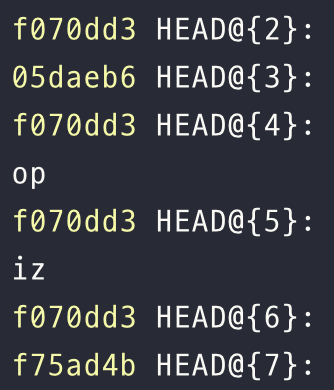

# 1⃣ 타입스크립트 알아보기

### 타입스크립트 설정 이해하기

tsconfig.json에서 compilerOptions을 설정할 수 있다. 그 중 `noImplicitAny`와 `strictNullChecks`를 이해해놓자.

#### **`noImplicitAny`**

타입을 명시할 수 있도록 도와주는 옵션. 명시되지 않은 타입을 타입스크립트가 추론할 때 any 로 추론하게 되면 컴파일 에러를 발생시킨다.&#x20;

```json
"noImplicitAny": true
```

<figure><figcaption></figcaption></figure>

타입스크립트는 타입 정보를 가질 때 가장 효과적이기 때문에 되도록이면 noImplicitAny를 설정하고 시작하는 것이 좋다.

#### **`strictNullChecks`**

null과 undefined가 모든 타입에서 허용되는지 확인하는 설정이다.&#x20;

```json
"strictNullChecks": true
```

true로 설정되어 있는 경우, 명시된 타입과 다르게 null을 넣었을 때 에러를 발생시킨다. (undefined 동일)

<figure><figcaption></figcaption></figure>

argument가 number 또는 null이라면 명시적으로 드러내야한다.&#x20;

```typescript
const x: number | null = null;
```

---

### 코드 생성과 타입이 관계없음을 이해하기

컴파일러는 두 가지 동작을 수행한다

1. 타입스크립트 문법을 자바스크립트 문법으로 변환하기
2. 타입오류 체크하기



#### 타입 오류가 있는 코드도 컴파일이 가능하다

\
_<mark style="color:red;">**컴파일은 타입 체크와 독립적으로 이뤄지기 때문에 가능하다.**</mark>_ 하지만 문제가 있는 코드를 컴파일하는 건 문제가 있지 않을까? 그래서 오류가 있을 때 컴파일하지 않게 하려면 tsconfig.json에 `noEmitOnError`를 설정하거나 빌드 도구에 동일하게 적으면 된다.&#x20;


#### 런타임에는 타입체크가 불가능하다.&#x20;

런타임 시점에 타입스크립트 타입은 모두 제거되어버린다. 그렇기 때문에 타입을 명확하게 하려면 런타임에 타입 정보를 유지하는 방법이 필요하다.
