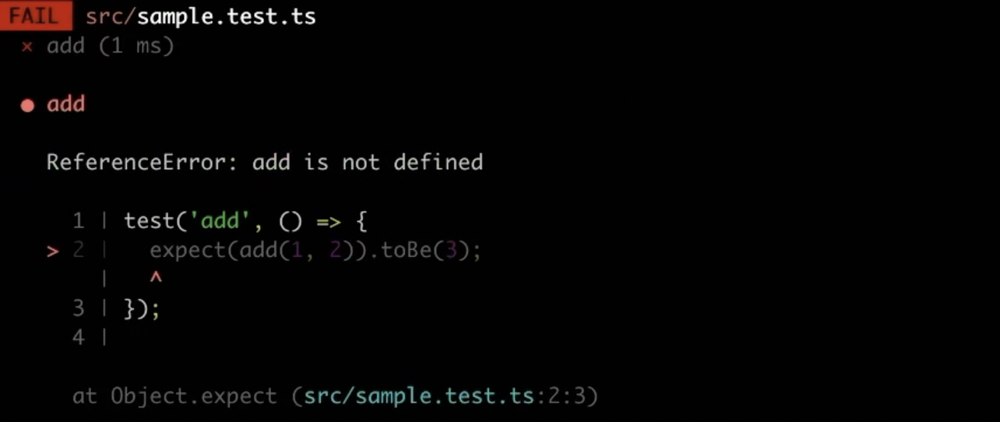

# TDD (Test Driven Development)

## 학습 키워드

- TDD란
- Jest
- Describe - Context - It 패턴
- 단위테스트란

---


**TDD 에 대해서 주의할 점**
테스트 코드를 작성한다고 해서 TDD 가 아닙니다.
TDD Cycle 에 따라 테스트 코드를 먼저 작성하고, 구현하고, 리팩터링 하는 과정을 엄격하게 지켜서 개발을 진행해야 TDD 라고 할 수 있습니다.
TDD 는 테스트 코드를 작성하는 것과 별개로 따로 연습이 필요하고 습관을 들여야하는 분야 입니다. 그리고 TDD 를 잘 하기 위해서는 테스트 코드 작성법 자체부터 공부를 하셔야 합니다.
당장은 TDD 보다 테스트 코드 작성에 익숙해지고 어떻게 하면 테스트 코드를 잘 작성할 수 있을까에 초점을 맞춰 공부하시면 좋습니다.


- [테스트 주도 개발](https://github.com/ahastudio/til/blob/main/agile/test-driven-development.md)
- [TDD FAQ](https://github.com/ahastudio/til/blob/main/blog/2016/12-03-tdd-faq.md)
- [Jest를 이용한 간단한 TDD 예제](https://github.com/ahastudio/til/blob/main/jest/20201204-simple-tdd-example.md)



## TDD (Test Driven Development)

테스트 코드를 먼저 작성하는, 즉 구현보다 인터페이스와 스펙을 먼저 정의함으로써 개발을 진행하는 방식.



<br />

**TDD Cycle**

1. Red → 실패하는 테스트 코드를 작성. 인터페이스와 스펙에 집중한다.
2. Green → 재빨리 테스트를 통과시킨다. 올바른 방법이 아니어도 괜찮다.
3. Refactor → 리팩터링을 통해 코드를 올바르게 만든다. TDD에서 가장 중요한 부분이지만, 간과될 때가 많다.

<br />

### 중요한 것은 작게 만드는 것!

작은 단계를 찾고, 코드에서 피드백을 얻는 게 (어렵고) 중요하다. 2번이 어렵다면 1번으로 돌아가서 더 작고 쉬운 문제를 정의하고, 3번을 위해 의도를 드러내고 중복을 찾아 제거하는 연습을 해야 한다. 이 둘이 익숙하지 않으면 TDD를 하는 게 거의 불가능하고, 사실 이 둘이 어려우면 일반적인 개발 또는 클린 코드를 작성하는 것 또한 매우 힘들다.

👉🏻 사실 작은 단계를 만들거나 중복을 찾아서 제거하는 것이 어려운 건 개발이 어려운 거나 마찬가지.

<br />

## Jest

- [Jest](https://jestjs.io/)
- [Given-When-Then](https://github.com/ahastudio/til/blob/main/blog/2018/12-08-given-when-then.md)

테스트 케이스를 정의할 때 크게 두 가지 방법을 사용한다:

1. test 함수로 개별 테스트를 나열하는 방식.
2. BDD 스타일로 주체-행위 중심으로 테스트를 조직화하는 방식.

<br />

**먼저 Jest가 있는지 확인하기**

jest와 @swc/jest 가 설치되어 있어야 한다.

<br />

### 🦖 09:43 - 근데 @swc/jest가 무슨 역할을 하는 패키지였지?

- Jest용 전처리기를 제공하는 패키지
- Jest에서 테스트를 실행하기 전에 SWC 컴파일러를 사용해서 JavaScript 코드로 변환해준다.

<br />

처음에는 test 함수로 개별 테스트를 써보자.

```jsx
test('add', () => {
  expect(add(1, 2)).toBe(3); // 기대한다. 1, 2를 더했을 때 3이 될거라고!
});
```

이 상태로 테스트를 실행하면 add 함수가 정의되지 않았다는 오류를 발생시킨다.



```tsx
function add(x: number, y: number) => {
	return 3;
}
```

+) 만약 타입스크립트를 인지하지 못해서 오류가 발생한다면 jest.config.js파일 추가하기

Jest에서 TypeScript 사용하도록 `jest.config.js` 파일 작성

```jsx
module.exports = {
  testEnvironment: 'jsdom',
  setupFilesAfterEnv: ['@testing-library/jest-dom/extend-expect'],
  transform: {
    '^.+\\.(t|j)sx?$': [
      '@swc/jest',
      {
        // -> tsx 또는 jsx 파일, x 뒤에 물음표가 붙으면 x가 없을 수도 있다는 의미
        jsc: {
          parser: {
            syntax: 'typescript',
            jsx: true,
            decorators: true,
          },
          transform: {
            react: {
              runtime: 'automatic',
            },
          },
        },
      },
    ],
  },
};
```

BDD 스타일로 테스트 대상과 행위를 명확히 드러내자.

```jsx
describe('add', () => {
  // ✅ add라는 것을 테스트 할거야!
  it('returns sum of two numbers', () => {
    // ✅ add는 무엇을 하는지 설명한다.
    expect(add(1, 2)).toBe(3); // ✅ 무엇을 기대하는지 작성하기
  });
});
```

<br />

다양한 경우를 고려해 보자.

🤷🏻‍♀️: 두 숫자만 더하는거 아닌데? 들어오는 숫자들 다 더하는건데?

```jsx
function add(...numbers: number[]): number {
  return numbers.reduce((acc, cur) => acc + cur, 0); // ✅ 리팩토링의 결과물!

  // refactoring 전 코드
  // return add(...numbers.slice(0, numbers.length - 1)) + numbers[numbers.length - 1]);
}

const context = describe;

describe('add', () => {
  context('with no argument', () => {
    it('returns zero', () => {
      expect(add()).toBe(0);
    });
  });

  context('with only one number', () => {
    it('returns the same number', () => {
      expect(add(1)).toBe(1);
    });
  });

  context('with two numbers', () => {
    it('returns sum of two numbers', () => {
      expect(add(1, 2)).toBe(3);
    });
  });

  context('with three numbers', () => {
    it('returns sum of three numbers', () => {
      expect(add(1, 2, 3)).toBe(6);
    });
  });
});
```

여러 개의 테스트 코드를 먼저 작성하고 테스트를 실행하면서 코드를 리팩토링해 나갈 수 있다. 또한 테스트 케이스를 생각하면서 어떤 값들이 들어올 것 같은지에 대해 생각해볼 수 있다.
